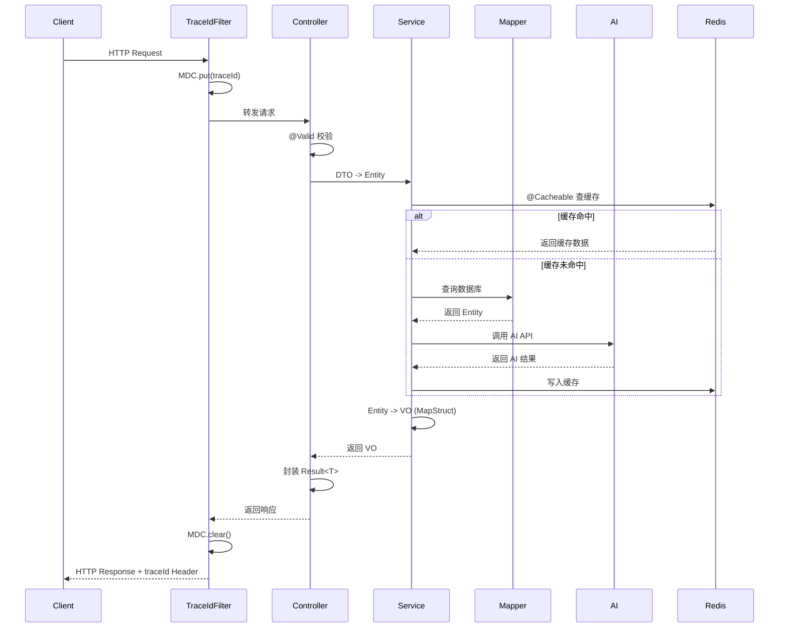

# Spring Boot 后端开发核心知识框架（升级版 v4.0）

> **版本说明**：基于 v3.0 全面优化，基于 Spring Boot 3.3.x + Java 21，最后更新 2026-07
> 补全了全章节面试问答闭环，修正了 RestTemplate/WebClient 技术描述，新增分布式定时、配置加密、优雅停机、Security 6 新写法等生产必备知识。Mermaid 时序图替代 ASCII，避坑指南增加"发现办法"列

---

## 一、Spring Boot 核心机制

### 1.1 自动配置原理（Auto-Configuration）

#### 1.1.1 本章核心定位

Spring Boot 的"灵魂机制"，位于框架启动层。上游依赖 Spring Framework 的`@Import`与条件化装配，下游支撑所有 Starter 的零配置开箱即用

#### 1.1.2 核心原理

- **通俗版：** Spring Boot 启动时扫描 `classpath` 下所有 jar 包中的 `META-INF/spring/org.springframework.boot.autoconfigure.AutoConfiguration.imports` 文件，读取自动配置类。每个配置类带条件注解（如 `@ConditionalOnClass`），满足条件就注册 Bean，不满足就跳过

- **底层版：**
  1. 入口：`@SpringBootApplication` → `@EnableAutoConfiguration` → `@Import(AutoConfigurationImportSelector.class)`
  2. `AutoConfigurationImportSelector#selectImports()` 调用 `getCandidateConfigurations()`，通过 `SpringFactoriesLoader` 读取 `AutoConfiguration.imports`
  3. `ConditionEvaluator` 对每个配置类执行条件评估
  4. 通过评估的配置类注册为 `BeanDefinition`，由 `BeanFactory` 实例化
  5. 自动配置 Bean 通常带 `@ConditionalOnMissingBean`，用户自定义 Bean 优先级更高

#### 1.1.3 核心知识点清单

| 考点 | 内容 |
| ------ | ------ |
| 自动配置加载文件 | 3.x: `META-INF/spring/org.springframework.boot.autoconfigure.AutoConfiguration.imports`；2.x: `META-INF/spring.factories` |
| 核心类 | `AutoConfigurationImportSelector`、`SpringFactoriesLoader`、`ConditionEvaluator` |
| 条件注解族 | `@ConditionalOnClass`、`@ConditionalOnMissingBean`、`@ConditionalOnProperty`、`@ConditionalOnWebApplication` |
| 排除自动配置 | `@SpringBootApplication(exclude = {...})` 或 `spring.autoconfigure.exclude` |
| 查看匹配详情 | 启动加 `--debug` 或 `debug=true`，看 `Positive matches` / `Negative matches` |

#### 1.1.4 面试高频问答

**Q：Spring Boot 自动配置原理是什么？**
> 答：通过 `@EnableAutoConfiguration` 导入 `AutoConfigurationImportSelector`，读取 `AutoConfiguration.imports` 获取所有自动配置类。`ConditionEvaluator` 进行条件评估，满足条件的注册为 BeanDefinition 并实例化
> 详见自动配置原理（Spring Core)

**Q：如何查看哪些自动配置生效了？**
> 答：启动时加 `--debug` 参数，或在 `application.yml` 中设置 `debug: true`，控制台会输出 `Positive matches`（生效）和 `Negative matches`（未生效）的完整列表。

---

### 1.2 Starter 机制

#### 1.2.1 本章核心定位

Spring Boot 生态的"插件化标准"，是自动配置的工程化封装。企业级开发中，自定义 Starter 是封装公共组件的标准方式

#### 1.2.2 核心原理

Starter 是一个普通 Maven 模块，通过`pom.xml`引入所需依赖，并在`META-INF/spring/`下注册自动配置类。当用户引入 Starter 依赖后，Spring Boot 自动扫描并加载其中的自动配置

#### 1.2.3 典型代码模板

```java
// 配置属性类
@Data
@ConfigurationProperties(prefix = "myapp.aiservice")
public class AiServiceProperties {
    private String apiKey;
    private String baseUrl = "https://api.openai.com";
    private Integer timeout = 30;
    private Integer maxRetries = 3;
}

// 自动配置类
@AutoConfiguration
@EnableConfigurationProperties(AiServiceProperties.class)
@ConditionalOnProperty(prefix = "myapp.aiservice", name = "api-key")
public class AiServiceAutoConfiguration {
    @Bean
    @ConditionalOnMissingBean
    public AiClient aiClient(AiServiceProperties properties) {
        return new AiClient(properties.getApiKey(), properties.getBaseUrl(), 
                          properties.getTimeout(), properties.getMaxRetries());
    }
}
```

**`META-INF/spring/org.springframework.boot.autoconfigure.AutoConfiguration.imports`：**

```text
com.myapp.aiservice.AiServiceAutoConfiguration
```

#### 1.2.4 面试高频问答

**Q：如何自定义一个 Starter？Spring Boot 如何识别你的自动配置类？**
> 答：① 创建 Maven 模块，引入 `spring-boot-autoconfigure` 依赖；② 编写 `xxxProperties` 配置属性类 + `xxxAutoConfiguration` 自动配置类；③ 在 `META-INF/spring/org.springframework.boot.autoconfigure.AutoConfiguration.imports` 中注册自动配置类全限定名；④ 用户引入 Starter 后，Spring Boot 通过 `SpringFactoriesLoader` 读取该文件并加载配置

**Q：自定义 Starter 时，为什么要加 `@ConditionalOnMissingBean`？**
> 答：防止与用户自定义的同名 Bean 冲突，保证用户自定义 Bean 优先级更高，体现"约定大于配置，配置大于默认"的原则

---

### 1.3 启动生命周期与初始化

#### 1.3.1 本章核心定位

应用启动完成后执行初始化逻辑的"标准钩子"，解决"Bean 创建完但应用未就绪"的时序问题

#### 1.3.2 核心原理

Spring Boot 应用启动完成后，会查找容器中所有 `CommandLineRunner` 和 `ApplicationRunner` 接口的实现类，按 `@Order` 排序后依次执行。

| 方式 | 执行时机 | 适用场景 |
| ------ | ---------- | ---------- |
| `@PostConstruct` | 当前 Bean 创建完 | Bean 内部初始化（如配置校验） |
| `CommandLineRunner` | **整个应用启动完** | 需要数据库连接等全局初始化（预热缓存、加载字典） |
| `ApplicationRunner` | 整个应用启动完 | 同 `CommandLineRunner`，但参数为 `ApplicationArguments` |

#### 1.3.3 典型代码模板

```java
@Component
@Order(1)  // 数字越小越先执行
public class CacheWarmupRunner implements CommandLineRunner {
    @Override
    public void run(String... args) {
        log.info("应用启动完成，执行缓存预热...");
        // 加载热点数据到 Redis、初始化布隆过滤器等
    }
}

@Component
@Order(2)
public class DictLoaderRunner implements ApplicationRunner {
    @Override
    public void run(ApplicationArguments args) {
        // args.containsOption("debug") 可解析命令行参数
        log.info("加载系统字典...");
    }
}
```

#### 1.3.4 面试高频问答

**Q：`@PostConstruct` 和 `CommandLineRunner` 有什么区别？**
> 答：`@PostConstruct` 在当前 Bean 初始化完成后立即执行，此时应用可能尚未完全启动（如数据库连接池未就绪）；`CommandLineRunner` 在整个 Spring Boot 应用启动完成后执行，适合需要依赖其他组件就绪的全局初始化任务

---

## 二、外部化配置体系

### 2.1 YAML/Properties 配置与加载优先级

#### 2.1.1 核心原理

Spring Boot 从 17 个位置加载配置，按优先级高到低覆盖。`application.yml`用**缩进**表示层级，多环境通过`spring.profiles.active`切换

**配置源优先级（高→低）：** 命令行参数 > JNDI > System 属性 > 环境变量 > `application-{profile}.yml` > `application.yml` > `@PropertySource`

#### 2.1.2 典型代码模板

```yaml
# application.yml（主配置）
spring:
  profiles:
    active: @spring.profiles.active@  # Maven占位符，需在pom.xml中配置resources过滤
  profiles:
    group:
      dev: dev,common   # 2.4+ 支持分组配置
      prod: prod,common
```

- **YAML 语法要点**：
  - 缩进只能用空格（禁用 Tab），冒号后必须加空格
  - 列表用 `- 元素` 表示
  - 多文档用 `---` 分隔不同 Profile（2.4+ 用 `spring.config.activate.on-profile`）

#### 2.1.3 多环境文件结构（推荐）

```text
resources/
├── application.yml           # 主配置（含 group 定义）
├── application-common.yml    # 通用配置
├── application-dev.yml       # 开发环境专属
└── application-prod.yml      # 生产环境专属
```

**加载顺序：** 激活 `dev` 时，`application.yml` → `application-dev.yml` → `application-common.yml`（后者覆盖前者）

#### 2.1.4 Maven 资源过滤配置

```xml
<build>
    <resources>
        <resource>
            <directory>src/main/resources</directory>
            <filtering>true</filtering>
            <includes>
                <include>application.yml</include>
                <include>application-*.yml</include>
            </includes>
        </resource>
        <resource>
            <directory>src/main/resources</directory>
            <filtering>false</filtering>
            <excludes>
                <exclude>application.yml</exclude>
                <exclude>application-*.yml</exclude>
            </excludes>
        </resource>
    </resources>
</build>
```

- **常见问题**：
  - **占位符失效**：IDE 直接运行 main 方法时 Maven 过滤不生效，需在 VM options 加 -Dspring.profiles.active=dev 或打包后 java -jar 启动
  - **`@Value` 陷阱**：不支持松散绑定（如 api-key 需写 `@Value("${app.ai.api-key}")）；`配置缺失且无默认值会启动报错，建议加默认值（如 `@Value("${test.hello:默认}")`）

---

### 2.2 配置绑定（@ConfigurationProperties）

#### 2.2.1 核心原理

`ConfigurationPropertiesBindingPostProcessor`拦截带`@ConfigurationProperties`的类，调用`Binder`递归绑定属性，支持松散绑定和 JSR-303 校验

#### 2.2.2 典型代码模板

- **方式一：Setter 绑定（传统，可变）**

```java
@Data
@Validated
@ConfigurationProperties(prefix = "app.ai")
public class AiProperties {
    @NotBlank(message = "API Key不能为空")
    private String apiKey;
    @Pattern(regexp = "^https?://.*", message = "必须以http/https开头")
    private String baseUrl = "https://api.openai.com";
    @Min(1) @Max(60)
    private Integer timeout = 30;
}
```

- **方式二：构造函数绑定（推荐，不可变，线程安全）**

```java
@Validated
@ConstructorBinding
@ConfigurationProperties(prefix = "app.ai")
public class AiProperties {
    @NotBlank
    private final String apiKey;
    @Pattern(regexp = "^https?://.*")
    private final String baseUrl;
    @Min(1) @Max(60)
    private final Integer timeout;
    
    public AiProperties(String apiKey, String baseUrl, Integer timeout) {
        this.apiKey = apiKey;
        this.baseUrl = baseUrl == null ? "https://api.openai.com" : baseUrl;
        this.timeout = timeout == null ? 30 : timeout;
    }
    // Getter only，无 Setter
}
```

- **激活构造函数绑定：**

```java
@Configuration
@EnableConfigurationProperties(AiProperties.class)  // 必须显式注册
public class AiConfig { }
```

#### 2.2.3 面试高频问答

**Q：`@ConfigurationProperties` 和 `@Value` 的区别？什么时候必须用构造器绑定？**
> 答：`@Value` 适合单个属性注入，不支持松散绑定和校验；`@ConfigurationProperties` 适合批量绑定复杂对象，支持松散绑定和 JSR-303 校验。构造器绑定适用于：① 需要不可变配置（`final` 字段）；② 多线程安全要求高的场景；③ 构造时进行完整性校验。

---

### 2.3 配置属性元数据（★ v4.0 新增）

#### 2.3.1 本章核心定位

让自定义 Starter 在 IDE（如 IntelliJ IDEA）中提供自动提示和配置补全，提升开发体验。

#### 2.3.2 典型代码模板

在 `src/main/resources/META-INF/spring-configuration-metadata.json` 中定义：

```json
{
  "groups": [
    {
      "name": "myapp.aiservice",
      "type": "com.myapp.aiservice.AiServiceProperties",
      "sourceType": "com.myapp.aiservice.AiServiceProperties"
    }
  ],
  "properties": [
    {
      "name": "myapp.aiservice.api-key",
      "type": "java.lang.String",
      "description": "AI 服务 API Key",
      "sourceType": "com.myapp.aiservice.AiServiceProperties"
    },
    {
      "name": "myapp.aiservice.timeout",
      "type": "java.lang.Integer",
      "description": "请求超时时间（秒）",
      "defaultValue": 30
    }
  ],
  "hints": []
}
```

> **工程建议**：使用 `spring-boot-configuration-processor` 注解处理器，编译时自动生成该文件，无需手写。

```xml
<dependency>
    <groupId>org.springframework.boot</groupId>
    <artifactId>spring-boot-configuration-processor</artifactId>
    <optional>true</optional>
</dependency>
```

---

### 2.4 配置文件加密（Jasypt）（★ v4.0 新增）

#### 2.4.1 本章核心定位

生产环境敏感信息（数据库密码、API Key）不应明文存储，Jasypt 提供透明加密方案

#### 典型代码模板

```xml
<dependency>
    <groupId>com.github.ulisesbocchio</groupId>
    <artifactId>jasypt-spring-boot-starter</artifactId>
    <version>3.0.5</version>
</dependency>
```

```yaml
jasypt:
  encryptor:
    password: ${JASYPT_PASSWORD}  # 通过环境变量传入，绝不写死在配置中

spring:
  datasource:
    password: ENC(加密后的密文)
```

```java
// 加密工具
@Autowired private StringEncryptor encryptor;

public String encrypt(String plain) {
    return encryptor.encrypt(plain);  // 生成 ENC(...) 格式密文
}
```

> **安全原则**：加密密钥必须通过环境变量或 K8s Secret 注入，绝不可与密文一同存储在代码仓库中。

---

## 三、==常用注解速查体系==

### 3.1 **请求映射与参数获取**

| 注解 | 作用 | 示例 |
| ------ | ------ | ------ |
| `@GetMapping` | 处理 GET | `@GetMapping("/users")` |
| `@PostMapping` | 处理 POST | `@PostMapping("/users")` |
| `@PutMapping` | 全量更新 | `@PutMapping("/users/{id}")` |
| `@PatchMapping` | 局部更新 | `@PatchMapping("/users/{id}")` |
| `@DeleteMapping` | 删除 | `@DeleteMapping("/users/{id}")` |
| `@RequestParam` | URL `?` 参数 | `@RequestParam(defaultValue = "1") int page` |
| `@PathVariable` | 路径 `/` 参数 | `@PathVariable Long id` |
| `@RequestBody` | 请求体 JSON | `@RequestBody @Valid UserDTO dto` |
| `@RequestHeader` | 请求头 | `@RequestHeader("Authorization") String token` |

### 3.2 **Bean 注入与生命周期**

| 注解 | 说明 | 推荐使用场景 |
| ------ | ------ | ------------- |
| `@Autowired` | 按**类型**注入（Spring 专属） | 配合 `@Qualifier` 使用 |
| `@Resource` | 按**名称**注入（JDK 标准） | 推荐，降低与 Spring 耦合 |
| `@Qualifier` | 配合 `@Autowired` 指定 Bean 名称 | 多实现类区分 |
| `@Primary` | 标注优先注入的实现类 | 多实现类默认注入 |

### 3.3 **分层架构注解**

| 注解 | 作用 | 与 `@Component` 区别 |
| ------ | ------ | --------------------- |
| `@Service` | 业务层 | 语义化，无功能差异 |
| `@Repository` | 数据层 | 自动转换持久化异常为 `DataAccessException` |
| `@Controller` | 控制层（返回视图名） | 配合视图解析器使用 |
| `@RestController` | 控制层（返回数据） | `@Controller + @ResponseBody` |
| `@Component` | 通用组件 | 无特殊语义 |

### 3.4 **核心功能注解**

| 注解 | 作用 |
| ------ | ------ |
| `@Configuration` | 声明配置类（含 `@Component`） |
| `@Bean` | 在配置类中手动注册 Bean |
| `@Value` | 读取配置文件单个值 |
| `@Valid` | 开启参数校验（JSR-303） |
| `@Transactional` | 声明式事务 |
| `@Async` | 异步执行 |
| `@Scheduled` | 定时任务 |
| `@Cacheable` | 方法结果缓存 |
| `@CacheEvict` | 清除缓存 |

### 3.5 条件注解速查表（★ v4.0 新增）

| 注解 | 条件 | 典型使用场景 |
| ------ | ------ | ------------- |
| `@ConditionalOnClass` | classpath 存在指定类 | 有 MySQL 驱动才配置数据源 |
| `@ConditionalOnMissingBean` | 容器中不存在该 Bean | 用户自定义优先 |
| `@ConditionalOnProperty` | 配置项满足指定值 | `myapp.feature.enabled=true` |
| `@ConditionalOnWebApplication` | 是 Web 应用 | 区分 Web 和非 Web 配置 |
| `@ConditionalOnExpression` | SpEL 表达式成立 | 复杂组合条件 |
| `@ConditionalOnBean` | 容器中存在指定 Bean | 依赖其他 Starter 的 Bean |

### 3.6 @Controller vs @RestController

| 注解 | 返回 `String` 时 | 适用场景 |
| ------ | ------------------ | ---------- |
| `@Controller` | 解析为**页面名**（如 `index.html`） | 服务端渲染（Thymeleaf） |
| `@RestController` | 直接作为**文本/JSON**返回 | REST API / 前后端分离 |

> **工程建议**：纯 API 项目全部使用 `@RestController`，避免混淆。

---

## 四、数据访问层

### 4.1 MyBatis-Plus 快速集成与标准化 CRUD

#### 核心原理
`BaseMapper` 通过 Java 动态代理生成代理对象，根据泛型 `Entity` 解析表名、主键、字段映射，方法名映射到 `AbstractMethod` 子类生成 SQL。

#### 典型代码模板

```java
// 配置类
@Configuration
public class MyBatisPlusConfig {
    @Bean
    public MybatisPlusInterceptor mybatisPlusInterceptor() {
        MybatisPlusInterceptor interceptor = new MybatisPlusInterceptor();
        interceptor.addInnerInterceptor(new PaginationInnerInterceptor(DbType.MYSQL));
        interceptor.addInnerInterceptor(new OptimisticLockerInnerInterceptor());
        return interceptor;
    }
}

// 实体类
@Data
@TableName("sys_user")
public class User {
    @TableId(type = IdType.ASSIGN_ID)
    private Long id;
    private String username;
    @TableField(fill = FieldFill.INSERT)
    private LocalDateTime createTime;
    @TableLogic
    private Integer deleted;
    @Version
    private Integer version;
}
```

---

### 4.2 Spring Data JPA 极简入门

#### 本章核心定位
"定义接口，自动生成 SQL" 的快速数据访问方案，适合简单 CRUD 场景，与 MyBatis-Plus 形成互补。

#### 典型代码模板

```java
// 1. 实体
@Entity
@Table(name = "sys_user")
public class User {
    @Id @GeneratedValue(strategy = GenerationType.IDENTITY)
    private Long id;
    @Column(nullable = false, length = 50)
    private String username;
}

// 2. 仓库（零实现，方法名即查询）
public interface UserRepository extends JpaRepository<User, Long> {
    Optional<User> findByUsername(String username);
    List<User> findByUsernameContainingAndStatus(String username, Integer status);
}

// 3. 使用
@Service
@RequiredArgsConstructor
public class UserService {
    private final UserRepository userRepository;

    @Transactional
    public User create(User user) {
        return userRepository.save(user);
    }
}
```

> **JPA 懒加载陷阱**：`LazyInitializationException` 是因为 Session 已关闭。推荐方案：① 使用 `JOIN FETCH` 或 `EntityGraph` 在查询时加载关联数据；② 避免 `OpenEntityManagerInView`（会导致长事务和连接泄露）。

```java
@Query("SELECT u FROM User u LEFT JOIN FETCH u.department WHERE u.id = :id")
Optional<User> findByIdWithDepartment(@Param("id") Long id);
```

> **选型建议**：复杂 SQL、多表关联用 MyBatis-Plus；简单单表 CRUD、快速原型用 JPA。

---

## 五、分层架构规范

### 5.1 Controller / Service / DAO / 工具类分层封装

#### 核心知识点清单

| 层级 | 职责 | 禁止行为 |
|------|------|----------|
| Controller | 接收 HTTP 请求、参数校验、调用 Service、封装统一返回结果 | 禁止写业务逻辑、禁止直接调用 Mapper |
| Service | 业务逻辑编排、事务管理、DTO 与 Entity 转换 | 禁止处理 HTTP 相关对象、禁止返回 VO |
| Mapper/DAO | 数据访问、SQL 执行 | 禁止写业务逻辑 |
| DTO | 层间数据传输 | 禁止包含持久化相关注解 |
| VO | 返回给前端的视图对象 | 禁止包含敏感字段 |

#### 面试高频问答

**Q：为什么要分层？如果项目很小，可以不分层吗？**
> 答：分层的核心目的是**职责隔离和可测试性**。Controller 只关心 HTTP 协议转换，Service 只关心业务规则，Mapper 只关心数据持久化。即使项目很小，也建议至少保留 Controller + Service + Mapper 三层，否则业务逻辑散落在 Controller 中会导致：① 单元测试困难（需要启动 Web 容器）；② 代码复用率低；③ 后期扩展时重构成本极高。

---

### 5.2 MapStruct 类型安全映射

#### 核心原理
编译期 APT 扫描 `@Mapper` 注解，根据方法签名和字段名匹配规则生成 `MapperImpl` 实现类，纯 Java 方法调用。

#### 典型代码模板

```java
@Mapper(componentModel = "spring")
public interface UserMapper {
    UserMapper INSTANCE = Mappers.getMapper(UserMapper.class);
    
    @Mapping(target = "password", ignore = true)
    @Mapping(target = "createTime", source = "createTime", dateFormat = "yyyy-MM-dd HH:mm:ss")
    UserVO entityToVo(User entity);
    
    @Mapping(target = "id", ignore = true)
    @Mapping(target = "createTime", ignore = true)
    User dtoToEntity(UserAddDTO dto);
    
    List<UserVO> entityListToVoList(List<User> entities);
}
```

#### 面试高频问答

**Q：MapStruct 和 `BeanUtils.copyProperties` 的底层差异？性能差距有多大？**
> 答：MapStruct 在**编译期**通过 APT 生成 `MapperImpl` 实现类，本质是纯 Java 方法调用（`getter/setter` 直接赋值），零反射开销；`BeanUtils.copyProperties` 在**运行时**通过反射获取字段并赋值，每次调用都有反射性能损耗。实测 MapStruct 性能约为 BeanUtils 的 **5-10 倍**，且 MapStruct 在编译期就能发现字段名不匹配、类型不兼容等问题，避免运行时隐蔽 Bug。

---

### 5.3 全局异常处理与参数校验

#### 核心原理
`@RestControllerAdvice` + `@ExceptionHandler` 全局拦截异常，配合 `spring-boot-starter-validation` 实现请求参数自动校验。

#### 典型代码模板

```java
@RestControllerAdvice
public class GlobalExceptionHandler {

    // 参数校验失败（@NotBlank 等触发）
    @ExceptionHandler(MethodArgumentNotValidException.class)
    public Result<Void> handleValid(MethodArgumentNotValidException e) {
        String msg = e.getFieldErrors().stream()
            .map(error -> error.getField() + ":" + error.getDefaultMessage())
            .collect(Collectors.joining(", "));
        return Result.error(msg);
    }

    // 业务异常
    @ExceptionHandler(BusinessException.class)
    public Result<Void> handleBusiness(BusinessException e) {
        return Result.error(e.getMessage());
    }

    // 兜底
    @ExceptionHandler(Exception.class)
    public Result<Void> handleException(Exception e) {
        log.error("系统异常", e);
        return Result.error("系统繁忙");
    }
}
```

**参数校验示例：**

```java
@Data
public class UserDTO {
    @NotBlank(message = "用户名不能为空")
    @Size(min = 2, max = 20, message = "长度 2-20")
    private String username;

    @Email(message = "邮箱格式错误")
    private String email;
}

// Controller 中使用
@PostMapping
public Result<User> create(@RequestBody @Valid UserDTO dto) {
    // 校验失败自动抛异常，被 GlobalExceptionHandler 捕获
}
```

---

## 六、Web 层进阶：拦截器与跨域

### 6.1 拦截器（HandlerInterceptor）

#### 本章核心定位
请求进入 Controller 前的"安检门"，用于鉴权、日志、限流等横切逻辑。

#### 典型代码模板

```java
@Component
public class AuthInterceptor implements HandlerInterceptor {
    @Override
    public boolean preHandle(HttpServletRequest req, HttpServletResponse res, Object handler) {
        String token = req.getHeader("Authorization");
        if (token == null || !token.startsWith("Bearer ")) {
            res.setStatus(401);
            return false;  // 拦截
        }
        // 解析 token，放入 ThreadLocal
        return true;  // 放行
    }
}

@Configuration
public class WebConfig implements WebMvcConfigurer {
    @Autowired private AuthInterceptor interceptor;

    @Override
    public void addInterceptors(InterceptorRegistry registry) {
        registry.addInterceptor(interceptor)
            .addPathPatterns("/api/**")
            .excludePathPatterns("/api/auth/**", "/api/public/**");
    }
}
```

#### 面试高频问答

**Q：拦截器和过滤器的执行顺序？如何让一个请求不被拦截器拦截？**
> 答：执行顺序：**Filter（Servlet 层）→ Interceptor（Spring MVC 层）→ Controller**。Filter 在请求进入 DispatcherServlet 前执行，Interceptor 在 HandlerMapping 之后、Controller 之前执行。让请求不被拦截：① 在 `addInterceptors` 中用 `excludePathPatterns` 排除路径；② 在 `preHandle` 中根据条件动态 `return false`；③ 使用 `@Order` 控制多个拦截器的优先级。

---

### 6.2 全局跨域（CORS）

#### 典型代码模板

```java
@Configuration
public class CorsConfig {
    @Bean
    public CorsFilter corsFilter() {
        CorsConfiguration config = new CorsConfiguration();
        config.addAllowedOriginPattern("*");  // 生产环境写具体域名
        config.addAllowedHeader("*");
        config.addAllowedMethod("*");
        config.setAllowCredentials(true);

        UrlBasedCorsConfigurationSource source = new UrlBasedCorsConfigurationSource();
        source.registerCorsConfiguration("/**", config);
        return new CorsFilter(source);
    }
}
```

> **安全提醒**：生产环境 `allowedOrigins` 必须指定具体域名，禁止 `*` + `allowCredentials=true` 同时使用。

---

## 七、外部服务调用：HTTP 客户端封装

### 7.1 RestClient / WebClient 封装 AI 接口

#### 核心原理
`WebClient` 基于 Reactor Netty，非阻塞 I/O，适合高并发。`RestClient`（Spring Boot 3.2+）是同步客户端，替代已标记为弃用的 `RestTemplate`。

#### 典型代码模板

```java
// WebClient 配置（企业级）
@Configuration
public class WebClientConfig {
    @Bean
    public WebClient aiWebClient(AiProperties aiProperties) {
        HttpClient httpClient = HttpClient.create()
                .option(ChannelOption.CONNECT_TIMEOUT_MILLIS, 5000)
                .responseTimeout(Duration.ofSeconds(30))
                .maxConnections(200)
                .pendingAcquireTimeout(Duration.ofSeconds(10));
        
        return WebClient.builder()
                .clientConnector(new ReactorClientHttpConnector(httpClient))
                .baseUrl(aiProperties.getBaseUrl())
                .defaultHeader(HttpHeaders.AUTHORIZATION, "Bearer " + aiProperties.getApiKey())
                .filter(loggingFilter())
                .filter(retryFilter())
                .build();
    }
    
    private ExchangeFilterFunction retryFilter() {
        return (request, next) -> next.exchange(request)
                .retryWhen(Retry.backoff(3, Duration.ofSeconds(1))
                        .filter(throwable -> {
                            if (throwable instanceof WebClientResponseException wex) {
                                return wex.getStatusCode().is5xxServerError();
                            }
                            return throwable instanceof TimeoutException;
                        }));
    }
}
```

**同步调用（Service 层）：**

```java
@Service
@RequiredArgsConstructor
public class AiService {
    private final WebClient aiWebClient;
    
    public String generateText(String prompt) {
        return aiWebClient.post()
                .uri("/v1/chat/completions")
                .bodyValue(Map.of("model", "gpt-4", "messages", List.of(Map.of("role", "user", "content", prompt))))
                .retrieve()
                .bodyToMono(String.class)
                .timeout(Duration.ofSeconds(30))
                .block();  // 同步阻塞
    }
}
```

> **⚠️ 重要提示**：若项目整体为**同步架构**（Spring MVC），优先使用 `RestClient`（Spring Boot 3.2+）；只有在全面异步（WebFlux）时才推荐全程使用 `WebClient`。在同步架构中滥用 `WebClient.block()` 会阻塞线程池，降低吞吐量，且可能引发线程饥饿。

---

## 八、测试策略

### 8.1 集成测试：MockMvc（不启动整个应用）

#### 本章核心定位
测试 Web 层的"轻量级方案"，只启动 Spring 上下文，通过 Mock 对象模拟 HTTP 请求，验证接口行为。

#### 典型代码模板

```java
@SpringBootTest
@AutoConfigureMockMvc
class UserControllerTest {
    @Autowired
    private MockMvc mockMvc;

    @Test
    void shouldGetUser() throws Exception {
        mockMvc.perform(get("/api/users/1"))
            .andExpect(status().isOk())
            .andExpect(jsonPath("$.code").value(200))
            .andExpect(jsonPath("$.data.username").value("Tom"));
    }

    @Test
    void shouldCreateUser() throws Exception {
        mockMvc.perform(post("/api/users")
                .contentType(MediaType.APPLICATION_JSON)
                .content("{\"username\":\"Tom\"}"))
            .andExpect(status().isOk())
            .andExpect(jsonPath("$.data.id").exists());
    }
}
```

#### 面试高频问答

**Q：单元测试和集成测试的本质区别是什么？如何决定 Mock 还是真实依赖？**
> 答：**单元测试**只测一个类，所有外部依赖（Mapper、Redis、HTTP 客户端）全部 Mock，验证被测单元的内部逻辑；**集成测试**测多个组件的协作，使用真实 Spring 上下文和部分真实依赖。决定原则：① 测业务逻辑 → 单元测试 + Mockito；② 测接口契约、参数校验、异常处理 → 集成测试 + MockMvc；③ 测数据库交互 → `@DataJpaTest` 或 `@MybatisPlusTest`。

---

### 8.2 单元测试：Mockito（只测 Service 层）

#### 核心原理
使用 Mockito 模拟依赖对象（Mapper/Repository），隔离被测单元，验证业务逻辑。

#### 典型代码模板

```java
@ExtendWith(MockitoExtension.class)
class UserServiceTest {
    @Mock private UserMapper userMapper;
    @InjectMocks private UserService userService;

    @Test
    void shouldFindUser() {
        when(userMapper.selectById(1L)).thenReturn(new User("Tom"));
        
        UserVO result = userService.findById(1L);
        
        assertEquals("Tom", result.getUsername());
        verify(userMapper, times(1)).selectById(1L);
    }
}
```

---

## 九、构建与部署

### 9.1 Maven 打包与 Docker 容器化

#### 9.1.1 典型代码模板

```dockerfile
# Dockerfile（多阶段构建 + 分层Jar）
# 阶段1：构建
FROM maven:3.9.9-eclipse-temurin-21-alpine AS build
WORKDIR /build
COPY pom.xml .
RUN mvn dependency:go-offline -B
COPY src ./src
RUN mvn clean package -DskipTests -B

# 阶段2：提取分层
FROM eclipse-temurin:21-jre-alpine AS extract
WORKDIR /extract
COPY --from=build /build/target/*.jar application.jar
RUN java -Djarmode=layertools -jar application.jar extract

# 阶段3：运行
FROM eclipse-temurin:21-jre-alpine
WORKDIR /app
RUN addgroup -S spring && adduser -S spring -G spring
COPY --from=extract /extract/dependencies/ ./
COPY --from=extract /extract/spring-boot-loader/ ./
COPY --from=extract /extract/snapshot-dependencies/ ./
COPY --from=extract /extract/application/ ./
HEALTHCHECK --interval=30s --timeout=3s --start-period=60s --retries=3 \
  CMD wget --no-verbose --tries=1 --spider http://localhost:8080/actuator/health || exit 1
USER spring:spring
EXPOSE 8080
ENTRYPOINT ["java", "-XX:+UseContainerSupport", "-XX:MaxRAMPercentage=75.0", \
            "-Djava.security.egd=file:/dev/./urandom", \
            "org.springframework.boot.loader.launch.JarLauncher"]
```

---

### 9.2 Docker Compose 健康检查

```yaml
# docker-compose.yml（Docker Compose V2 格式，无需 version 声明）
services:
  app:
    build: .
    ports:
      - "8080:8080"
    environment:
      - SPRING_PROFILES_ACTIVE=prod
      - MYSQL_HOST=mysql
    depends_on:
      mysql:
        condition: service_healthy
      redis:
        condition: service_healthy
    healthcheck:
      test: ["CMD", "wget", "--no-verbose", "--tries=1", "--spider", "http://localhost:8080/actuator/health"]
      interval: 30s
      timeout: 3s
      retries: 3
      start_period: 60s
  
  mysql:
    image: mysql:8.0
    environment:
      MYSQL_ROOT_PASSWORD: ${MYSQL_PASSWORD}
      MYSQL_DATABASE: app_db
    healthcheck:
      test: ["CMD", "mysqladmin", "ping", "-h", "localhost", "-u", "root", "-p${MYSQL_PASSWORD}"]
      interval: 10s
      timeout: 5s
      retries: 5
      start_period: 30s
  
  redis:
    image: redis:7-alpine
    healthcheck:
      test: ["CMD", "redis-cli", "ping"]
      interval: 10s
      timeout: 3s
      retries: 3
```

> **说明**：Docker Compose V2 已不需要 `version: '3.8'` 声明，直接使用 services 顶层键即可

---

### 9.3 K8s 部署模板

```yaml
# k8s-deployment.yaml
apiVersion: apps/v1
kind: Deployment
metadata:
  name: ai-assistant-app
spec:
  replicas: 3
  selector:
    matchLabels:
      app: ai-assistant
  template:
    metadata:
      labels:
        app: ai-assistant
    spec:
      containers:
        - name: app
          image: registry.example.com/ai-assistant:latest
          ports:
            - containerPort: 8080
          env:
            - name: SPRING_PROFILES_ACTIVE
              value: "prod"
            - name: MYSQL_HOST
              valueFrom:
                configMapKeyRef:
                  name: app-config
                  key: mysql.host
            - name: MYSQL_PASSWORD
              valueFrom:
                secretKeyRef:
                  name: app-secrets
                  key: mysql.password
          resources:
            requests:
              memory: "512Mi"
              cpu: "500m"
            limits:
              memory: "1Gi"
              cpu: "1000m"
          livenessProbe:
            httpGet:
              path: /actuator/health/liveness
              port: 8080
            initialDelaySeconds: 60
            periodSeconds: 30
          readinessProbe:
            httpGet:
              path: /actuator/health/readiness
              port: 8080
            initialDelaySeconds: 30
            periodSeconds: 10
---
apiVersion: v1
kind: Service
metadata:
  name: ai-assistant-service
spec:
  selector:
    app: ai-assistant
  ports:
    - port: 80
      targetPort: 8080
  type: ClusterIP
---
apiVersion: v1
kind: ConfigMap
metadata:
  name: app-config
data:
  mysql.host: "mysql-service"
---
apiVersion: v1
kind: Secret
metadata:
  name: app-secrets
type: Opaque
stringData:
  mysql.password: "your-secure-password"
  ai.api-key: "sk-your-api-key"
```

---

## 十、生产监控：Actuator

### 10.1 核心端点与配置

#### 10.1.1 本章核心定位

Spring Boot 自带的"运维监控仪表盘"，提供健康检查、指标、环境、日志级别调整等生产级端点。

#### 10.1.2 典型代码模板

```yaml
management:
  endpoints:
    web:
      exposure:
        include: health,info,metrics,env,loggers,beans  # 生产环境按需暴露
  endpoint:
    health:
      show-details: always
      probes:
        enabled: true  # K8s 存活/就绪探测
  info:
    env:
      enabled: true
```

**常用端点速查：**

| 端点 | 功能 | 生产建议 |
| ------ | ------ | ---------- |
| `/actuator/health` | 健康状态 | 必须暴露，用于负载均衡检查 |
| `/actuator/health/liveness` | 存活检查 | K8s 配置 `livenessProbe` |
| `/actuator/health/readiness` | 就绪检查 | K8s 配置 `readinessProbe` |
| `/actuator/metrics` | JVM、CPU、HTTP 指标 | 对接 Prometheus |
| `/actuator/env` | 环境变量与配置 | 敏感信息需脱敏 |
| `/actuator/loggers` | 查看/修改日志级别 | 线上问题排查神器 |

#### 10.2.3 自定义健康检查

```java
@Component
public class DatabaseHealthIndicator implements HealthIndicator {
    @Autowired private DataSource dataSource;
    
    @Override
    public Health health() {
        try (Connection conn = dataSource.getConnection()) {
            if (conn.isValid(1)) {
                return Health.up().withDetail("database", "MySQL").build();
            }
        } catch (SQLException e) {
            return Health.down().withException(e).build();
        }
        return Health.down().build();
    }
}
```

---

## 十一、扩展模块

### 11.1 Spring Cache + Redis

#### 核心原理
`@EnableCaching` 注册 `CacheInterceptor`（AOP 拦截器），方法调用时生成缓存 Key，通过 `RedisCacheManager` 存取数据。

#### 典型代码模板

```java
@Configuration
@EnableCaching
public class CacheConfig {
    @Bean
    public CacheManager cacheManager(RedisConnectionFactory factory) {
        RedisCacheConfiguration config = RedisCacheConfiguration.defaultCacheConfig()
                .entryTtl(Duration.ofMinutes(10))
                .serializeKeysWith(RedisSerializationContext.SerializationPair
                        .fromSerializer(new StringRedisSerializer()))
                .serializeValuesWith(RedisSerializationContext.SerializationPair
                        .fromSerializer(new GenericJackson2JsonRedisSerializer()));
        
        return RedisCacheManager.builder(factory)
                .cacheDefaults(config)
                .withCacheConfiguration("user", config.entryTtl(Duration.ofMinutes(30)))
                .build();
    }
}

@Service
public class UserServiceImpl implements UserService {
    @Override
    @Cacheable(value = "user", key = "#id", unless = "#result == null")
    public UserVO getUserById(Long id) { }
    
    @Override
    @CacheEvict(value = "user", key = "#dto.id")
    @Transactional
    public void updateUser(UserUpdateDTO dto) { }
}
```

#### 面试高频问答

**Q：`@CachePut` 和 `@Cacheable` 的区别？缓存更新策略有哪些？**
> 答：`@Cacheable` 先查缓存，命中则直接返回，不执行方法体；`@CachePut` 始终执行方法体，并将结果写入缓存（用于更新操作）。缓存更新策略：① **Cache Aside**（旁路缓存）：先更新 DB，再删缓存（最常用）；② **Read/Write Through**：读写都经过缓存层；③ **Write Behind**：先写缓存，异步刷盘。

**Q：缓存穿透、击穿、雪崩有什么区别？怎么解决？**
> 答：① **穿透**：查询不存在的 Key，每次都打到 DB。解决：缓存空值、布隆过滤器。② **击穿**：热点 Key 过期瞬间大量请求打到 DB。解决：互斥锁、逻辑过期。③ **雪崩**：大量 Key 同时过期。解决：随机 TTL、多级缓存。

---

### 11.2 SpringDoc OpenAPI 接口文档

```xml
<dependency>
    <groupId>org.springdoc</groupId>
    <artifactId>springdoc-openapi-starter-webmvc-ui</artifactId>
    <version>2.8.5</version>
</dependency>
```

```java
@Configuration
public class SpringDocConfig {
    @Bean
    public OpenAPI customOpenAPI() {
        return new OpenAPI()
                .info(new Info().title("AI 助手 API").version("1.0.0"))
                .addSecurityItem(new SecurityRequirement().addList("BearerAuth"))
                .components(new Components()
                        .addSecuritySchemes("BearerAuth", new SecurityScheme()
                                .type(SecurityScheme.Type.HTTP)
                                .scheme("bearer")
                                .bearerFormat("JWT")));
    }
}

@Tag(name = "AI对话")
@RestController
public class ChatController {
    @Operation(summary = "发送对话", description = "向 AI 发送消息并获取回复")
    @PostMapping
    public Result<ChatResponse> chat(@RequestBody @Valid @Parameter(description = "对话请求") ChatRequest request) {
        return Result.ok(aiChatService.chat(request));
    }
}
```

#### 面试高频问答

**Q：生产环境中如何保护 Swagger UI？要不要完全关闭？**
> 答：生产环境**必须加权限控制或完全关闭**。方案：① 通过 Spring Security 限制 `/swagger-ui/**` 和 `/v3/api-docs/**` 仅允许内网 IP 或特定角色访问；② 使用 `springdoc.swagger-ui.enabled=false` 完全关闭；③ 更安全的做法：将 API 文档生成到静态文件，通过独立文档站点发布，不暴露在生产服务上。

---

### 11.3 MDC 日志链路追踪

```java
@Component
@Order(Ordered.HIGHEST_PRECEDENCE)
public class TraceIdFilter extends OncePerRequestFilter {
    public static final String TRACE_ID = "traceId";
    
    @Override
    protected void doFilterInternal(HttpServletRequest request, 
                                    HttpServletResponse response, 
                                    FilterChain filterChain) throws ServletException, IOException {
        String traceId = request.getHeader(TRACE_ID);
        if (StringUtils.isBlank(traceId)) {
            traceId = UUID.randomUUID().toString().replace("-", "");
        }
        MDC.put(TRACE_ID, traceId);
        response.setHeader(TRACE_ID, traceId);
        try {
            filterChain.doFilter(request, response);
        } finally {
            MDC.clear();
        }
    }
}
```

```xml
<!-- logback-spring.xml -->
<property name="LOG_PATTERN" 
          value="%d{yyyy-MM-dd HH:mm:ss.SSS} [%thread] [%X{traceId}] %-5level %logger{36} - %msg%n"/>
```

---

### 11.4 @Async 自定义线程池（★ v4.0 新增）

#### 本章核心定位
Spring 默认线程池 `SimpleAsyncTaskExecutor` 每次创建新线程，高并发下会导致 OOM，生产环境**必须显式配置**。

#### 典型代码模板

```java
@Configuration
@EnableAsync
public class AsyncConfig {
    @Bean("taskExecutor")
    public Executor taskExecutor() {
        ThreadPoolTaskExecutor executor = new ThreadPoolTaskExecutor();
        executor.setCorePoolSize(10);
        executor.setMaxPoolSize(50);
        executor.setQueueCapacity(200);
        executor.setThreadNamePrefix("async-");
        executor.setRejectedExecutionHandler(new ThreadPoolExecutor.CallerRunsPolicy());
        executor.setTaskDecorator(new MdcTaskDecorator());  // 传递 MDC 上下文
        executor.initialize();
        return executor;
    }
}

// MDC 上下文传递
public class MdcTaskDecorator implements TaskDecorator {
    @Override
    public Runnable decorate(Runnable runnable) {
        Map<String, String> contextMap = MDC.getCopyOfContextMap();
        return () -> {
            try {
                MDC.setContextMap(contextMap);
                runnable.run();
            } finally {
                MDC.clear();
            }
        };
    }
}
```

**使用：**
```java
@Async("taskExecutor")
public CompletableFuture<String> asyncProcess(Long id) {
    // 异步逻辑
}
```

---

### 11.5 @Scheduled 分布式陷阱（★ v4.0 新增）

#### 本章核心定位
单机 `@Scheduled` 在多实例部署时会重复执行，需要分布式锁或幂等设计。

#### 典型代码模板

```java
// 方案1：ShedLock（推荐）
@Scheduled(cron = "0 0 2 * * ?")  // 每天凌晨2点
@SchedulerLock(name = "nightlyDataSync", lockAtMostFor = "PT30M")
public void nightlySync() {
    // 只有获取到锁的实例才会执行
}

// 方案2：Redis 分布式锁（Redisson）
@Scheduled(fixedRate = 60000)
public void heartbeat() {
    RLock lock = redissonClient.getLock("heartbeat:lock");
    if (lock.tryLock(0, 30, TimeUnit.SECONDS)) {
        try {
            // 执行业务
        } finally {
            lock.unlock();
        }
    }
}
```

> **工程建议**：微服务环境下优先使用 ShedLock 或 Quartz 集群模式，避免自行实现分布式锁。

---

## 十二、Spring Boot 3.x 新特性与迁移

### 12.1 Jakarta EE 9 包名迁移

Spring Boot 3.x 基于 Jakarta EE 9，所有 `javax.*` 改为 `jakarta.*`：

| 旧（2.x） | 新（3.x） |
|-----------|-----------|
| `javax.persistence.*` | `jakarta.persistence.*` |
| `javax.validation.*` | `jakarta.validation.*` |
| `javax.servlet.*` | `jakarta.servlet.*` |
| `javax.annotation.*` | `jakarta.annotation.*` |

> **迁移建议**：使用 IntelliJ IDEA 的"迁移到 Jakarta EE"自动重构功能。

---

### 12.2 Spring Security 6 新写法（★ v4.0 新增）

#### 本章核心定位
Spring Security 6 已弃用 `and()` 链式写法，采用 Lambda DSL 配置，是 2.x → 3.x 迁移的常见坑点。

#### 典型代码模板

```java
@Configuration
@EnableWebSecurity
public class SecurityConfig {
    @Bean
    public SecurityFilterChain filterChain(HttpSecurity http) throws Exception {
        http
            .csrf(csrf -> csrf.disable())
            .authorizeHttpRequests(auth -> auth
                .requestMatchers("/api/auth/**", "/swagger-ui/**").permitAll()
                .anyRequest().authenticated()
            )
            .sessionManagement(session -> session
                .sessionCreationPolicy(SessionCreationPolicy.STATELESS)
            )
            .addFilterBefore(jwtAuthFilter, UsernamePasswordAuthenticationFilter.class);
        return http.build();
    }
}
```

> **旧写法（已废弃）**：`http.csrf().disable().authorizeHttpRequests().anyRequest().authenticated().and()...`

---

### 12.3 ProblemDetail：标准化错误响应（RFC 7807）

```java
@ExceptionHandler(BusinessException.class)
public ProblemDetail handleBusiness(BusinessException e) {
    ProblemDetail pd = ProblemDetail.forStatusAndDetail(HttpStatus.BAD_REQUEST, e.getMessage());
    pd.setType(URI.create("https://api.example.com/errors/business"));
    pd.setTitle("业务异常");
    pd.setProperty("code", e.getCode());
    pd.setProperty("timestamp", Instant.now());
    return pd;
}
```

**响应示例：**
```json
{
  "type": "https://api.example.com/errors/business",
  "title": "业务异常",
  "status": 400,
  "detail": "用户不存在",
  "code": 10001,
  "timestamp": "2024-01-15T08:30:00Z"
}
```

> **选型建议**：内部系统继续使用自定义 `Result<T>` 统一包裹；对外暴露的 OpenAPI 推荐使用 `ProblemDetail` 符合 RFC 规范。

---

### 12.4 原生镜像（GraalVM）

```bash
# Gradle
./gradlew bootBuildImage

# 编译为原生可执行文件，启动毫秒级，内存占用极低
# 适合 Serverless、CLI 工具、边缘计算场景
```

---

## 十三、性能优化与日志体系

### 13.1 **日志配置与调优**

#### 13.1.1 **YAML 配置**

```yaml
logging:
  level:
    root: info
    com.example.demo: debug
    com.example.demo.mapper: trace  # 打印 SQL
  pattern:
    console: "%d{yyyy-MM-dd HH:mm:ss.SSS} [%thread] [%X{traceId}] %-5level %logger{36} - %msg%n"
  file:
    name: logs/app.log
  logback:
    rollingpolicy:
      max-file-size: 10MB
      max-history: 30
```

---

#### 13.1.2 **XML配置**

> [!WARNING]
> 上述 YAML 配置未开启异步日志，高并发下同步刷盘会阻塞业务线程。生产环境需额外创建 src/main/resources/logback-spring.xml，用 AsyncAppender 包装 RollingFileAppender（如下），YAML 与 XML 会**自动合并生效**

```xml
<?xml version="1.0" encoding="UTF-8"?>
<configuration>
    <!--
        功能：引入 Spring Boot 预设的日志配置
        效果：定义了 CONSOLE_LOG_PATTERN、FILE_LOG_PATTERN 等基础变量
        注意：后续自定义的 appender 可直接复用 ${CONSOLE_LOG_PATTERN} 等占位符
    -->
    <include resource="org/springframework/boot/logging/logback/defaults.xml" />

    <!-- ==================== 1. 控制台输出 Appender ==================== -->
    <!--
        作用：将日志实时打印到终端（IDE / 容器标准输出）
        场景：开发调试、容器日志收集（如 K8s 的 kubectl logs）
    -->
    <appender name="CONSOLE" class="ch.qos.logback.core.ConsoleAppender">
        <encoder>
            <!-- 复用 Spring Boot 默认的控制台格式，包含时间、线程、日志级别等 -->
            <pattern>${CONSOLE_LOG_PATTERN}</pattern>
            <!-- 指定字符集，避免中文乱码 -->
            <charset>${CONSOLE_LOG_CHARSET}</charset>
        </encoder>
    </appender>

    <!-- ==================== 2. 文件输出 Appender ==================== -->
    <!--
        作用：将日志持久化到磁盘文件
        关键特性：支持文件滚动（按大小和时间切割）、自动归档
    -->
    <appender name="FILE" class="ch.qos.logback.core.rolling.RollingFileAppender">
        <encoder>
            <!-- 复用 Spring Boot 默认的文件格式（如无特殊要求，维持统一风格） -->
            <pattern>${FILE_LOG_PATTERN}</pattern>
            <charset>${FILE_LOG_CHARSET}</charset>
        </encoder>

        <!-- 当前日志文件路径：若 YAML 未定义 LOG_FILE，则回退到 logs/app.log -->
        <file>${LOG_FILE:-logs/app.log}</file>

        <!-- 滚动策略：按时间 + 大小双重触发（推荐替代纯 SizeBased 或 TimeBased） -->
        <rollingPolicy class="ch.qos.logback.core.rolling.SizeAndTimeBasedRollingPolicy">
            <!-- 归档文件命名格式：按日期分目录，并用 %i 区分同一日期的多个文件 -->
            <fileNamePattern>${LOG_FILE}.%d{yyyy-MM-dd}.%i.log</fileNamePattern>
            <!-- 单个日志文件最大容量：默认 10MB，超过则触发滚动 -->
            <maxFileSize>${LOG_FILE_MAX_SIZE:-10MB}</maxFileSize>
            <!-- 归档文件保留天数：默认 30 天，过期自动清理，防止磁盘爆满 -->
            <maxHistory>${LOG_FILE_MAX_HISTORY:-30}</maxHistory>
        </rollingPolicy>
    </appender>

    <!-- ==================== 3. 异步文件输出 Appender ==================== -->
    <!--
        作用：将 FILE Appender 改造为异步写入（生产者-消费者模型）
        意义：解耦业务线程和磁盘 I/O，高并发下可显著降低接口 RT（响应时间）
        警告：若此处不配置，同步刷盘会成为性能瓶颈（生产必备）
    -->
    <appender name="ASYNC_FILE" class="ch.qos.logback.classic.AsyncAppender">
        <!-- 引用已定义好的 FILE Appender，作为实际写入的“消费者” -->
        <appender-ref ref="FILE" />

        <!-- 阻塞队列容量：512 条日志。过大浪费内存，过小容易丢弃日志，建议 256~1024 -->
        <queueSize>512</queueSize>

        <!--
            丢弃阈值：0 表示队列满时永不丢弃日志（会阻塞业务线程等待队列腾出空间）
            默认策略是丢弃 TRACE/DEBUG/INFO，此处设为 0 是为了保护 ERROR 级日志必达
            注意：若极端流量下经常阻塞，可调大 queueSize 或调高阈值，需压测决定
        -->
        <discardingThreshold>0</discardingThreshold>
    </appender>

    <!-- ==================== 4. 根日志级别与 Appender 绑定 ==================== -->
    <!--
        说明：根级别（root）控制全局日志输出门限
        注意：若需针对特定包微调，在 application.yml 中配置 logging.level 即可覆盖此处的 INFO
    -->
    <root level="INFO">
        <!-- 开发/调试时保留控制台输出，方便实时查看 -->
        <appender-ref ref="CONSOLE" />
        <!-- 生产环境建议启用异步文件，替代同步 FILE（可注释掉 CONSOLE 减少 I/O） -->
        <appender-ref ref="ASYNC_FILE" />
    </root>
</configuration>
```

保存到 `src/main/resources/logback-spring.xml`，直接就能跑。YAML 里的 `logging.file.name` 和 `rollingpolicy` 会自动生效（通过 `${LOG_FILE}` 等占位符读取），不需要重复配置。

---

#### 13.1.3 **日志使用规范：**

```java
@Slf4j
@Service
public class UserService {
    public void doSomething(Long userId) {
        log.debug("调试: {}", variable);   // 占位符，比字符串拼接高效
        log.info("业务: userId={}", userId);
        log.error("错误: {}", e.getMessage(), e);  // 最后一个参数传异常对象，打印堆栈
    }
}
```

- 日志级别从低到高分为 TRACE < DEBUG < INFO < WARN < ERROR (SLF4J（Spring Boot 默认）不包含 FATAL)，Logback 将严重错误归入 ERROR。Spring Boot 默认打印 INFO 及以上级别

> [!TIP]
> **生产技巧**：通过 Actuator `/actuator/loggers` 实时调整日志级别，无需重启排查线上问题。
>
> ```yaml
> management:
>   endpoints:
>     web:
>       exposure:
>         include: loggers
> ```

---

#### 13.1.4 MDC 自定义日志字段

- **场景**：每条日志自动携带用户 ID、请求 ID、IP 等业务字段。
- **原理**：MDC（Mapped Diagnostic Context）是基于 `ThreadLocal` 的线程本地存储，请求入口放数据，日志打印时自动填充占位符，请求结束清除。
- **使用示例（Filter 统一注入）：**

```java
@WebFilter("/*")
public class LogFilter implements Filter {
    @Override
    public void doFilter(ServletRequest request, ServletResponse response, FilterChain chain) {
        try {
            MDC.put("reqId", UUID.randomUUID().toString().replace("-", ""));
            MDC.put("ip", request.getRemoteAddr());
            chain.doFilter(request, response);
        } finally {
            MDC.clear();  // 必须清除，防止线程复用污染
        }
    }
}
```

- **日志配置占位符：**

```xml
<pattern>%d{yyyy-MM-dd HH:mm:ss.SSS} [%X{reqId}] [%X{ip}] %-5level %logger{36} - %msg%n</pattern>
```

- **关键点：**

| 要点 | 说明 |
| ------ | ------ |
| 占位符 | `%X{key}`，key 与 `MDC.put` 保持一致 |
| 清除 | 必须 `MDC.clear()`，否则线程复用导致日志串了 |
| 子线程 | MDC 基于 ThreadLocal，子线程默认丢失，需手动传递 `MDC.getCopyOfContextMap()` |
| 已有工具 | Spring Cloud Sleuth / Micrometer Tracing 会自动注入 traceId，无需手动编写 |

---

#### 13.1.5 TraceId 注入（让日志中的 `%X{traceId}` 生效）

```java
@WebFilter("/*")
public class TraceFilter implements Filter {
    @Override
    public void doFilter(ServletRequest request, ServletResponse response, FilterChain chain) {
        try {
            MDC.put("traceId", UUID.randomUUID().toString().replace("-", ""));
            chain.doFilter(request, response);
        } finally {
            MDC.clear();  // 必须清除，防止线程复用污染
        }
    }
}
```

---

### 13.2 性能优化速查表（★ v4.0 重构）

#### 13.2.1 启动优化

| 优化项 | 配置 | 说明 |
| -------- | ------ | ------ |
| 懒初始化 | `spring.main.lazy-initialization=true` | 开发环境加速启动，**生产禁用** |
| AOT 处理 | `./gradlew bootBuildImage` | GraalVM 原生镜像，启动毫秒级 |

#### 13.2.2 请求优化

| 优化项 | 配置 | 说明 |
| -------- | ------ | ------ |
| HTTP 压缩 | `server.compression.enabled=true` | 减少传输体积 |
| JSON 忽略 null | `spring.jackson.default-property-inclusion=non_null` | 减少响应体大小 |
| 连接池调优 | HikariCP `maximum-pool-size=20` | 微服务内网/SSD 场景固定 20 左右，不建议公式化（原 PostgreSQL 公式已过时） |
| 虚拟线程 | `spring.threads.virtual.enabled=true`（Spring Boot 3.2+） | Java 21 轻量级并发 |

#### 13.2.3 JVM 与容器优化

| 优化项 | 配置 | 说明 |
| -------- | ------ | ------ |
| 容器内存感知 | `-XX:MaxRAMPercentage=75.0` | **注意**：Java 10+/8u191+ 已默认开启 `UseContainerSupport`，无需显式声明 |
| 优雅停机 | `server.shutdown=graceful` + `spring.lifecycle.timeout-per-shutdown-phase=30s` | K8s 滚动更新零停机 |
| 随机数优化 | `-Djava.security.egd=file:/dev/./urandom` | 容器内加速随机数生成 |

---

### 13.3 优雅停机实践（★ v4.0 新增）

```yaml
server:
  shutdown: graceful

spring:
  lifecycle:
    timeout-per-shutdown-phase: 30s  # 等待 in-flight 请求处理完毕的最大时间
```

**K8s 配合配置：**

```yaml
spec:
  template:
    spec:
      terminationGracePeriodSeconds: 60  # 必须大于 timeout-per-shutdown-phase
      containers:
        - name: app
          lifecycle:
            preStop:
              exec:
                command: ["sh", "-c", "sleep 10"]  # 给负载均衡器摘除流量留出时间
```

> **原理**：收到 SIGTERM 后，Spring Boot 停止接收新请求，等待已有请求处理完毕或超时后关闭容器。`preStop` 钩子确保在停止前负载均衡器已将该 Pod 从服务列表中移除。

---

### 13.4 数据层与缓存优化（★ v4.0 新增）

#### 13.4.1 HikariCP 连接池调优

```yaml
spring:
  datasource:
    hikari:
      maximum-pool-size: 20           # 内网/SSD 场景固定 20 左右
      minimum-idle: 10
      connection-timeout: 3000        # 获取连接超时，快速失败
      idle-timeout: 300000
      max-lifetime: 1800000
      leak-detection-threshold: 10000 # 🌟 超过 10 秒打印堆栈，定位慢 SQL 和长事务
```

#### 13.4.2 多级缓存（Caffeine + Redis）

```yaml
spring:
  cache:
    type: redis
    caffeine:
      spec: maximumSize=1000,expireAfterWrite=60s
```

```java
@Cacheable(value = "users", key = "#id", cacheManager = "caffeineCacheManager")
public User getById(Long id) { ... }
```

#### 13.4.3 事务与 SQL 超时控制

```java
@Transactional(timeout = 3)   // 强制 3 秒超时回滚
public void updateOrder() { ... }
```

```yaml
spring:
  jdbc:
    template:
      query-timeout: 5         # 全局 SQL 超时兜底
```

---

### 13.5 可观测性监控指标（★ v4.0 新增）

| 指标 | Prometheus 表达式 | 告警阈值 |
|------|-------------------|---------|
| GC 停顿 | `jvm_gc_pause_seconds_max` | > 200ms |
| Tomcat 线程繁忙率 | `tomcat_threads_busy / tomcat_threads_max` | > 80% |
| 连接池活跃数 | `hikaricp_connections_active` | 接近 maximum-pool-size |

---

## 十四、全栈贯通案例

### 14.1 可线上运行的完整项目（Boot + MySQL + AI + Docker）

#### 请求处理时序图（Mermaid）



#### 技术栈组合

| 层级 | 技术 | 说明 |
|------|------|------|
| 基础框架 | Spring Boot 3.x + Java 21 | LTS 长期支持，虚拟线程支持 |
| 数据层 | MySQL 8.0 + MyBatis-Plus 3.5.x + HikariCP | 标准 CRUD，复杂查询用 XML |
| 数据层（备选）| Spring Data JPA | 简单单表、快速原型 |
| 缓存 | Redis + Spring Cache | 热点数据缓存 |
| 外部服务 | RestClient / WebClient | AI 大模型 API |
| DTO 转换 | MapStruct | 类型安全映射 |
| 文档 | SpringDoc OpenAPI 3.0 | 自动生成接口文档 |
| 日志 | Logback + MDC | 链路追踪 |
| 监控 | Spring Boot Actuator | 健康检查、指标 |
| 部署 | Docker 多阶段构建 + K8s 模板 | 容器化交付 |
| 安全 | Spring Security 6 + JWT | 认证授权 |
| 配置加密 | Jasypt | 敏感信息加密 |

---

## 附录 A：面试速查表（v4.0 扩充）

| 问题 | 一句话答案 |
|------|-----------|
| Spring Boot 自动配置原理 | `AutoConfigurationImportSelector` 读取 `AutoConfiguration.imports`，`ConditionEvaluator` 条件评估后注册 Bean |
| `@ConstructorBinding` 优势 | `final` 字段不可变，线程安全，构造时完整性校验 |
| MapStruct vs BeanUtils | 编译期代码生成 vs 运行时反射，类型安全 vs 静默失败 |
| WebClient vs RestClient | 非阻塞响应式 vs 同步阻塞，同步架构优先用 `RestClient` |
| 缓存穿透/击穿/雪崩 | 查不存在Key/热点Key过期/大量Key同时过期 → 布隆过滤器/互斥锁/随机TTL |
| Docker 多阶段构建优势 | 编译运行环境分离，减小镜像体积，提升安全性 |
| K8s liveness vs readiness | 存活检查（失败重启）vs 就绪检查（失败摘除流量） |
| MDC 异步传递 | `TaskDecorator` 复制 `ThreadLocal` 上下文到异步线程 |
| CommandLineRunner vs @PostConstruct | 应用启动完成后执行 vs Bean 创建后执行 |
| `@Controller` vs `@RestController` | 返回视图名 vs 返回数据（含 `@ResponseBody`） |
| ProblemDetail 优势 | 符合 RFC 7807 标准，错误格式统一，利于 API 消费方处理 |
| 自定义 Starter 步骤 | 配置类 + 自动配置类 + `AutoConfiguration.imports` 注册 |
| Spring Security 6 新写法 | Lambda DSL 替代 `and()` 链式调用 |
| 优雅停机原理 | SIGTERM → 停止接收新请求 → 等待 in-flight 请求 → 关闭容器 |

---

## 附录 B：避坑指南（v4.0 重构）

| 坑 | 现象 | 发现办法（日志/报错） | 解决 |
|----|------|----------------------|------|
| **循环依赖** | Bean A 注入 B，B 注入 A，启动报错 | `BeanCurrentlyInCreationException` | 重构；或用 `@Lazy` |
| **事务不生效** | 同类方法内调用 `@Transactional` 方法 | 数据未回滚，日志无事务开启 | 拆分到另一个 Service，或注入自身代理 |
| **404 但路径对** | 启动类包层级不对，没扫描到 Controller | 日志无 `Mapped` 记录 | 启动类放根包，如 `com.example.demo` |
| **时区差 8 小时** | 数据库时间不对 | 查询结果时间比预期少 8 小时 | JDBC URL 加 `serverTimezone=Asia/Shanghai` |
| **JSON 字段为 null** | 响应里全是 null 字段 | 前端收到大量 null 值 | `spring.jackson.default-property-inclusion=non_null` |
| **文件上传失败** | 默认限制 1MB | `SizeLimitExceededException` | `spring.servlet.multipart.max-file-size=10MB` |
| **端口占用** | 8080 被占用 | `PortInUseException` | `server.port=8081` |
| **@Value 取不到** | 配置项拼写错误或没加载 | 字段值为 null 或默认值 | 检查 YAML 缩进；或用 `@ConfigurationProperties` |
| **JPA 懒加载异常** | `LazyInitializationException` | 访问关联对象时抛异常 | 使用 `JOIN FETCH` 或 `EntityGraph`，避免 `OpenEntityManagerInView` |
| **MyBatis-Plus 逻辑删除失效** | 自定义 SQL 未带 deleted 条件 | 查询到已删除数据 | 使用 `@TableLogic` + 避免手写 WHERE 漏掉 deleted=0 |
| **@Async 使用默认线程池** | 高并发下 OOM | `OutOfMemoryError: unable to create new native thread` | 显式配置 `ThreadPoolTaskExecutor` |
| **@Scheduled 多实例重复** | 定时任务多实例同时执行 | 数据库出现重复数据 | 使用 ShedLock 或 Redis 分布式锁 |
| **Swagger 生产暴露** | API 文档暴露敏感接口 | 外网可访问 `/swagger-ui.html` | 加权限控制或 `springdoc.swagger-ui.enabled=false` |

---

## 附录 C：技术栈版本对照表（v4.0 更新）

| 组件 | 推荐版本 | 说明 |
|------|----------|------|
| Spring Boot | 3.3.x | Java 17+，Jakarta EE 9，虚拟线程 |
| Java | 21 LTS | 长期支持，虚拟线程原生支持 |
| MyBatis-Plus | 3.5.7+ | 支持 Spring Boot 3.x |
| MapStruct | 1.5.5.Final | 稳定版本 |
| SpringDoc | 2.8.5 | 适配 Spring Boot 3.x |
| Redis | 7.x | 缓存 + 分布式锁 |
| MySQL | 8.0+ | 数据库 |
| Docker | 24.x+ | 容器化 |
| K8s | 1.28+ | 容器编排 |
| Jasypt | 3.0.5 | 配置加密 |
| ShedLock | 5.13.0 | 分布式定时锁 |

---

> **使用建议（v4.0 版）**：本笔记按知识框架组织，每节独立完整。**复习路径建议**：① 先通读"核心原理"建立认知；② 背诵"核心知识点清单"应对面试；③ 手敲"典型代码模板"形成肌肉记忆；④ 对照"避坑指南"检查项目代码；⑤ 最后通读"全栈贯通案例"理解组件协同。**v4.0 核心改进：全章节面试问答闭环、技术描述修正、Mermaid 时序图、避坑指南增加发现办法、新增 Jasypt/ShedLock/Security6/优雅停机等生产必备知识。**
