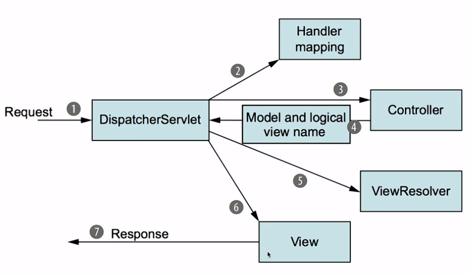

# SpringMVC 底层学习笔记（现代 Java 技术栈）

> **定位**：面向后端接口开发，贯穿原生 SpringMVC 底层原理，无缝衔接 SpringBoot
> **环境**：Spring 5.3.x / Spring 6+，Servlet 3.1+，纯 Java Config，外置 Tomcat（或 Jetty）
> **摒弃**：web.xml、JSP、XML 配置方式。视图解析器仅概念提及，不实操

---

## 1. 核心概念与 Servlet 关系

### 1.1 SpringMVC 是什么

SpringMVC 是 Spring 框架的 Web 模块，基于 **MVC 设计模式**，核心是一套围绕 **前端控制器（Front Controller）** 设计的组件体系。它深度整合 Servlet API，但通过抽象让开发者几乎不用直接操作 `HttpServletRequest/Response`（除非你需要）

---

### 1.2 与 Servlet 的血缘关系

- SpringMVC 的入口是 **`DispatcherServlet`**，它本质就是一个 `Servlet`（继承自 `HttpServlet`）
- 在原生`Servlet`开发中，每个请求需要对应一个`Servlet`或在 `doGet/doPost` 中手写分发逻辑。SpringMVC 将这种分发能力升级为**可插拔的组件链**：请求到达 `DispatcherServlet` 后，由专门的组件负责找到处理器、执行处理器、处理视图/响应
- **一句话**：SpringMVC = 更好用的 Servlet 前端控制器 + 丰富的策略组件

---

## 2. 五大核心组件 & 完整请求执行流程（逐层拆解）

### 2.1 **五大核心组件**

| 组件 | 接口 / 类 | 作用 |
| ------ | ----------- | ------ |
| **DispatcherServlet** | `DispatcherServlet` | 前端**总控**，协调其他组件，本身不干活 |
| **HandlerMapping** | `HandlerMapping` | 根据请求（URL、方法等）**找到**对应的 Handler（处理器） |
| **HandlerAdapter** | `HandlerAdapter` | **适配并执行** Handler，屏蔽不同类型的处理器差异 |
| **Handler（处理器）** | `Object`（通常是我们写的 `@Controller` 方法封装） | 真正**执行业务逻辑**的地方 |
| **HandlerExceptionResolver** | `HandlerExceptionResolver` | **处理**执行过程中抛出的**异常**（视图与 REST 响应的异常统一处理） |

> 关于视图解析器 `ViewResolver`：前后端分离中我们直接返回 JSON 数据，完全不需要它。只有在返回 JSP/模板页面时才用到，本文仅做概念提及

---


> 此图为传统SpringMVc流程图

---

### 2.2 **请求执行流程**（重点，走读每一步）

以一次 `POST /api/users` 且携带 JSON 请求体为例：

1. **请求进入 `DispatcherServlet`**  
   `service()` → `doDispatch()` 方法是整个流程的骨架
2. **根据请求获取 Handler**  
   遍历 `handlerMappings` 集合（默认有 `RequestMappingHandlerMapping` 等），调用 `getHandler(request)` 返回 **HandlerExecutionChain**（包含具体的 Handler 及匹配的拦截器链）
3. **获取适配该 Handler 的 `HandlerAdapter`**  
   遍历 `handlerAdapters`，调用 `supports(handler)` 判断。我们的 `@Controller` 方法会被封装为 `HandlerMethod`，由 `RequestMappingHandlerAdapter` 支持
4. **执行拦截器的 `preHandle`**（正序）  
   如果有拦截器，按注册顺序执行 `preHandle`。返回 `false` 则直接终止请求
5. **Adapter 实际调用 Handler**  
   `handlerAdapter.handle(request, response, handler)` 内部：
   - **解析参数**：借助参数解析器（`HandlerMethodArgumentResolver`），如 `@RequestBody` 由 `RequestResponseBodyMethodProcessor` 借助 `HttpMessageConverter` 把 JSON 转为对象
   - **调用目标方法**：反射执行 `controller.method(...)`
   - **处理返回值**：返回值处理器（`HandlerMethodReturnValueHandler`），如 `@ResponseBody` 由 `RequestResponseBodyMethodProcessor` 借助 `HttpMessageConverter` 将对象序列化为 JSON 写入`response`
6. **执行拦截器的 `postHandle`**（逆序）  
   Adapter 调用完成后，按注册的逆序执行 `postHandle`（此时还未提交响应）
7. **处理异常（如果有）**  
   若 Handler 或拦截器抛出异常，会被 `HandlerExceptionResolver` 捕获处理（如 `@ExceptionHandler` 的机制最终也是通过 `ExceptionHandlerExceptionResolver` 完成）
8. **执行拦截器的 `afterCompletion`**（逆序）  
   在视图渲染完成后或异常处理后执行（确保资源清理）。如果 `preHandle` 成功，对应的 `afterCompletion` 总会执行
9. **返回响应**  
   序列化的 JSON 已写入 response 的输出流，浏览器收到数据

> **关键点**：前后端分离中，第5步的返回值处理直接通过 `HttpMessageConverter` 写入 JSON，**不会经过** `ViewResolver`，也没有“视图渲染”环节

---

## 3. 纯注解方式搭建原生 SpringMVC 环境（外置 Tomcat）

### 3.1 依赖（Maven，Spring 5.3.x）

```xml
<properties>
    <spring.version>5.3.30</spring.version>
    <servlet.api.version>4.0.1</servlet.api.version>
    <jackson.version>2.15.3</jackson.version>
</properties>

<dependencies>
    <!-- Spring Web MVC -->
    <dependency>
        <groupId>org.springframework</groupId>
        <artifactId>spring-webmvc</artifactId>
        <version>${spring.version}</version>
    </dependency>
    <!-- Servlet API（provided，由外置 Tomcat 提供） -->
    <dependency>
        <groupId>javax.servlet</groupId>
        <artifactId>javax.servlet-api</artifactId>
        <version>${servlet.api.version}</version>
        <scope>provided</scope>
    </dependency>
    <!-- Jackson（JSON 支持） -->
    <dependency>
        <groupId>com.fasterxml.jackson.core</groupId>
        <artifactId>jackson-databind</artifactId>
        <version>${jackson.version}</version>
    </dependency>
</dependencies>
```

- **Spring 6+ / Jakarta EE 注意**：  
Servlet API 改为 `jakarta.servlet:jakarta.servlet-api:6.0.0`，Spring MVC 6 已迁移至 Jakarta 命名空间，代码中 `javax.servlet.*` 变为 `jakarta.servlet.*`

---

### 3.2 消除 web.xml：使用 `ServletContainerInitializer` 的实现

Spring 提供了 `AbstractAnnotationConfigDispatcherServletInitializer`，它会自动被 Servlet 3.0+ 容器（如 Tomcat 8+）发现并初始化

```java
package com.example.config;

import org.springframework.web.servlet.support.AbstractAnnotationConfigDispatcherServletInitializer;

/**
 * 替代 web.xml，由 Servlet 容器自动加载
 */
public class MyWebAppInitializer extends AbstractAnnotationConfigDispatcherServletInitializer {

    // 根容器配置类（通常配置 Service、DAO 等）
    @Override
    protected Class<?>[] getRootConfigClasses() {
        return new Class[] { RootConfig.class };
    }

    // DispatcherServlet 容器配置类（仅 MVC 相关）
    @Override
    protected Class<?>[] getServletConfigClasses() {
        return new Class[] { WebConfig.class };
    }

    // DispatcherServlet 映射路径
    @Override
    protected String[] getServletMappings() {
        return new String[] { "/" };
    }
}
```

---

### 3.3 根容器配置（RootConfig）

```java
package com.example.config;

import org.springframework.context.annotation.ComponentScan;
import org.springframework.context.annotation.Configuration;
import org.springframework.context.annotation.FilterType;
import org.springframework.stereotype.Controller;

@Configuration
@ComponentScan(basePackages = "com.example",
               excludeFilters = @ComponentScan.Filter(
                   type = FilterType.ANNOTATION,
                   value = Controller.class))
public class RootConfig {
    // 这里配置 Service、Repository 等非 Web 组件
}
```

---

### 3.4 Web 层配置（WebConfig，替代 springmvc-servlet.xml）

```java
package com.example.config;

import org.springframework.context.annotation.ComponentScan;
import org.springframework.context.annotation.Configuration;
import org.springframework.http.converter.HttpMessageConverter;
import org.springframework.http.converter.json.MappingJackson2HttpMessageConverter;
import org.springframework.web.servlet.config.annotation.EnableWebMvc;
import org.springframework.web.servlet.config.annotation.WebMvcConfigurer;

import java.util.List;

@Configuration
@EnableWebMvc   // 激活默认 SpringMVC 配置（等于 <mvc:annotation-driven/>）
@ComponentScan("com.example.controller")
public class WebConfig implements WebMvcConfigurer {

    // 显式添加 JSON 转换器（其实 @EnableWebMvc 已经自动注册，此处为演示）
    @Override
    public void configureMessageConverters(List<HttpMessageConverter<?>> converters) {
        converters.add(new MappingJackson2HttpMessageConverter());
    }

    // 后续拦截器、静态资源等都在这里配置……
}
```

> **原理解释**：`@EnableWebMvc` 会导入 `DelegatingWebMvcConfiguration`，它将所有 `WebMvcConfigurer` 的实现汇总，完成默认的 HandlerMapping、HandlerAdapter、参数解析器等注册。这就是纯注解背后的魔法

---

## 4. 控制器与请求映射

### 4.1 编写 REST 控制器

```java
package com.example.controller;

import org.springframework.web.bind.annotation.*;

@RestController                 // @Controller + @ResponseBody
@RequestMapping("/api/users")
public class UserController {

    // GET /api/users/123
    @GetMapping("/{id}")
    public String getUser(@PathVariable Long id) {
        return "user:" + id;
    }

    // POST /api/users
    @PostMapping
    public String createUser(@RequestBody User user) {
        // 处理新增
        return "created: " + user.getName();
    }
}
```

- **`@RestController` 本质**：类级别和方法级别都隐含 `@ResponseBody`，所有返回值直接序列化写入响应体，不走视图解析

---

### 4.2 ==@RequestMapping==

- **`@RequestMapping`**:表示为此类中所有请求映射添加一个路径前缀，支持**通配符**
  - `?`:表示任意一个字符
  - `*`:表示0~n个字符
  - `**`:表示当前目录或基于当前目录的多级目录
  - 路径匹配优先级：`?` > `*` > `**`

#### (1)**`@RequestMapping` 常用属性**

| 属性 | 作用 | 示例 |
| ------ | ------ | ------ |
| `value` / `path` | 指定**请求路径** | `@RequestMapping("/user")` |
| `method` | 限制**请求方法** | `method = RequestMethod.POST` |
| `params` | 要求**请求**必须包含某些**参数** | `params = "type=1"` |
| `headers` | 要求**请求头**包含**指定值** | `headers = "X-Requested-With=XMLHttpRequest"` |
| `consumes` | 限定**请求**的 **Content-Type**(内容类型) | `consumes = "application/json"` |
| `produces` | 限定**响应**的 **Content-Type** | `produces = "application/json"` |

#### (2)**组合注解（等价写法）**

| 组合注解 | 等价于 |
| ---------- | -------- |
| `@GetMapping` | `@RequestMapping(method = RequestMethod.GET)` |
| `@PostMapping` | `@RequestMapping(method = RequestMethod.POST)` |
| `@PutMapping` | `@RequestMapping(method = RequestMethod.PUT)` |
| `@DeleteMapping` | `@RequestMapping(method = RequestMethod.DELETE)` |
| `@PatchMapping` | `@RequestMapping(method = RequestMethod.PATCH)` |

---

### 4.3 请求映射规则补充

- **URL 匹配**：`@RequestMapping("/users")` 自动继承到类上方法
- **请求方法限定**：`@GetMapping`、`@PostMapping`、`@PutMapping`、`@DeleteMapping`、`@PatchMapping`
- **进阶匹配**：还可限定 `params`、`headers`、`consumes`（Content-Type）、`produces`（Accept）等，例如：

```java
@PostMapping(value = "/search", produces = "application/jsoncharset=UTF-8")
```

---

## 5. 全套参数绑定

### 5.1 **`@RequestParam`（查询参数 / 表单参数）**

```java
@GetMapping("/hello")
public String hello(@RequestParam("name") String name,
                    @RequestParam(defaultValue = "1") int page) {
    return "Hello " + name + ", page=" + page;
}
// 请求：/hello?name=Jack&page=2   （参数名对应）
// 如果去掉 @RequestParam，对于简单类型依然可自动绑定，但无法设置必填、默认值
```

- `@RequestParam` 用来从 HTTP 请求的查询字符串（? 后面的部分）中**取出某个参数的值**，并**赋给 Controller 方法中的对应参数**
- **常用参数**：

|属性|作用|示例|
|-|-|-|
|`value`（或`name`）|指定URL中的**参数名**（当参数名与方法参数名不同时使用）|`@RequestParam("user_id") Long id`|
|`required`|**是否必须传递**该参数（默认为`true`）|`@RequestParam(required = false) String keyword`|
|`defaultValue`|参数缺失或值为空时使用的**默认值**|`@RequestParam(defaultValue = "1") int page`|

---

### 5.2 Servlet中的类

- 如果需要使用 Servlet 原本的一些类，**直接添加** `HttpServletRequest` 为形式参数即可，SpringMVC 会自动传递该请求原本的 `HttpServletRequest` 对象，同理，我们也可以添加 `HttpServletResponse` 作为形式参数，甚至可以直接将HttpSession也作为参数传递

```java
@RequestMapping(value = "/index")
public ModelAndView index(HttpServletRequest request){
    System.out.println("接受到请求参数: "+request.getParameterMap().keySet());
    return new ModelAndView("index");
}
```

---

### 5.3 实体类绑定（无需注解）

```java
@GetMapping("/search")
public String search(UserQuery query) {
    return "query: " + query;
}
// UserQuery 有属性 name, age。请求 /search?name=Tom&age=20 会自动填充
```

---

### 5.4 `@PathVariable`（路径变量）

`@PathVariable` 用于将 URL 模板中的占位符参数绑定到控制器方法的形参上

```java
@GetMapping("/{id}/detail")
public String detail(@PathVariable("id") Long userId) {
    return "detail of " + userId;
}
```

---

### 5.5 `@RequestBody`（JSON/XML 请求体）

```java
@PostMapping
public Result save(@RequestBody @Valid User user) {
    // 依赖 HttpMessageConverter (Jackson) 反序列化 JSON
    userService.save(user);
    return Result.success();
}
```

- 必须设置 `Content-Type: application/json`
- 搭配 `@Valid` 或 `@Validated` 可触发 Bean Validation

---

### 5.6 请求头 / Cookie

> Cookie（HTTP Cookie） 是服务器发送到用户浏览器并保存在本地的一小块数据，浏览器后续请求时会自动携带它

```java
@GetMapping("/header")
public String readHeader(@RequestHeader("User-Agent") String ua,
                         @CookieValue(value = "JSESSIONID", required = false) String sid) {
    return "UA: " + ua + ", SessionId: " + sid;
}
```

- `@RequestHeader` 和 `@CookieValue` 的用法与 `@RequestParam` 类似，支持 `required`、`defaultValue` 等属性

---

### 5.7 Session 操作

> Session（会话） 是服务器端用来保存同一个用户多次请求之间的状态数据的一种机制

- HttpSession（可读可写,手动转换）

```java
@GetMapping("/profile")
public String profile(HttpSession session) {
    session.setAttribute("userId", 1001);          // 存
    Long id = (Long) session.getAttribute("userId"); // 取（需强转）
    return "id:" + id;
}
```

- @SessionAttribute（只读，自动转换）

```java
@GetMapping("/getUser")
public String getUser(@SessionAttribute("userId") Long userId) {
    return "id:" + userId;
}
```

- @SessionAttribute 支持 `required` 和 `defaultValue` 属性，用法与 `@RequestParam` 类似

---

## 6. 响应处理

### 6.1 `@ResponseBody` 与 `@RestController`

- `@ResponseBody`：方法返回值直接作为 HTTP 响应体，通过 `HttpMessageConverter` 序列化（对象→JSON）。
- `@RestController`：类上同时标注 `@Controller` 和 `@ResponseBody`，该类所有方法均自动具备 `@ResponseBody`。

### 6.2 `ResponseEntity`

提供更细粒度的响应控制（状态码、头）：

```java
@GetMapping("/custom")
public ResponseEntity<String> custom() {
    return ResponseEntity.status(HttpStatus.CREATED)
            .header("X-Custom", "test")
            .body("created success");
}
```

### 6.3 转发与重定向（非 JSON 场景）

虽然前后端分离极少使用，但在某些混合场景仍可出现。必须用在标注 `@Controller`（无 `@ResponseBody`）的方法上：

```java
@Controller
public class LegacyController {

    @GetMapping("/forward-demo")
    public String forwardDemo() {
        // 转发到另一个处理器 /target
        return "forward:/target";
    }

    @GetMapping("/redirect-demo")
    public String redirectDemo() {
        // 重定向
        return "redirect:/other-page";
    }
}
```

如果在 `@RestController` 或带有 `@ResponseBody` 的方法中返回 `"forward:..."`，它会被直接当成字符串写入响应体，不会转发。

---

## 7. 拦截器

### 7.1 实现 `HandlerInterceptor`

```java
package com.example.interceptor;

import org.springframework.web.servlet.HandlerInterceptor;
import javax.servlet.http.HttpServletRequest;
import javax.servlet.http.HttpServletResponse;

public class LoginInterceptor implements HandlerInterceptor {
    @Override
    public boolean preHandle(HttpServletRequest request, HttpServletResponse response,
                             Object handler) throws Exception {
        String token = request.getHeader("Authorization");
        if (token == null || !token.startsWith("Bearer ")) {
            response.setContentType("application/json;charset=UTF-8");
            response.getWriter().write("{\"code\":401,\"msg\":\"未登录\"}");
            return false;
        }
        // 校验 token，可将用户信息放入 request attribute
        return true;
    }
}
```

### 7.2 配置拦截器（Java Config）

在 `WebConfig`（实现 `WebMvcConfigurer`）中覆盖方法：

```java
@Override
public void addInterceptors(InterceptorRegistry registry) {
    registry.addInterceptor(new LoginInterceptor())
            .addPathPatterns("/api/**")          // 拦截路径
            .excludePathPatterns("/api/login", "/api/register"); // 排除
}
```

### 7.3 执行顺序

- **单个拦截器**：`preHandle` → 目标方法 → `postHandle` → `afterCompletion`
- **多个拦截器**：  
  `preHandle-1` → `preHandle-2` → 目标方法 → `postHandle-2` → `postHandle-1` → `afterCompletion-2` → `afterCompletion-1`  
  呈**栈式正序进、逆序出**。

> 注意：只要任意一个 `preHandle` 返回 `false`，后续的处理器和拦截器将不会执行，但之前已成功的拦截器的 `afterCompletion` 仍会执行（清理）。

---

## 8. 全局异常处理

### 8.1 `@ControllerAdvice` + `@ExceptionHandler`
```java
package com.example.advice;

import org.springframework.web.bind.annotation.ExceptionHandler;
import org.springframework.web.bind.annotation.RestControllerAdvice;
import java.util.HashMap;
import java.util.Map;

@RestControllerAdvice   // = @ControllerAdvice + @ResponseBody
public class GlobalExceptionHandler {

    @ExceptionHandler(IllegalArgumentException.class)
    public Map<String, Object> handleIllegalArgument(IllegalArgumentException e) {
        Map<String, Object> result = new HashMap<>();
        result.put("code", 400);
        result.put("msg", e.getMessage());
        return result;
    }

    @ExceptionHandler(Exception.class)
    public Map<String, Object> handleException(Exception e) {
        Map<String, Object> result = new HashMap<>();
        result.put("code", 500);
        result.put("msg", "系统异常：" + e.getMessage());
        // 实际项目应记录日志
        return result;
    }
}
```
- `@RestControllerAdvice` 使得所有异常处理方法都默认带 `@ResponseBody`。
- 建议定义统一返回体 `Result`，而非散装 Map。

### 8.2 异常处理原理简述
`@ControllerAdvice` 注解的类会被 `ExceptionHandlerExceptionResolver` 扫描并内置，发生异常时按类型匹配最近的 `@ExceptionHandler` 方法，通过参数解析器注入异常对象，通过返回值处理器将结果输出。

---

## 9. SpringMVC 与 SpringBoot 的关联与区别

### 9.1 SpringBoot 自动配置了什么
当我们引入 `spring-boot-starter-web`：
- **内嵌 Tomcat**：不再需要外置 Servlet 容器。
- **`DispatcherServlet` 自动注册**：映射路径默认为 `/`，相当于 `AbstractAnnotationConfigDispatcherServletInitializer` 的自动化。
- **自动配置** `WebMvcConfigurer` 各项 Bean：如 `RequestMappingHandlerMapping`、`RequestMappingHandlerAdapter`、`HttpMessageConverters`（Jackson 自动配置）。
- **静态资源**：默认 `/static`、`/public` 等路径映射，无需手动 `addResourceHandlers`。
- **全局异常处理**：`ErrorMvcAutoConfiguration` 提供基础错误页面/JSON。
- **自动扫描**：`@SpringBootApplication` 已包含 `@ComponentScan`，开发者只需写 `@RestController`。

### 9.2 本质区别
| 维度 | 原生 SpringMVC | SpringBoot |
|------|---------------|------------|
| 容器 | 需外置 Tomcat 等，打包 war | 内嵌容器，jar 直接运行 |
| 配置 | 需手写 Initializer + Config 类 | 自动配置，约定大于配置 |
| 依赖 | 手动管理 Spring、Jackson 版本 | 通过 starter 一站式管理 |
| 视图 | 可集成的模板引擎丰富 | 更偏向前后端分离，也支持模板 |

**学透原生 SpringMVC 的价值**：排查问题时能看透 SpringBoot 的自动配置层面，知道内部到底注册了什么 HandlerMapping、消息转换器何时生效，从而精准解决“为什么参数没绑上”“为什么返回 406”等疑难杂症。

---

## 10. 开发高频问题 & 解决方案速查

### 1. 参数接收失败（常见 400 Bad Request）
- **现象**：`Required request parameter 'xxx' is not present`
- **原因**：`@RequestParam` 标注但未传参，且未设 `required=false` 或 `defaultValue`。
- **解决**：合理设置必填属性或改用 `@RequestParam(defaultValue = "...")`。

### 2. JSON 解析异常（415 / 400）
- **现象**：`Content type 'application/x-www-form-urlencoded' not supported` 或 JSON 反序列化失败。
- **原因**：
  - 客户端未设置 `Content-Type: application/json`。
  - 缺少 Jackson 依赖，`HttpMessageConverter` 未注册。
  - JSON 字段与 Java 属性不匹配（驼峰/下划线）。可加 `@JsonProperty` 或配置 `ObjectMapper` 下划线转驼峰。
- **解决**：确保请求头正确、依赖存在，配置如下：
  ```java
  @Override
  public void configureMessageConverters(List<HttpMessageConverter<?>> converters) {
      MappingJackson2HttpMessageConverter converter = new MappingJackson2HttpMessageConverter();
      ObjectMapper mapper = new ObjectMapper();
      mapper.setPropertyNamingStrategy(PropertyNamingStrategy.SNAKE_CASE);
      converter.setObjectMapper(mapper);
      converters.add(converter);
  }
  ```

### 3. 跨域问题（CORS）

- **现象**：浏览器提示 `No 'Access-Control-Allow-Origin' header`。
- **方案1（局部）**：`@CrossOrigin(origins = "http://localhost:3000")` 加在 Controller 或方法。
- **方案2（全局）**：在 `WebConfig` 中覆盖：
  ```java
  @Override
  public void addCorsMappings(CorsRegistry registry) {
      registry.addMapping("/**")
              .allowedOrigins("http://localhost:3000")
              .allowedMethods("*")
              .allowCredentials(true);
  }
  ```

### 4. 中文乱码
- **请求乱码**：Tomcat 默认 URI 编码为 ISO-8859-1，需配置 `server.xml` 中 `URIEncoding="UTF-8"`。SpringBoot 中 `server.tomcat.uri-encoding=UTF-8` 已默认。
- **响应乱码**：确保 `@RequestMapping` 的 `produces = "application/json;charset=UTF-8"` 或全局配置 `StringHttpMessageConverter` 默认 UTF-8。
- **全局过滤器方案**：注册 `CharacterEncodingFilter`：
  ```java
  @Override
  protected Filter[] getServletFilters() {
      CharacterEncodingFilter encodingFilter = new CharacterEncodingFilter();
      encodingFilter.setEncoding("UTF-8");
      encodingFilter.setForceEncoding(true);
      return new Filter[] { encodingFilter };
  }
  ```

### 5. 静态资源 404
在纯注解配置中，`@EnableWebMvc` 会完全接管资源映射，默认不暴露 `*.html` 等。
- **解决**：覆盖 `addResourceHandlers`：
  ```java
  @Override
  public void addResourceHandlers(ResourceHandlerRegistry registry) {
      registry.addResourceHandler("/static/**")
              .addResourceLocations("/static/");
  }
  ```
- 在 SpringBoot 中，静态资源默认位于 `src/main/resources/static`，无需手动配置。

### 6. 请求 404，明明写了 Controller
- **检查**：`@Controller` 或 `@RestController` 是否被扫描到。确认 `@ComponentScan` 包含所在包。
- **检查**：`getServletMappings()` 是否匹配（例如映射为 `/*` 和 `/` 的区别）。
- **检查**：方法上是否标注了 `@RequestMapping` 且路径正确。

---

## 附录：完整项目结构示例
```
src/main/java
 └ com.example
    ├ config
    │   ├ MyWebAppInitializer.java
    │   ├ RootConfig.java
    │   └ WebConfig.java
    ├ controller
    │   └ UserController.java
    ├ interceptor
    │   └ LoginInterceptor.java
    └ advice
        └ GlobalExceptionHandler.java
```

编译后部署至 Tomcat 即可运行，所有请求从 `/` 进入 `DispatcherServlet`，按照本文讲解的流程执行。

---
