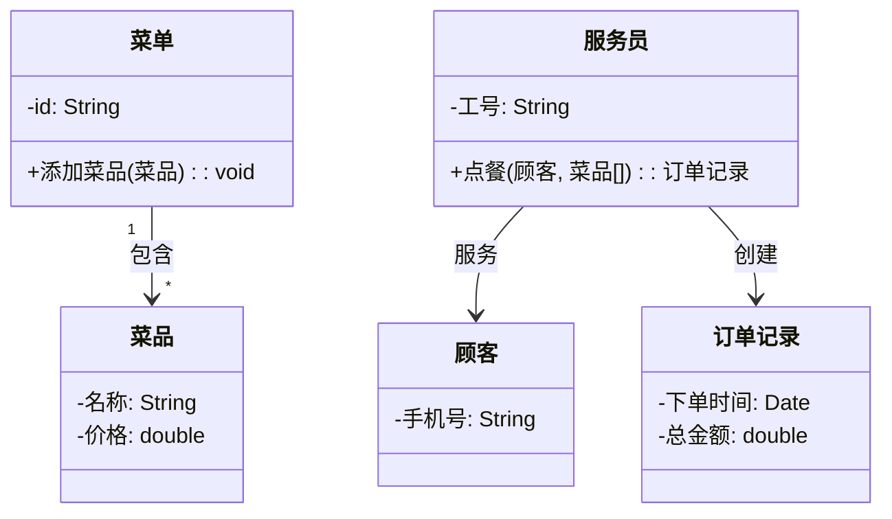

# 类图绘画方法

## 系统的设计思路

### 一、核心设计思想：分层架构

参考图（Video Rental System）采用了一个非常经典的分层设计：

```Java
┌─────────────────────────────────────────┐
│  控制层（VRS / LMS）← 用户直接交互        │
│  - 接收用户操作（借书、还书、查书...）      │
│  - 调用数据库层完成功能                    │
├─────────────────────────────────────────┤
│  数据库层（BookDB / MemberDB / RentalDB） │
│  - 管理实体的增删改查                      │
│  - 提供迭代器遍历所有记录                   │
├─────────────────────────────────────────┤
│  实体层（Book / Member / Rental）        │
│  - 纯数据对象，只有属性和getter             │
│  - 代表真实世界中的对象                     │
└─────────────────────────────────────────┘
```

## 控制层 vs DB层 vs 实体层 对比表

| 对比维度 | 控制层 | DB层 | 实体层 |
| ---------- | ------------------ | ------------------------ | ------------------------------- |
| **类名** | 系统缩写（LMS、VRS） | 实体名 + DB（BookDB） | 纯实体名（Book、Member） |
| **属性** | 无属性，只有DB引用（private BookDB bookDB） | 无显式属性，内部是集合（List\<Book>） | 业务属性（-ISBN、-title、-status） |
| **方法** | 业务流程方法（rent、return、display、generateReport） | 增删查方法（add、remove、get、getNumber、getIterator） | 只有getter/setter（getISBN()、getTitle()） |
| **方法参数** | 业务ID（String memberId, String ISBN） | 实体对象或ID（Book book, String id） | 无参数 |
| **返回值** | void 或 业务对象 | 实体对象 / int / Iterator | 属性类型（String、int、double） |
| **连线对象** | 只连DB层（不连实体） | 连控制层 + 连实体层 | 被DB层连 + 被关联类连 |
| **箭头方向** | 指向DB（我用DB） | 指向实体（我管实体） | 被指向（我被管） |
| **多重性** | 1:1（一个系统配一个DB） | 1:*（一个DB管多个实体） | *:1（多个实体被一个DB管） |
| **角色名** | -bookDB、-memberDB | -books、-members | -book、-member（在关联类中） |
| **是否有构造方法** | 有，初始化所有DB引用 | 有，初始化集合 | 有，初始化属性 |
| **是否单例** | 通常单例（整个系统一个入口） | 通常单例（一个系统一个数据库） | 多实例（每本书是一个对象） |
| **代码类比** | Controller / Service | DAO / Repository | POJO / Entity / Bean |
| **职责** | 接收请求、调度协调、返回结果 | 数据存储、查询、遍历 | 封装数据、提供访问 |
| **能否直接操作实体** | ❌ 不能，必须通过DB层 | ✅ 能，直接管理实体 | ❌ 不能，只被管理 |

---

### 二、为什么要分这三层？

| 层级 | 职责 | 类比 |
|------|------|------|
| **控制层 (LMS)** | 业务流程控制，用户界面交互 | 餐厅前台服务员 |
| **数据库层 (BookDB)** | 数据存储、查询、管理 | 后厨仓库管理员 |
| **实体层 (Book)** | 纯数据定义 | 菜单上的菜品描述 |

**没有分层的问题**：如果把所有功能都塞到一个类里，类会变得巨大且混乱，难以维护。

---

### 三、逐类解析

#### 1. 实体层（最底层）

```Java
┌─────────────┐     ┌─────────────┐     ┌─────────────┐
│    Book     │     │   Member    │     │  Borrowing  │
├─────────────┤     ├─────────────┤     ├─────────────┤
│ -ISBN       │     │ -memberId   │     │ -recordId   │
│ -title      │     │ -name       │     │ -borrowDate │
│ -author     │     │ -email      │     │ -dueDate    │
│ ...         │     │ ...         │     │ ...         │
├─────────────┤     ├─────────────┤     ├─────────────┤
│ +getISBN()  │     │ +getId()    │     │ +getBook()  │
│ +getTitle() │     │ +getName()  │     │ +getMember()│
└─────────────┘     └─────────────┘     └─────────────┘
```

**特点**：

- 只有 **private 属性** 和 **getter 方法**
- 没有业务逻辑（如"借书"操作）
- 就像数据库表的一行记录

**Borrowing 的特殊之处**：它同时关联 Book 和 Member

```Java
Borrowing ──book──→ Book (1:1)
Borrowing ──member──→ Member (1:1)
```

表示"谁借了哪本书"。

---

#### 2. 数据库层（中间层）

```Java
┌─────────────┐     ┌─────────────┐     ┌─────────────┐
│   BookDB    │     │  MemberDB   │     │ BorrowingDB │
├─────────────┤     ├─────────────┤     ├─────────────┤
│             │     │             │     │             │
├─────────────┤     ├─────────────┤     ├─────────────┤
│ +addBook()  │     │ +addMember()│     │ +addBorrow()│
│ +removeBook()│    │ +removeMember()│   │ +removeBorrow()│
│ +getBook()  │     │ +getMember()│     │ +getBorrow()│
│ +getNumber()│     │ +getNumber()│     │ +getNumber()│
│ +getIterator()│    │ +getIterator()│    │ +getIterator()│
└─────────────┘     └─────────────┘     └─────────────┘
```

**作用**：

- 像是一个 **List<Book>** 的包装器
- 提供统一的增删查接口
- `getIterator()` 让你能遍历所有记录（用于生成报表）

**为什么不用直接用 List？**

- 封装：隐藏具体数据结构（今天用ArrayList，明天可能改数据库）
- 验证：addBook时可以检查重复ISBN
- 扩展：可以加入缓存、日志等功能

---

#### 3. 控制层（最顶层）

```Java
┌─────────────────────┐
│        LMS          │
├─────────────────────┤
│                     │
├─────────────────────┤
│ +displayBookDB()    │  ← 查：显示所有书
│ +displayBook(id)    │  ← 查：显示某本书详情
│ +displayMemberDB()  │  ← 查：显示所有会员
│ +displayMemberBooks()│ ← 查：显示某会员借的书
│ +borrowBook()       │  ← 增：借书（创建Borrowing记录）
│ +returnBook()       │  ← 改：还书（更新Borrowing记录）
│ +reserveBook()      │  ← 增：预约（创建Reservation记录）
│ +renewBook()        │  ← 改：续借（更新dueDate）
│ +generateReport()   │  ← 查：生成报表
└─────────────────────┘
```

**这是用户唯一能直接操作的类**。

---

### 四、关系连线详解

#### 关系1：LMS → BookDB (1:1)

```Java
LMS ────bookDB────→ BookDB
      1           1
```

**含义**：LMS 内部有一个 BookDB 对象作为成员变量。

```java
class LMS {
    private BookDB bookDB;  // ← 这条线表示这个
    private MemberDB memberDB;
    private BorrowingDB borrowingDB;
}
```

#### 关系2：BookDB → Book (1:*)

```
BookDB ────books────→ Book
       1           *
```

**含义**：BookDB 管理着多本 Book。

```java
class BookDB {
    private List<Book> books;  // ← 这条线表示这个
}
```

#### 关系3：Borrowing → Book (1:1)

```
Borrowing ────book────→ Book
        1           1
```

**含义**：每条借阅记录指向一本具体的书。

```java
class Borrowing {
    private Book book;   // ← 这条线表示这个
    private Member member;
}
```

---

### 五、完整交互流程：借一本书

```
用户调用: LMS.borrowBook(memberId, bookISBN)

    ↓
LMS 内部：
  1. memberDB.getMember(memberId)  → 获取 Member 对象
  2. bookDB.getBook(bookISBN)      → 获取 Book 对象
  3. 检查 Book 的 status 是否为 "available"
  4. 检查 Member 的 currentBorrowed < maxBooksAllowed
  5. 创建新的 Borrowing 对象
  6. borrowingDB.addBorrowing(newBorrowing)
  7. 更新 Book 的 status 为 "borrowed"
  8. 更新 Member 的 currentBorrowed +1

    ↓
返回成功/失败
```

---

### 六、对比：你的图 vs 标准答案

| 方面 | 标准答案 | 常见错误 |
|------|----------|----------|
| **分层** | 明确三层（控制/DB/实体） | 混在一起，没有DB类 |
| **箭头方向** | 从使用者指向被使用者 | 方向混乱 |
| **角色名** | 标注 `-bookDB`、`-books` | 不写或写错 |
| **多重性** | 明确标注 1 或 * | 遗漏 |
| **方法归属** | 业务方法在LMS，getter在实体 | 方法放错类 |

---

### 七、**记忆口诀**

> **"控制用DB，DB管实体，实体纯数据"**

- **控制层**（LMS）**用** 数据库层（调用DB的方法）
- **数据库层**（BookDB）**管** 实体层（存储实体对象）
- **实体层**（Book）**纯数据**（只有属性和getter）

---

## 方向一：根据“文字描述”画类图（提取->转化）

**核心心法**：把自然语言翻译成UML的“名词/动词/形容词”。

1. **第一步：划名词（找类）**
   - 阅读描述，圈出所有**名词**（包括隐含的）。
   - *规则*：名词通常对应类，但**系统边界外的角色**（如“银行系统”中的“用户”）和**纯数值**（如“金额”）需单独判断。
   - *例*：“学生借阅书籍” -> 类有：`学生`、`书籍`、`借阅记录`（隐含的关联中间类）。

2. **第二步：划形容词/数词（定属性）**
   - 描述中修饰名词的词汇，以及名词自带的特征，就是属性。
   - *规则*：只保留**核心特征**（如ID、名称、状态），描述业务流程的动词属性（如“借阅时间”）通常放在关联类或方法参数里。
   - *例*：“学生有**学号**和**姓名**，书籍有**编号**和**书名**” -> 属性直接对应。

3. **第三步：划动词（定方法）**
   - 描述中涉及的动作（行为）通常映射为类的方法。
   - *规则*：动词属于**动作的发起者**（主语）。如果动作涉及两个对象，通常写在**主导者**一侧。
   - *例*：“学生**借阅**书籍” -> `借阅()` 方法放在 `学生` 类中。

4. **第四步：划关联词（定关系与多重性）**
   - 找“拥有”、“属于”、“包含”、“使用”等词。
   - **数量判断**：看数量词（一个、多个、0..*）。如果没写，默认 `1` 对 `*`。
   - **强弱判断**：“拥有/包含”通常是聚合（空心菱形）或组合（实心菱形），“使用/依赖”是虚线箭头。

---

## 方向二：根据“类图”写类定义（符号->代码）

**核心心法**：把UML符号逐一映射到编程语言关键字。

1. **第一步：读类名和可见性**
   - 矩形框顶部的名字 -> `class ClassName {}`。
   - ==符号映射==：**`+`（public）、`-`（private）、`#`（protected）、`~`（default/package）**。

2. **第二步：翻译属性和方法**
   - `- name: String` -> `private String name;`。
   - `+ getName(): String` -> `public String getName() { return name; }`（仅定义签名时可以先写空方法体）。
   - **类型映射**：UML的 `String`、`int`、`Date` 对应 Java的 `String`、`int`、`LocalDateTime`，Python则不需要显式类型，用注解即可。

3. **第三步：翻译关联关系（最重要的一步）**
   - **直线关联（包含聚合/组合）**：不管有没有箭头，只要A连到B，就在A类中**声明一个B类型的成员变量**（如 `private List<B> bList;`）。如果是组合（实心菱形），通常在该类构造方法内直接 `new B()`。
   - **依赖（虚线箭头）**：只在方法参数或局部变量中使用，**不声明为成员变量**（如 `public void method(B b) {}`）。
   - **继承（空心三角实线）** -> `class A extends B`。
   - **实现（空心三角虚线）** -> `class A implements B`。

4. **第四步：生成骨架代码**
   - 先只写成员变量和方法的**空壳**（签名），无需立刻写业务逻辑（`System.out.println`），先确保结构完整。

---

## 即时演练（跟着我来做一次）

**假设描述**：“一个餐厅系统，菜单包含多道菜品。每道菜品有名称和价格。服务员可以帮顾客点餐，点餐会生成订单记录。”

**第一步（画类图流程）**：

- 名词 -> 类：`菜单`、`菜品`、`服务员`、`顾客`、`订单记录`。
- 形容词 -> 属性：`菜品`（名称、价格）、`订单记录`（时间、总价）。
- 动词 -> 方法：`服务员` 的 `点餐()`。
- 关联与多重性：
  - “菜单**包含**多道菜品”（组合，因为菜单没了菜品一般也就没了，1对多）。
  - “服务员**帮**顾客”（依赖或关联，为了简单这里做单向关联）。
  - “点餐**生成**订单记录”（关联，1对1或1对多）。

**生成的类图（Mermaid代码）**：



**第二步（写代码流程 - 以Java为例）**：

1. 写类：`public class 菜品 {}`
2. 写属性：`private String 名称; private double 价格;`
3. 写关系：在 `菜单` 类里写 `private List<菜品> 菜品列表;`；在 `服务员` 类里写 `public 订单记录 点餐(顾客 c, 菜品[] items) { return new 订单记录(); }`

---
