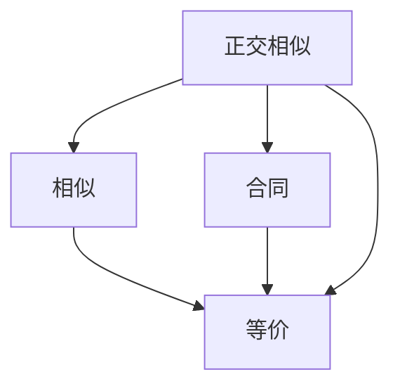

# 第六章 二次型

## 第一节 二次型的基本概念

### 1. 定义

**定义 6.1**:

$n$ 个变量 $x_1,x_2,\cdots,x_n$ 的二次齐次函数

$$
f(x_1,x_2,\cdots,x_n)=\sum_{i,j=1}^{n}a_{ij}x_ix_j
$$

称为一个 $n$ 元二次型，简称**二次型**

> 当系数 $a_{ij}$ 均为实数时称为实二次型（本章仅讨论实二次型）

### 2. 矩阵表示

由于 $x_ix_j=x_jx_i$，令 $a_{ij}=a_{ji}$（$i\neq j$），则二次型可写成：

$$
\boxed{f(\boldsymbol{x})=\boldsymbol{x}^\mathrm{T}A\boldsymbol{x}}
$$

其中 $\boldsymbol{x}=(x_1,\cdots,x_n)^\mathrm{T}$，$A=(a_{ij})_{n\times n}$ 为实对称矩阵 

> [!NOTE]
> **关键性质**：二次型 $f$ 与实对称矩阵 $A$ 一一对应

**定义 6.2**：

称上式为 $n$ 元二次型的矩阵表示，实对称矩阵 $A$ 称为二次型 $f$ 的矩阵，$f$ 称为实对称矩阵 $A$ 的二次型， $R(A)$ 称为二次型 $f$ 的秩

> [!NOTE]
> 1. 平方项系数直接放主对角线
> 2. 交叉项系数除以 2，分别放在两个对称位置上
   例：$-x_2x_3$ 的系数为 $-1$，则 $a_{23}=a_{32}=-\frac{1}{2}$

### 3. 标准形与规范形

- **标准形（定义 6.3）**：只含平方项的二次型
  $$
  f=d_1y_1^2+d_2y_2^2+\cdots+d_ny_n^2
  $$
  其矩阵为对角矩阵
- **规范形**：标准形中系数 $d_i$ 只**在 $\{1,-1,0\}$ 中取值**的形式(先1，后-1，最后0)：
  $$
  f=y_1^2+\cdots+y_p^2-y_{p+1}^2-\cdots-y_r^2
  $$

---

## 第二节 用正交变换化二次型为标准形

### 1. **线性变换与合同**

设 $\boldsymbol{x}=C\boldsymbol{y}$（$C$ 为 $n$ 阶方阵）：

- **$C$ 可逆 $\Rightarrow$ 可逆线性变换，逆变换 $\boldsymbol{y}=C^{-1}\boldsymbol{x}$**
- **$C$ 正交矩阵 $\Rightarrow$ 正交变换（必可逆）**

代入二次型：
$$
f=\boldsymbol{x}^\mathrm{T}A\boldsymbol{x}=\boldsymbol{y}^\mathrm{T}(C^\mathrm{T}AC)\boldsymbol{y}=\boldsymbol{y}^\mathrm{T}B\boldsymbol{y}
$$
其中 $B=C^\mathrm{T}AC$

**定义 6.4（合同）**：

设 $A,B$ 为同阶方阵，若存在可逆矩阵 $C$ ，使 $B=C^\mathrm{T}AC$。则称 $A$ 与 $B$ **合同**，记作 $A\simeq B$，或称矩阵B是A的**合同矩阵**，对方阵A作运算$C^\mathrm{T}AC$称为对A进行**合同变换**，可逆矩阵C称为把A变为B的**合同变换矩阵**

> [!NOTE]
> **定理 6.1**：
>
> 对二次型作线性变换仍变为二次型；若变换可逆，则二次型的秩不变

> [!WARNING]
> 合同 $\Rightarrow$ 等价 $\Rightarrow$ 等秩；但等价不一定合同

#### 合同的基本性质

若 $A\simeq B$，则：
1. $R(A)=R(B)$
2. $A$ 对称 $\Leftrightarrow$ $B$ 对称
3. $A,B$ 可逆 $\Rightarrow$ $A^{-1}\simeq B^{-1}$
4. $A^\mathrm{T}\simeq B^\mathrm{T}$

### 2. 正交变换化标准形

**定理 6.2**：

任意 $n$ 元实二次型 $f=\boldsymbol{x}^\mathrm{T}A\boldsymbol{x}$，都可经正交变换 $\boldsymbol{x}=Q\boldsymbol{y}$ 化为标准形：

$$
\boxed{f=\boldsymbol{y}^\mathrm{T}\Lambda\boldsymbol{y}=\lambda_1y_1^2+\lambda_2y_2^2+\cdots+\lambda_ny_n^2}
$$
其中 $\Lambda=\mathrm{diag}(\lambda_1,\cdots,\lambda_n)$，$\lambda_i$ 恰为 $A$ 的 $n$ 个特征值

> [!NOTE]
> **步骤**（与实对称矩阵正交相似对角化完全一致）：
>
> 1. 写出二次型矩阵 $A$
> 2. 求 $A$ 的特征值
> 3. 求特征向量并正交单位化
> 4. 构造正交矩阵 $Q=(\xi_1,\xi_2,\cdots,\xi_n)$，得 $\boldsymbol{x}=Q\boldsymbol{y}$

- 正交变换不唯一，所得标准形也不一定相同（特征值排列顺序可不同）
- **保范性**：正交变换保持向量长度不变：$|\boldsymbol{x}|=|\boldsymbol{y}|$

### 3. 等价、相似、正交相似、合同的关系

| 关系 | 条件 | 公式 |
|------|------|------|
| **等价** | $A,B$ 同型，存在可逆 $P,Q$ | $PAQ=B$ |
| **相似** | $A,B$ 同阶，存在可逆 $P$ | $P^{-1}AP=B$ |
| **正交相似** | $A,B$ 同阶，存在正交 $P$ | $P^{-1}AP=P^\mathrm{T}AP=B$ |
| **合同** | $A,B$ 同阶，存在可逆 $P$ | $P^\mathrm{T}AP=B$ |

> [!NOTE]
>
> **推论 1**：$A,B$ 为 $n$ 阶实对称矩阵，若 $A\sim B$（相似），则 $A\simeq B$（合同）
> **推论 2**：任意实二次型都可经可逆变换化为规范形

---

## 第三节 **用配方法化二次型为标准形**

### 1. 配方法步骤

**情形一：含有平方项**（如 $a_{11}\neq 0$）

把所有含 $x_1$ 的项集中配成完全平方，使配方后其余项中不再含 $x_1$；再对 $x_2$ 配方，以此类推

**情形二：不含平方项，只有交叉项**（如 $a_{ii}=0$ 但 $a_{ij}\neq 0$）

先作可逆线性变换产生平方项：
$$
\begin{cases}
x_i=y_i+y_j\\
x_j=y_i-y_j\\
x_k=y_k\quad(k\neq i,j)
\end{cases}
$$
再按情形一配方

### 2. 初等变换法（合同变换法）

对 $A$ 作有限次相同的初等行变换和初等列变换（即合同变换），同时对单位矩阵 $E$ 只作相应的列变换：

$$
\begin{pmatrix}A\\ \hline E\end{pmatrix}\xrightarrow{\text{对 }A\text{ 作行(列)变换，对 }E\text{ 作相应列(行)变换}}\begin{pmatrix}\Lambda\\ \hline C\end{pmatrix}
$$
则 $C^\mathrm{T}AC=\Lambda$，令 $\boldsymbol{x}=C\boldsymbol{y}$ 即得标准形

---

## 第四节 正定二次型

### 1. 惯性定理

**定理 6.3（惯性定理）**：

设实二次型 $f=\boldsymbol{x}^\mathrm{T}A\boldsymbol{x}$ 的秩为 $r$，在不同可逆线性变换下的标准形分别为
$$
f=\lambda_1y_1^2+\cdots+\lambda_ry_r^2,\quad f=\mu_1z_1^2+\cdots+\mu_rz_r^2
$$
则 $\lambda_1,\cdots,\lambda_r$ 中正数的个数与 $\mu_1,\cdots,\mu_r$ 中正数的个数**相同**

**定义 6.5**：

- 标准形中正系数的个数 $\rightarrow$ **正惯性指数**（记为 $p$）
- 标准形中负系数的个数 $\rightarrow$ **负惯性指数**（记为 $r-p$）
- **符号差** $=$ 正惯性指数 $-$ 负惯性指数 $=2p-r$

> [!NOTE]
> **推论**：$n$ 阶实对称矩阵 $A$ 与 $B$ **合同的充要条件**是：$A$ 与 $B$ 的大于 $0$ 的特征值个数和小于 $0$ 的特征值个数**分别相同**

### 2. 正定性定义

**定义 6.6**：

设 $f=\boldsymbol{x}^\mathrm{T}A\boldsymbol{x}$ 为实二次型，
- 若对任意 $\boldsymbol{x}\neq\boldsymbol{0}$，都有 $f>0$，称 $f$ 为**正定二次型**，$A$ 为**正定矩阵**
- 若对任意 $\boldsymbol{x}\neq\boldsymbol{0}$，都有 $f<0$，称 $f$ 为**负定二次型**，$A$ 为**负定矩阵**

**定义 6.7**：

- 若对任意 $\boldsymbol{x}\neq\boldsymbol{0}$，都有 $f\geq 0$，称 $f$ 为**半正定二次型**，$A$ 为**半正定矩阵**
- 若对任意 $\boldsymbol{x}\neq\boldsymbol{0}$，都有 $f\leq 0$，称 $f$ 为**半负定二次型**，$A$ 为**半负定矩阵**

> [!TIP]
> **注意区分：** 半正定允许 $f=0$（如 $f=x_1^2+2x_2^2+0\cdot x_3^2$，取 $(0,0,1)$ 时 $f=0$）

### 3. 正定性判定定理

#### 方法一：惯性指数法

**定理 6.4**：

$n$ 元实二次型 $f=\boldsymbol{x}^\mathrm{T}A\boldsymbol{x}$ 为**正定的充要条件**是 $f$ 的正惯性指数等于 $n$

$f$ 为负定的**充要条件**是 $f$ 的负惯性指数等于 $n$

**推论 1**：半正定的充要条件是负惯性指数等于 $0$；半负定的充要条件是正惯性指数等于 $0$

#### 方法二：特征值法

**推论 2**：$n$ 阶实对称矩阵 $A$

- 正定 $\Leftrightarrow$ $A$ 的 $n$ 个特征值全是正数
- 负定 $\Leftrightarrow$ $A$ 的 $n$ 个特征值全是负数
- 半正定 $\Leftrightarrow$ $A$ 没有负特征值（特征值 $\geq 0$）
- 半负定 $\Leftrightarrow$ $A$ 没有正特征值（特征值 $\leq 0$）

#### 方法三：顺序主子式法（最实用）

**定义 6.8**：

$n$ 阶方阵 $A=(a_{ij})$ 的左上角的 $k$ 阶子式
$$
D_k=\begin{vmatrix}
a_{11}&\cdots&a_{1k}\\
\vdots&\ddots&\vdots\\
a_{k1}&\cdots&a_{kk}
\end{vmatrix}\quad(k=1,2,\cdots,n)
$$
称为 $A$ 的 $k$ 阶顺序主子式

**定理 6.5（Hurwitz 赫尔维茨定理）**：

- $A$ 正定 $\Leftrightarrow$ **各阶**顺序主子式**都大于** $0$
  $$D_1>0,\;D_2>0,\;\cdots,\;D_n=|A|>0$$
- $A$ 负定 $\Leftrightarrow$ **奇数阶**顺序主子式 $<0$，**偶数阶**顺序主子式 $>0$
  $$D_1<0,\;D_2>0,\;D_3<0,\;\cdots$$

### 4. 正定矩阵的重要性质

设 $A$ 正定，则：

1. $A^{-1}$ 也正定；
2. $A^*$（伴随矩阵）也正定
3. $A^k$（$k$ 为正整数）也正定
4. 若 $B$ 正定（或半正定），则 $A+B$ 正定
5. $A$ 的主对角线元素都大于 $0$
6. 正定二次型经过可逆线性替换后仍是正定的

> [!IMPORTANT]
> 正定 $\Leftrightarrow$ 正惯性指数 $=n$ $\Leftrightarrow$ $n$ 个特征值 $>0$ $\Leftrightarrow$ $A\simeq E$ $\Leftrightarrow$ 标准形系数全 $>0$ $\Leftrightarrow$ $|A|>0$

---

## 第五节 二次型应用实例（概要）

### 1. 二次曲面图形的判定

利用正交变换（保持图形形状不变）和平移变换，将二次曲面方程化为标准形，从而判定曲面类型（椭球面、双曲面、抛物面等）。

### 2. 多元函数极值的判定（Hesse 矩阵）

设 $n$ 元函数 $f(\boldsymbol{x})$ 在 $\boldsymbol{x}_0$ 处具有二阶连续偏导数，则
$$
H(\boldsymbol{x}_0)=\begin{pmatrix}
f''_{11}&f''_{12}&\cdots&f''_{1n}\\
f''_{21}&f''_{22}&\cdots&f''_{2n}\\
\vdots&\vdots&\ddots&\vdots\\
f''_{n1}&f''_{n2}&\cdots&f''_{nn}
\end{pmatrix}
$$
称为 $f$ 在 $\boldsymbol{x}_0$ 处的 Hesse 矩阵。

- $H(\boldsymbol{x}_0)$ 正定 $\Rightarrow$ $f$ 在 $\boldsymbol{x}_0$ 取极小值；
- $H(\boldsymbol{x}_0)$ 负定 $\Rightarrow$ $f$ 在 $\boldsymbol{x}_0$ 取极大值；
- $H(\boldsymbol{x}_0)$ 不定 $\Rightarrow$ $\boldsymbol{x}_0$ 不是极值点；
- $H(\boldsymbol{x}_0)$ 半正定/半负定 $\Rightarrow$ 需另行判定

---
