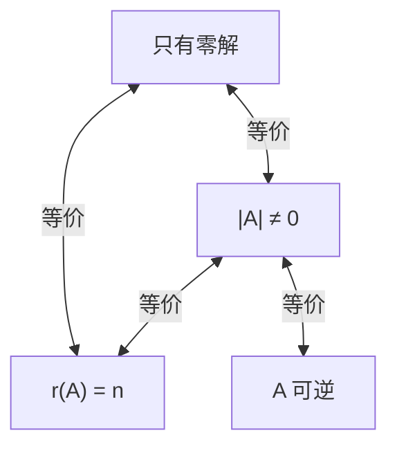

# 第四章 线性方程组

## 第一节 线性方程组解的判定

### 一、线性方程组的一般形式

$$
\begin{cases}
a_{11}x_1 + a_{12}x_2 + \cdots + a_{1n}x_n = b_1 \\
a_{21}x_1 + a_{22}x_2 + \cdots + a_{2n}x_n = b_2 \\
\cdots\cdots\cdots\cdots \\
a_{m1}x_1 + a_{m2}x_2 + \cdots + a_{mn}x_n = b_m
\end{cases}
$$

其中 $x_1, x_2, \cdots, x_n$ 表示 $n$ 个未知量，$m$ 是方程的个数，$a_{ij}$ 表示第 $i$ 个方程中第 $j$ 个未知量 $x_j$ 的系数，$b_i$ 为常数项

- 如果 $b_1 = b_2 = \cdots = b_m = 0$，则称为**齐次线性方程组**
- 否则（即 $b_1, b_2, \cdots, b_m$ 不全为零），称为**非齐次线性方程组**

### 二、矩阵形式与向量形式

**矩阵形式**：
$$\boldsymbol{A}\boldsymbol{x} = \boldsymbol{\beta}$$

其中：
- **系数矩阵** $\boldsymbol{A} = \begin{pmatrix} a_{11} & a_{12} & \cdots & a_{1n} \\ a_{21} & a_{22} & \cdots & a_{2n} \\ \vdots & \vdots & & \vdots \\ a_{m1} & a_{m2} & \cdots & a_{mn} \end{pmatrix}$
- **未知量向量** $\boldsymbol{x} = \begin{pmatrix} x_1 \\ x_2 \\ \vdots \\ x_n \end{pmatrix}$
- **常数项向量** $\boldsymbol{\beta} = \begin{pmatrix} b_1 \\ b_2 \\ \vdots \\ b_m \end{pmatrix}$

- **增广矩阵**：$(\boldsymbol{A} \mid \boldsymbol{\beta})$

**向量形式**：
记 $\boldsymbol{\alpha}_j = \begin{pmatrix} a_{1j} \\ a_{2j} \\ \vdots \\ a_{mj} \end{pmatrix}$（$j=1,2,\cdots,n$），则
$$x_1\boldsymbol{\alpha}_1 + x_2\boldsymbol{\alpha}_2 + \cdots + x_n\boldsymbol{\alpha}_n = \boldsymbol{\beta}$$

### 三、解的定义

如果一组数 $c_1, c_2, \cdots, c_n$ 满足 $c_1\boldsymbol{\alpha}_1 + c_2\boldsymbol{\alpha}_2 + \cdots + c_n\boldsymbol{\alpha}_n = \boldsymbol{\beta}$，则称 $\boldsymbol{\eta} = (c_1, c_2, \cdots, c_n)^\mathrm{T}$ 为线性方程组的一个**解向量**，简称为一个**解**

- **解线性方程组**就是求出它的解集合
- 如果两个方程组有相同的解集合，就称它们是**同解线性方程组**

### 四、**解的判定定理**

**定理 4.1**

==线性方程组 $\boldsymbol{A}\boldsymbol{x} = \boldsymbol{\beta}$ **有解的充要条件**是它的系数矩阵 $\boldsymbol{A}$ 的秩等于增广矩阵 $(\boldsymbol{A} \mid \boldsymbol{\beta})$ 的秩==，即
$$R(\boldsymbol{A}) = R(\boldsymbol{A} \mid \boldsymbol{\beta})$$

> [!TIP]
> **原因：**$\boldsymbol{\beta}$ 可由 $\boldsymbol{A}$ 的列向量组线性表示 $\iff R\{\boldsymbol{\alpha}_1, \cdots, \boldsymbol{\alpha}_n\} = R\{\boldsymbol{\alpha}_1, \cdots, \boldsymbol{\alpha}_n, \boldsymbol{\beta}\}$

==**定理 4.2**==

设 $R(\boldsymbol{A}) = R(\boldsymbol{A} \mid \boldsymbol{\beta}) = r$，则：

| 情况 | 解的情况 |
|------|----------|
| $r = n$（未知量个数） | **唯一解**(因为对增广矩阵作初等变换时对应的线性方程组的解不变) |
| $r < n$ | **无穷多个解**，通解中包含 $n-r$ 个任意参数 |

> [!NOTE]
> $R(\boldsymbol{A}) \neq R(\boldsymbol{A} \mid \boldsymbol{\beta}) \iff$ 无解

==**求解步骤**==：
1. 写出 $(\boldsymbol{A} \mid \boldsymbol{\beta})$
2. 初等行变换为阶梯形
3. 比较 $R(\boldsymbol{A})$ 与 $R(\boldsymbol{A} \mid \boldsymbol{\beta})$
4. 若相等，继续化为行最简形
5. 将非零行的首非零元留在左边，其余变量移到右边，得一般解

### 五、**齐次线性方程组**

对于齐次线性方程组 $\boldsymbol{A}\boldsymbol{x} = \boldsymbol{0}$（即 $\boldsymbol{\beta} = \boldsymbol{0}$）：

> [!NOTE]
> 总有 $R(\boldsymbol{A}) = R(\boldsymbol{A} \mid \boldsymbol{0})$，所以**齐次线性方程组总是有解的**（至少有零解）

**定理 4.3** 
- 当 $R(\boldsymbol{A}) = n$ 时，$n$ 元齐次线性方程组 $\boldsymbol{A}\boldsymbol{x} = \boldsymbol{0}$ **只有零解**
- 当 $R(\boldsymbol{A}) = r < n$ 时，有**无穷多个解**（当然有非零解），且通解中包含 $n-r$ 个任意参数

> [!NOTE]
> - 方程个数 = 未知量个数 = $n$
> - ==有非零解== $\iff |\boldsymbol{A}| = 0 \iff R(\boldsymbol{A}) < n \iff \boldsymbol{A}$ 不可逆
> - ==只有零解==：

> [!IMPORTANT]
> 🔴 **重要结论**：方程组 $\boldsymbol{A}_{m \times n}\boldsymbol{x} = \boldsymbol{0}$ 仅有零解的充要条件是 $R(\boldsymbol{A}) = n$，即 $\boldsymbol{A}$ 的列向量组线性无关

---

## 第二节 线性方程组解的结构

### 一、齐次线性方程组解的结构

齐次线性方程组如果有非零解，那么一定有无穷多解

**性质 4.1**

设 $\boldsymbol{\xi}_1, \boldsymbol{\xi}_2$ 是齐次线性方程组 $\boldsymbol{A}\boldsymbol{x} = \boldsymbol{0}$ 的两个解向量，则 $\boldsymbol{\xi}_1 + \boldsymbol{\xi}_2$ 也是 $\boldsymbol{A}\boldsymbol{x} = \boldsymbol{0}$ 的解向量

**性质 4.2**

设 $\boldsymbol{\xi}$ 是齐次线性方程组 $\boldsymbol{A}\boldsymbol{x} = \boldsymbol{0}$ 的解向量，$k$ 是任意常数，则 $k\boldsymbol{\xi}$ 也是 $\boldsymbol{A}\boldsymbol{x} = \boldsymbol{0}$ 的解向量

**推论**：如果 $\boldsymbol{\xi}_1, \boldsymbol{\xi}_2, \cdots, \boldsymbol{\xi}_s$ 都是 $\boldsymbol{A}\boldsymbol{x} = \boldsymbol{0}$ 的解向量，$k_1, k_2, \cdots, k_s$ 是任意常数，则 $k_1\boldsymbol{\xi}_1 + k_2\boldsymbol{\xi}_2 + \cdots + k_s\boldsymbol{\xi}_s$ 也是 $\boldsymbol{A}\boldsymbol{x} = \boldsymbol{0}$ 的解向量

> [!NOTE]
> 即：解集合 $S$ 对向量的线性运算是**封闭的**：
> - (i) 若 $\boldsymbol{\xi}_1, \boldsymbol{\xi}_2 \in S$，则 $\boldsymbol{\xi}_1 + \boldsymbol{\xi}_2 \in S$
> - (ii) 若 $\boldsymbol{\xi} \in S, k \in \mathbb{R}$，则 $k\boldsymbol{\xi} \in S$

**定义 4.1**

设 $\boldsymbol{\xi}_1, \boldsymbol{\xi}_2, \cdots, \boldsymbol{\xi}_s$ 是齐次线性方程组 $\boldsymbol{A}\boldsymbol{x} = \boldsymbol{0}$ 的一组解向量，如果满足：
1. $\boldsymbol{\xi}_1, \boldsymbol{\xi}_2, \cdots, \boldsymbol{\xi}_s$ **线性无关**
2. $\boldsymbol{A}\boldsymbol{x} = \boldsymbol{0}$ 的**任意解**都可由 $\boldsymbol{\xi}_1, \boldsymbol{\xi}_2, \cdots, \boldsymbol{\xi}_s$ 线性表示

那么称 $\boldsymbol{\xi}_1, \boldsymbol{\xi}_2, \cdots, \boldsymbol{\xi}_s$ 为齐次线性方程组 $\boldsymbol{A}\boldsymbol{x} = \boldsymbol{0}$ 的一个**基础解系**

> [!WARNING]
> $S = \{\boldsymbol{0}\}$（只有零解）时没有基础解系

**通解**：如果 $\boldsymbol{\xi}_1, \boldsymbol{\xi}_2, \cdots, \boldsymbol{\xi}_s$ 是 $\boldsymbol{A}\boldsymbol{x} = \boldsymbol{0}$ 的一个基础解系，则 $\boldsymbol{A}\boldsymbol{x} = \boldsymbol{0}$ 的全部解（通解）为
$$\boldsymbol{x} = k_1\boldsymbol{\xi}_1 + k_2\boldsymbol{\xi}_2 + \cdots + k_s\boldsymbol{\xi}_s$$
其中 $k_1, k_2, \cdots, k_s$ 是任意常数

可见，当 \(R(A) < n\) 时，\(n\) 元齐次线性方程组 \(Ax=0\) 有无穷多个解，但只要能找到齐次线性方程组 \(Ax=0\) 的一个基础解系，就能完整地描述齐次线性方程组的所有解

**定理 4.4**

==设有 $n$ 元齐次线性方程组 $\boldsymbol{A}\boldsymbol{x} = \boldsymbol{0}$，如果 $R(\boldsymbol{A}) = r < n$，则它有基础解系，且基础解系含 **$n-r$ 个解向量**==

> [!IMPORTANT]
> 即：基础解系中解向量的个数 = 未知量个数 - 系数矩阵的秩 = **自由未知量的个数**

### 二、非齐次线性方程组解的结构

**导出组**：非齐次线性方程组 $\boldsymbol{A}\boldsymbol{x} = \boldsymbol{\beta}$ 所对应的齐次线性方程组 $\boldsymbol{A}\boldsymbol{x} = \boldsymbol{0}$ 称为非齐次线性方程组的**导出组**

**性质 4.3**

非齐次线性方程组 $\boldsymbol{A}\boldsymbol{x} = \boldsymbol{\beta}$ 的任意两个解的差是它的导出组 $\boldsymbol{A}\boldsymbol{x} = \boldsymbol{0}$ 的解

**性质 4.4**

非齐次线性方程组 $\boldsymbol{A}\boldsymbol{x} = \boldsymbol{\beta}$ 的一个解 $\boldsymbol{\eta}$ 与其导出组 $\boldsymbol{A}\boldsymbol{x} = \boldsymbol{0}$ 的一个解 $\boldsymbol{\xi}$ 之和 $\boldsymbol{\eta} + \boldsymbol{\xi}$ 仍是 $\boldsymbol{A}\boldsymbol{x} = \boldsymbol{\beta}$ 的解

**性质 4.5**

如果 $\boldsymbol{\eta}_0$ 是非齐次线性方程组 $\boldsymbol{A}\boldsymbol{x} = \boldsymbol{\beta}$ 的某个解，那么 $\boldsymbol{A}\boldsymbol{x} = \boldsymbol{\beta}$ 的任意解 $\boldsymbol{\eta}$ 都可以表示为
$$\boldsymbol{\eta} = \boldsymbol{\eta}_0 + \boldsymbol{\xi}$$
其中 $\boldsymbol{\xi}$ 是其导出组 $\boldsymbol{A}\boldsymbol{x} = \boldsymbol{0}$ 的一个解

**定理 4.5**

对 $n$ 元非齐次线性方程组 $\boldsymbol{A}\boldsymbol{x} = \boldsymbol{\beta}$，设 $R(\boldsymbol{A} \mid \boldsymbol{\beta}) = R(\boldsymbol{A}) = r$。如果 $\boldsymbol{\eta}_0$ 是它的某个解，$\boldsymbol{\xi}_1, \boldsymbol{\xi}_2, \cdots, \boldsymbol{\xi}_{n-r}$ 是对应的齐次线性方程组（导出组）的一个基础解系，那么非齐次线性方程组 $\boldsymbol{A}\boldsymbol{x} = \boldsymbol{\beta}$ 的**全部解**（通解）为
$$\boldsymbol{\eta}_0 + c_1\boldsymbol{\xi}_1 + c_2\boldsymbol{\xi}_2 + \cdots + c_{n-r}\boldsymbol{\xi}_{n-r}$$

其中 $c_1, c_2, \cdots, c_{n-r}$ 是任意常数

> [!note]
> - $\boldsymbol{\eta}_0$ 称为非齐次线性方程组的一个**特解**
> - **通解 = 特解 + 导出组通解**

---

## 第三节 向量空间

### 一、向量空间的定义

**定义 4.2**

设 $V$ 是非空的 $n$ 维向量集合，如果集合 $V$ 对向量的加法和数乘运算是**封闭的**，则称集合 $V$ 是**向量空间**

所谓封闭是指：
1. 如果 $\boldsymbol{\alpha}, \boldsymbol{\beta} \in V$，则 $\boldsymbol{\alpha} + \boldsymbol{\beta} \in V$
2. 如果 $\boldsymbol{\alpha} \in V, k \in \mathbb{R}$，则 $k\boldsymbol{\alpha} \in V$

> **例子**：
> - $\mathbb{R}^n$ 是一个向量空间
> - 齐次线性方程组 $\boldsymbol{A}\boldsymbol{x} = \boldsymbol{0}$ 的解集合 $S$ 是一个向量空间，称为**解空间**
> - 非齐次线性方程组 $\boldsymbol{A}\boldsymbol{x} = \boldsymbol{b}$ 的解集合 $U$ **不是**向量空间（两个解的和不是解）

**生成向量空间**：由向量组 $\boldsymbol{\alpha}_1, \boldsymbol{\alpha}_2, \cdots, \boldsymbol{\alpha}_m$ 的所有线性组合组成的集合
$$L(\boldsymbol{\alpha}_1, \boldsymbol{\alpha}_2, \cdots, \boldsymbol{\alpha}_m) = \{k_1\boldsymbol{\alpha}_1 + k_2\boldsymbol{\alpha}_2 + \cdots + k_m\boldsymbol{\alpha}_m \mid k_1, k_2, \cdots, k_m \in \mathbb{R}\}$$

### 二、子空间

**定义 4.3**

设有向量空间 $V$ 和 $U$，若 $V \subset U$，则称 $V$ 是 $U$ 的**子空间**

> 易见，由 $n$ 维向量组成的向量空间都是 $\mathbb{R}^n$ 的子空间

### 三、**基与维数**

**定义 4.4**

在向量空间 $V$ 中，如果有 $r$ 个向量 $\boldsymbol{\alpha}_1, \boldsymbol{\alpha}_2, \cdots, \boldsymbol{\alpha}_r$ 线性无关，且 $V$ 中任意向量都可以由它们线性表示，那么称 $\boldsymbol{\alpha}_1, \boldsymbol{\alpha}_2, \cdots, \boldsymbol{\alpha}_r$ 为 $V$ 的一个**基**，$r$ 称为 $V$ 的**维数**，$V$ 称为 $r$ 维向量空间

- 由正交向量组构成的基称为**正交基**
- 由规范正交向量组构成的基称为**规范正交基**

> 如果向量空间没有基，那么 $V$ 的维数是零，零维向量空间仅含一个零向量

**重要结论**：
- $n$ 维标准单位向量组 $\boldsymbol{e}_1, \boldsymbol{e}_2, \cdots, \boldsymbol{e}_n$ 是 $\mathbb{R}^n$ 的一个规范正交基
- $\mathbb{R}^n$ 是 $n$ 维向量空间
- 任意 $n$ 个线性无关的 $n$ 维向量都是 $\mathbb{R}^n$ 的一个基
- $n$ 元齐次线性方程组 $\boldsymbol{A}\boldsymbol{x} = \boldsymbol{0}$ 的基础解系就是解空间 $S$ 的一个基，如果 $R(\boldsymbol{A}) = r$，则 $S$ 是 $n-r$ 维向量空间
- **向量组 $\boldsymbol{\alpha}_1, \cdots, \boldsymbol{\alpha}_m$ 的极大无关组就是 $L(\boldsymbol{\alpha}_1, \cdots, \boldsymbol{\alpha}_m)$ 的一个基，该向量组的秩就是向量空间的维数**

### 四、坐标

**定义 4.5**

如果在向量空间 $V$ 中取定一个基 $\boldsymbol{\alpha}_1, \boldsymbol{\alpha}_2, \cdots, \boldsymbol{\alpha}_r$，则 $V$ 中任一向量 $\boldsymbol{\alpha}$ 可表示为
$$\boldsymbol{\alpha} = x_1\boldsymbol{\alpha}_1 + x_2\boldsymbol{\alpha}_2 + \cdots + x_r\boldsymbol{\alpha}_r$$

称 $(x_1, x_2, \cdots, x_r)^\mathrm{T}$ 为向量 $\boldsymbol{\alpha}$ 在基 $\boldsymbol{\alpha}_1, \boldsymbol{\alpha}_2, \cdots, \boldsymbol{\alpha}_r$ 下的**坐标**

向量形式：
$$\boldsymbol{\alpha} = (\boldsymbol{\alpha}_1, \boldsymbol{\alpha}_2, \cdots, \boldsymbol{\alpha}_r)\begin{pmatrix} x_1 \\ x_2 \\ \vdots \\ x_r \end{pmatrix}$$

### 五、**过渡矩阵与坐标变换**

设 $\boldsymbol{\alpha}_1, \boldsymbol{\alpha}_2, \boldsymbol{\alpha}_3$ 和 $\boldsymbol{\beta}_1, \boldsymbol{\beta}_2, \boldsymbol{\beta}_3$ 是向量空间 $\mathbb{R}^3$ 的两个基，设 $\boldsymbol{\beta}_i$ 在基 $\boldsymbol{\alpha}_1, \boldsymbol{\alpha}_2, \boldsymbol{\alpha}_3$ 下的坐标为 $(c_{1i}, c_{2i}, c_{3i})^\mathrm{T}$，则有
$$(\boldsymbol{\beta}_1, \boldsymbol{\beta}_2, \boldsymbol{\beta}_3) = (\boldsymbol{\alpha}_1, \boldsymbol{\alpha}_2, \boldsymbol{\alpha}_3)\begin{pmatrix} c_{11} & c_{12} & c_{13} \\ c_{21} & c_{22} & c_{23} \\ c_{31} & c_{32} & c_{33} \end{pmatrix}$$

**过渡矩阵**：矩阵 $\boldsymbol{C} = (c_{ij})$ 称为由基 $\boldsymbol{\alpha}_1, \boldsymbol{\alpha}_2, \boldsymbol{\alpha}_3$ 到基 $\boldsymbol{\beta}_1, \boldsymbol{\beta}_2, \boldsymbol{\beta}_3$ 的**过渡矩阵**

> [!NOTE]
> 两个基之间的过渡矩阵 $\boldsymbol{C}$ 是**可逆矩阵**

==**坐标变换公式**：==
如果向量 $\boldsymbol{\alpha}$ 在基 $\boldsymbol{\alpha}_1, \boldsymbol{\alpha}_2, \boldsymbol{\alpha}_3$ 下的坐标为 $\boldsymbol{x} = (x_1, x_2, x_3)^\mathrm{T}$，在基 $\boldsymbol{\beta}_1, \boldsymbol{\beta}_2, \boldsymbol{\beta}_3$ 下的坐标为 $\boldsymbol{y} = (y_1, y_2, y_3)^\mathrm{T}$，即
$$\boldsymbol{\alpha} = (\boldsymbol{\alpha}_1, \boldsymbol{\alpha}_2, \boldsymbol{\alpha}_3)\boldsymbol{x} = (\boldsymbol{\beta}_1, \boldsymbol{\beta}_2, \boldsymbol{\beta}_3)\boldsymbol{y}$$

则有
$$\boldsymbol{x} = \boldsymbol{C}\boldsymbol{y}$$

其中 $\boldsymbol{C}$ 是基 $\boldsymbol{\alpha}_1, \boldsymbol{\alpha}_2, \boldsymbol{\alpha}_3$ 到基 $\boldsymbol{\beta}_1, \boldsymbol{\beta}_2, \boldsymbol{\beta}_3$ 的过渡矩阵

---

## 补充：矩阵秩的重要不等式

> [!IMPORTANT]
> 设 $\boldsymbol{A} \in \mathbb{R}^{m \times n}$，$\boldsymbol{B} \in \mathbb{R}^{n \times s}$，若 $\boldsymbol{AB} = \boldsymbol{O}_{m \times s}$，则 $R(\boldsymbol{A}) + R(\boldsymbol{B}) \le n$

---
