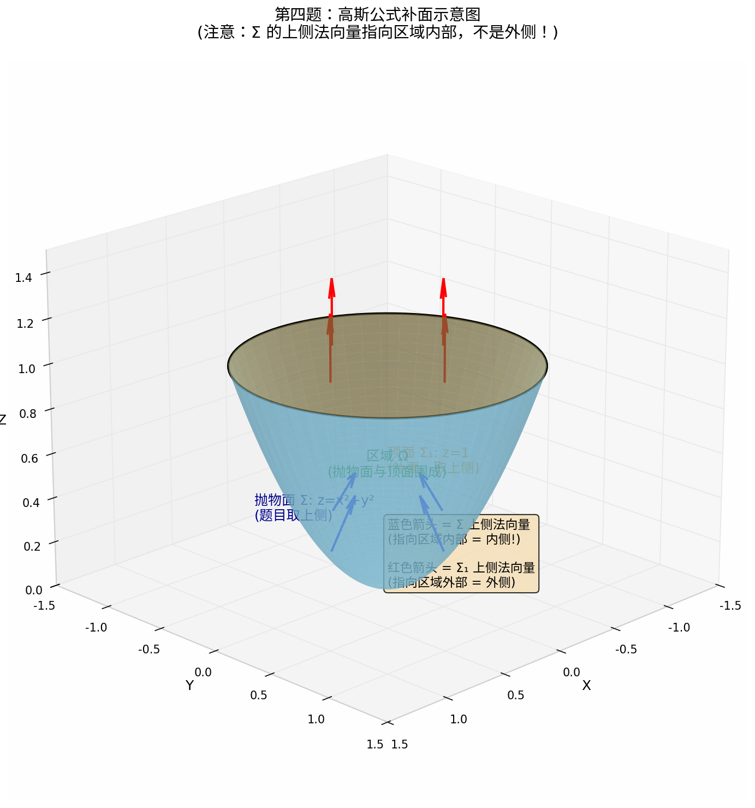

# 高斯公式（Gauss Formula）笔记

---

## 1. 基本公式

$$\iiint_\Omega \left(\frac{\partial P}{\partial x} + \frac{\partial Q}{\partial y} + \frac{\partial R}{\partial z}\right) dV = \oiint_{\Sigma} P\,dy\,dz + Q\,dz\,dx + R\,dx\,dy$$

或写成向量形式：
$$\iiint_\Omega (\nabla \cdot \vec{F})\,dV = \oiint_{\Sigma} \vec{F}\cdot d\vec{S}$$

---

## 2. **适用条件**

| 条件 | 说明 |
| ------ | ------ |
| **封闭曲面** | **$\Sigma$ 必须是封闭区域** $\Omega$ 的边界 |
| **外侧** | $\Sigma$ 取**外侧**（法向量指向区域外部） |
| **连续偏导** | $P,Q,R$ 在 $\Omega$ 上具有连续一阶偏导数 |

> [!WARNING]
> **不满足条件时，必须补面或挖洞！**

---

## 3. 不封闭怎么办？补面

### (1) 常见补面策略

| 原曲面类型 | 补面方式 | 方向 |
| ----------- | --------- | ------ |
| 抛物面/锥面（开口向上） | 补顶面 $z=h$ | 上侧 |
| 抛物面/锥面（开口向下） | 补底面 $z=h$ | 下侧 |
| 半球面 | 补底面圆盘 | 下侧（上侧） |
| 圆柱侧面 | 补上下底面 | 上侧+下侧 |

### (2) 核心公式

$$\iint_{\Sigma} = \oiint_{\Sigma+\Sigma_1} - \iint_{\Sigma_1}$$

---

## 4. 方向判断（最容易错！）

### (1) 外侧 vs 上侧/下侧

**外侧**：法向量指向区域**外部**（远离区域内部）
**上侧**：法向量的 $z$ 分量为**正**（朝上）

> **关键：上侧 ≠ 外侧！**

### (2) 以第四题为例

**几何结构：**

- 抛物面 $z=x^2+y^2$（$0\le z\le 1$）+ 顶面 $z=1$ 围成区域 $\Omega$
- **蓝色箭头**（抛物面上侧）：$z$ 分量为正，朝上
- **红色箭头**（顶面上侧）：$z$ 分量为正，朝上

**方向分析：**

| 曲面 | 题目要求 | 法向量方向 | 相对于 $\Omega$ |
|------|----------|-----------|----------------|
| 抛物面 $\Sigma$ | 上侧 | 朝上偏外 | 指向 $\Omega$ **内部** = **内侧** |
| 顶面 $\Sigma_1$ | 上侧 | 竖直向上 | 指向 $\Omega$ **外部** = **外侧** |

**结论：**
$$\boxed{\Sigma_{上侧} = -\Sigma_{外侧}}$$

> 对开口向上的抛物面/锥面，**上侧 = 内侧**，高斯公式结果要**加负号**！

---

## 5. 第四题完整解法（高斯公式版）

**题目：** 计算 $I=\displaystyle\iint_\Sigma (2x+z)\,dy\,dz + z\,dx\,dy$

其中 $\Sigma: z=x^2+y^2$（$0\le z\le 1$），取**上侧**。

### 步骤一：补面
补上 $\Sigma_1: z=1$（$x^2+y^2\le 1$），取**上侧**。

### 步骤二：计算散度
$$\vec{F}=(2x+z,\ 0,\ z)$$
$$\text{div}\,\vec{F}=\frac{\partial(2x+z)}{\partial x}+\frac{\partial z}{\partial z}=2+1=3$$

### 步骤三：计算三重积分
$$\iiint_\Omega 3\,dV = 3\int_0^1 \pi z\,dz = \frac{3\pi}{2}$$
（截面 $x^2+y^2\le z$ 的面积为 $\pi z$）

### 步骤四：计算补面 $\Sigma_1$ 上的积分
在 $z=1$ 上，$dz=0$，所以 $dy\,dz=0$：
$$\iint_{\Sigma_1}(2x+z)\,dy\,dz+z\,dx\,dy = \iint_{x^2+y^2\le 1}1\,dx\,dy = \pi$$

### 步骤五：方向修正（关键！）
$$\oiint_{\Sigma_{外侧}+\Sigma_{1外侧}} = \frac{3\pi}{2}$$

但题目要求的是 $\Sigma_{上侧}$，而 $\Sigma_{上侧}=-\Sigma_{外侧}$（内侧）：

$$\iint_{\Sigma_{外侧}} = \frac{3\pi}{2}-\pi = \frac{\pi}{2}$$

$$\iint_{\Sigma_{上侧}} = -\iint_{\Sigma_{外侧}} = \boxed{-\frac{\pi}{2}}$$

---

## 6. 常见错误清单

| 错误 | 后果 | 如何避免 |
| ------ | ------ | ---------- |
| **忘记补面** | 直接对非封闭曲面用高斯公式，结果错误 | 先检查曲面是否封闭 |
| **方向搞反** | 上侧/下侧与内侧/外侧混淆，差一个负号 | 画草图判断法向量指向 |
| **补面方向错** | 补面方向与外侧要求矛盾 | 记住：封闭后整体要取外侧 |
| **散度算错** | 偏导数求错 | 逐项检查 $\frac{\partial P}{\partial x}$ 等 |
| **补面积分漏项** | 补面上某些微分为零没注意到 | 分析补面的几何特征 |

---

## 7. 快速判断方向口诀

> [!TIP]
> **"开口向上，上侧是内；开口向下，下侧是内"**
> **"半球朝上，上侧是外；半球朝下，下侧是外"**

| 曲面 | 上侧是否=外侧？ |
| ------ | ---------------- |
| $z=f(x,y)$（开口向上，如抛物面、锥面） | ❌ 上侧 = 内侧 |
| $z=f(x,y)$（开口向下） | ❌ 下侧 = 内侧 |
| $z=\sqrt{a^2-x^2-y^2}$（上半球） | ✅ 上侧 = 外侧 |
| $z=-\sqrt{a^2-x^2-y^2}$（下半球） | ✅ 下侧 = 外侧 |

---

## 8. 与转换投影法的对比

| 方法 | 优点 | 缺点 | 适用场景 |
| ------ | ------ | ------ | ---------- |
| **转换投影法** | 直接，不用考虑封闭性 | 计算量大，容易出错 | 单一曲面，方向明确 |
| **高斯公式** | 转化为三重积分，可能更简单 | 必须补面，方向容易错 | 散度简单，补面好算 |

**建议：** 如果 $\text{div}\,\vec{F}$ 是常数或简单函数，优先用高斯公式；如果散度很复杂，直接用转换投影法

---

> [!IMPORTANT]
> 📌 **保存好这张图，复习时对照看方向！** 高斯公式就错在"方向"两个字上
