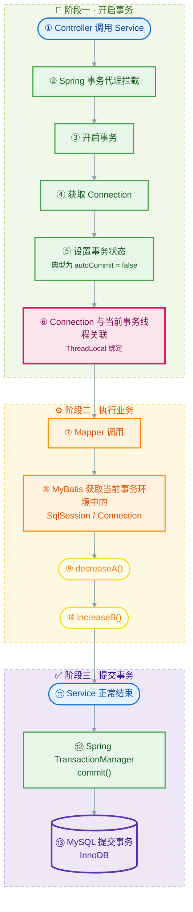
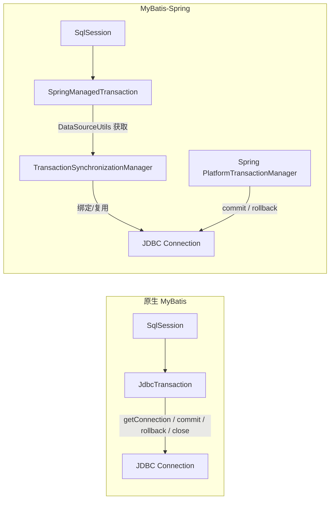
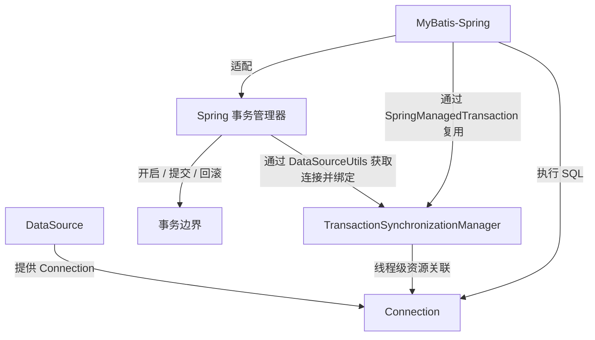

# 《MyBatis 完整学习与开发速查笔记》

> **适用环境**：Java 17+、Spring Boot 3.x、MyBatis 3.x、mybatis-spring-boot-starter 3.x、MySQL 8.x。  
> **标记说明**：  
> 【MyBatis 核心】= MyBatis 原生功能  
> 【Spring Boot 整合】= MyBatis-Spring / Starter 提供  
> 【第三方扩展】= PageHelper、MyBatis-Plus 等，不属于 MyBatis 核心  
> ⚠️ 易混淆 = 实际开发高频混淆点

---

# 第一篇：MyBatis 基础认知

## 1. MyBatis 是什么

【**MyBatis 核心**】

MyBatis 是一个**半自动 ORM 持久层框架**。它把 JDBC 中重复的：

- 获取连接
- 创建 `PreparedStatement`
- 设置参数
- 执行 SQL
- 处理 `ResultSet`
- 映射 Java 对象
- 关闭资源

封装起来，但 **SQL 仍然由开发者自己写**。

> [!tip]
> 
> - JDBC 是手动挡，Hibernate/JPA 是自动挡，MyBatis 是“SQL 自己写，映射框架帮你做”。
> - **MyBatis = Java ↔ SQL ↔ 数据库之间的桥梁**

### 1.1 MyBatis 与 JDBC 的关系

| 对比项 | JDBC | MyBatis |
|---|---|---|
| SQL 控制 | 完全手写 | 完全手写 |
| 参数设置 | `ps.setXxx()` | `#{}` |
| 结果映射 | 手动 `ResultSet` | `resultType/resultMap` |
| 资源管理 | 手动关闭 | 框架管理 |
| 重复代码 | 多 | 少 |
| 灵活性 | 最高 | 很高 |

MyBatis 底层仍然使用 JDBC，只是封装了流程。

```
JDBC
= Java 直接操作数据库的底层 API
= 自己处理很多细节

MyBatis
= 建立在 JDBC 之上的持久层框架
= SQL 仍然可以自己写
= MyBatis 帮你处理 JDBC 的大量重复工作
= 特别是参数绑定 + 结果映射
```

### 1.2 MyBatis 与 Hibernate / JPA 的区别

| 特性 | MyBatis | Hibernate / JPA |
|---|---|---|
| SQL 控制 | 开发者写 SQL | 框架生成 SQL |
| ORM 程度 | 半自动 | 全自动 |
| 学习成本 | 较低 | 较高 |
| 复杂 SQL | 非常友好 | 较麻烦 |
| 数据库移植 | 依赖 SQL | 较好 |
| 典型场景 | 互联网、复杂查询 | 业务模型稳定、CRUD 多 |

### 1.3 MyBatis 优缺点

**优点：**

- SQL 可控，性能调优方便
- 动态 SQL 强大
- 学习成本相对低
- 与 Spring Boot 整合简单
- 适合复杂查询、报表、多表关联

**缺点：**

- 需要手写 SQL
- XML 较多时维护成本高
- 数据库移植性弱
- 简单 CRUD 也要写 Mapper

**适合**：需要精细控制 SQL、复杂查询多的项目。  
**不适合**：完全不想写 SQL、追求全自动 ORM 的项目。

---

## 2. MyBatis 整体工作流程

【**MyBatis 核心**】

```text
Java 调用 Mapper 接口
        ↓
MapperProxy 代理
        ↓
SqlSession
        ↓
Executor
        ↓
MappedStatement（namespace + id）
        ↓
ParameterHandler 设置参数
        ↓
StatementHandler + JDBC PreparedStatement
        ↓
MySQL 执行
        ↓
ResultSetHandler
        ↓
resultType / resultMap 映射
        ↓
Java 对象
```

**核心组件关系**：

| 组件 | 职责 |
|---|---|
| `SqlSessionFactory` | 工厂，单例，创建 `SqlSession` |
| `SqlSession` | 一次会话，执行 SQL、获取 Mapper、管理事务 |
| `Executor` | 真正执行 SQL，有 SIMPLE、REUSE、BATCH |
| `MappedStatement` | 一个 SQL 映射，由 `namespace + id` 唯一确定 |
| `ParameterHandler` | 把 Java 参数设置到 PreparedStatement |
| `StatementHandler` | 创建、执行 JDBC Statement |
| `ResultSetHandler` | 把 ResultSet 映射为 Java 对象 |
| `Configuration` | 全局配置，保存所有映射、TypeHandler、缓存等 |

---

# 第二篇：MyBatis 项目搭建

## 3. 最小 MyBatis 项目

### 1.4 Maven 依赖

```xml
<dependencies>
    <dependency>
        <groupId>org.mybatis</groupId>
        <artifactId>mybatis</artifactId>
        <version>3.5.16</version>
    </dependency>
    <dependency>
        <groupId>com.mysql</groupId>
        <artifactId>mysql-connector-j</artifactId>
        <version>8.4.0</version>
    </dependency>
</dependencies>
```

### 1.5 数据库表

```sql
CREATE TABLE student (
    id BIGINT PRIMARY KEY AUTO_INCREMENT,
    name VARCHAR(50),
    age INT,
    score DECIMAL(5,2)
);
```

### 1.6 Java Bean

**JavaBean 参数**：

- 把多个相关参数封装到一个 Java 对象中，再把这个对象作为 Mapper 方法参数。
- **适合**：参数比较多，而且这些参数属于同一个业务对象/查询条件。

```java
package com.example.entity;

public class Student {
    private Long id;
    private String name;
    private Integer age;
    private Double score;

    // getter / setter / toString
}
```

### 1.7 Mapper 接口

```java
package com.example.mapper;

import com.example.entity.Student;

public interface StudentMapper {
    Student selectById(Long id);
}
```

### 1.8 Mapper XML

```xml
<?xml version="1.0" encoding="UTF-8"?>
<!DOCTYPE mapper
        PUBLIC "-//mybatis.org//DTD Mapper 3.0//EN"
        "https://mybatis.org/dtd/mybatis-3-mapper.dtd">
<mapper namespace="com.example.mapper.StudentMapper">

    <select id="selectById" resultType="com.example.entity.Student">
        SELECT id, name, age, score
        FROM student
        WHERE id = #{id}
    </select>

</mapper>
```

> [!note]
> `#{name}` 本质上是在按当前参数对象的属性名去取值，**关键**不是它长什么形式，而是 MyBatis 能不能找到对应的参数/属性。

> [!tip]
> `Mapper.xml` 是 MyBatis 的 SQL 映射文件，**核心作用**：
> **把 Mapper 接口的方法和具体 SQL 绑定起来，并定义参数怎么传、结果怎么映射成 Java 对象**。

### 1.9 mybatis-config.xml

```xml
<?xml version="1.0" encoding="UTF-8"?>      // 这是 XML 1.0，使用 UTF-8 编码
<!DOCTYPE configuration
        PUBLIC "-//mybatis.org//DTD Config 3.0//EN"
        "https://mybatis.org/dtd/mybatis-3-config.dtd">    //这个文件遵循 MyBatis Mapper XML 的格式规范
<configuration>
    <environments default="development">
        <environment id="development">
            <transactionManager type="JDBC"/>
            <dataSource type="POOLED">
                <property name="driver" value="com.mysql.cj.jdbc.Driver"/>
                <property name="url" value="jdbc:mysql://localhost:3306/test?serverTimezone=Asia/Shanghai"/>
                <property name="username" value="root"/>
                <property name="password" value="123456"/>
            </dataSource>
        </environment>
    </environments>

    <mappers>
        <mapper resource="mapper/StudentMapper.xml"/>
    </mappers>
</configuration>
```

### 1.10 测试

```java
InputStream in = Resources.getResourceAsStream("mybatis-config.xml");
SqlSessionFactory factory = new SqlSessionFactoryBuilder().build(in);

try (SqlSession session = factory.openSession()) {
    StudentMapper mapper = session.getMapper(StudentMapper.class);
    Student student = mapper.selectById(1L);
    System.out.println(student);
}
```

---

# 第三篇：Mapper

## 4. Mapper 接口

【**MyBatis 核心**】

Mapper 接口不需要写实现类，MyBatis 通过 JDK 动态代理生成 `MapperProxy`。

**对应关系：**

```text
Mapper 接口全限定名 = XML namespace
方法名 = XML 标签 id
参数 = #{}
返回值 = resultType / resultMap
```

> [!tip]
> **`resultType`：决定“结果封装成什么 Java 类型”，而 MyBatis 再根据这个类型的属性和 SQL 返回的列进行结果映射**
> **`resultMap`：手动告诉 MyBatis “这一列对应哪个属性”**

**示例：**

```java
Student selectById(Integer id);
```

```xml
<select id="selectById" resultType="Student">
    SELECT * FROM student WHERE id = #{id}
</select>
```

**对应关系：**

```text
StudentMapper.selectById()
        ↕
namespace="com.example.mapper.StudentMapper"
id="selectById"
```

### 4.1 @Mapper 与 @MapperScan

> [!tip]
> **`@Mapper`告诉 MyBatis：这个接口是 Mapper，请为它创建代理对象**
> **`@MapperScan`告诉 MyBatis：去这个包下面，把 Mapper 接口全部扫描出来**

【**Spring Boot 整合**】

```java
@Mapper
public interface StudentMapper {
    Student selectById(Long id);
}
```

**或在启动类**：

```java
@SpringBootApplication
@MapperScan("com.example.demo.mapper")
public class DemoApplication {
    public static void main(String[] args) {
        SpringApplication.run(DemoApplication.class, args);
    }
}
```

> [!warning]
> **易混淆：**`@Mapper` 加在单个接口上，`@MapperScan` 加在配置类或启动类上扫描包

**整体链路：**

```
Spring Boot
    │
    │ @MapperScan
    ↓
发现 StudentMapper
    │
    ↓
MyBatis 为 StudentMapper 创建代理
    │
    ↓
namespace 找到 StudentMapper.xml
    │
    ↓
id="selectAll"
    │
    ↓
找到 SQL
    │
    ↓
执行
```

---

# 第四篇：XML 映射文件

## 5. Mapper XML

【**MyBatis 核心**】

```xml
<mapper namespace="com.example.mapper.StudentMapper">
    <select id="selectById" resultType="Student">
        SELECT * FROM student WHERE id = #{id}
    </select>

    <insert id="insert" useGeneratedKeys="true" keyProperty="id">
        INSERT INTO student(name, age, score)
        VALUES(#{name}, #{age}, #{score})
    </insert>

    <update id="update">
        UPDATE student SET name = #{name} WHERE id = #{id}
    </update>

    <delete id="deleteById">
        DELETE FROM student WHERE id = #{id}
    </delete>
</mapper>
```

**常用属性**：

| 属性 | 作用 |
|---|---|
| `namespace` | 对应 Mapper 名 |
| `id` | 对应 Mapper 方法名 |
| `parameterType` | 参数类型，通常可省略 |
| `resultType` | 自动映射结果类型 |
| `resultMap` | 手动映射结果 |
| `useGeneratedKeys` | 使用自增主键 |
| `keyProperty` | 主键回填到哪个属性 |

> [!note]
> `Mapper` 与 `Mapper.xml` 文件名相同，只是我们开发时的约定和习惯。
> **`namespace + id` 才是 MyBatis 用来定位 SQL 的关键。**

---

# 第五篇：参数传递

## 6. 单参数

```java
Student selectById(Integer id);
```

```xml
<select id="selectById" resultType="Student">
    SELECT * FROM student WHERE id = #{id}
</select>
```

单参数时，`#{}` 内名称可以任意，但推荐与方法参数名一致。

## 7. 多参数

```java
Student selectByCondition(String name, Integer age);
```

不写 `@Param` 时，MyBatis 使用：

- `arg0`、`arg1`
- `param1`、`param2`

```xml
WHERE name = #{param1} AND age = #{param2}
```

推荐：

```java
Student select(@Param("name") String name, @Param("age") Integer age);
```

```xml
<select id="select" resultType="Student">
    SELECT * FROM student
    WHERE name = #{name}
      AND age = #{age}
</select>
```

⚠️ 易混淆：多参数没有 `@Param`，XML 中写 `#{name}` 会报 `Parameter 'name' not found`。

---

# 第六篇：`#{}` 与 `${}`

## 8. `#{}`

【**MyBatis 核心**】

`#{}` 是预编译**参数占位符**(把 `{}` 内的值作为 SQL 参数传进去)，底层变成 JDBC `?`。

```xml
WHERE id = #{id}
```

**等价于**：

```java
PreparedStatement ps = conn.prepareStatement("SELECT * FROM student WHERE id = ?");
ps.setLong(1, id);
```

**优点**：

- 防止 SQL 注入
- 参数类型自动处理
- 推荐所有参数值都用 `#{}`

## 9. `${}`

`${}` 是字符串直接拼接，直接替换 SQL 文本。

```xml
ORDER BY ${orderBy}
```

如果 `orderBy = "id; DROP TABLE student"`，就会产生 SQL 注入风险。

> [!note]
> **`#{}` = 把内容当“参数值”处理；`${}` = 把内容当“SQL文本”直接拼进去**
> 因此 `${}` 既可以传列名、表名，也可以传数字、字符串，只是不应该用它来处理普通的用户数据参数

### 9.1 ⚠️ `#{}` 与 `${}` 对比

| 对比项 | `#{}` | `${}` |
|---|---|---|
| 处理方式 | 预编译 `?` | 字符串拼接 |
| SQL 注入 | 安全 | 危险 |
| 适用 | 参数值 | 动态表名、列名、ORDER BY |
| 示例 | `#{id}` | `${orderBy}` |
| 推荐 | 默认使用 | 必须白名单校验 |

安全示例：

```java
String orderBy = "id";
if (!Set.of("id", "name", "score").contains(orderBy)) {
    throw new IllegalArgumentException("非法排序字段");
}
```

```xml
ORDER BY ${orderBy}
```

---

# 第七篇：结果映射

## 10. resultType

【**MyBatis 核心**】

**自动映射**：

```xml
<select id="selectById" resultType="com.example.entity.Student">
    SELECT id, name, age, score FROM student WHERE id = #{id}
</select>
```

字段名与属性名不一致时：

- **开启驼峰映射**：

```yaml
mybatis:
  configuration:
    map-underscore-to-camel-case: true
```

例如 `class_name` -> `className`。

- **或使用别名**：

```sql
SELECT class_name AS className FROM student
```

## 11. resultMap

**复杂映射使用**：

```xml
<resultMap id="StudentResultMap" type="com.example.entity.Student">
    <id column="id" property="id"/>
    <result column="name" property="name"/>
    <result column="age" property="age"/>
    <result column="score" property="score"/>
</resultMap>

<select id="selectById" resultMap="StudentResultMap">
    SELECT id, name, age, score FROM student WHERE id = #{id}
</select>
```

> [!tip]
> `resultType` 适合简单自动映射；`resultMap` 适合字段不一致、一对一、一对多、多对多。

> [!note]
> `property `代表：Java 对象的属性
> `column` 代表：SQL 查询结果中的列名
>
> `<id>`：用于主键映射。
> `<result>`：用于普通字段映射。

```
resultType
    ↓
指定结果对象类型
    ↓
主要依靠自动映射

resultMap
    ↓
指定结果对象类型
+
明确指定字段 → 属性的映射关系
```

---

# 第八篇：CRUD

> [!tip]
> **Mapper 接口**：声明“我要做什么”
> **Mapper.xml**：告诉 MyBatis “具体怎么做”

**CRUD 全流程**：

```
Mapper 接口（如 UserMapper）
    ↓
声明 Java 方法，如 User selectById(Long id)
    ↓
Mapper.xml
    ↓
namespace = Mapper 接口全限定名
id = 接口方法名
    ↓
两者共同组成 statement id：namespace + id
    ↓
编写具体 SQL
    ↓
#{参数} 进行参数绑定，生成预编译 SQL 占位符 ?
    ↓
MyBatis 通过 JDK 动态代理调用接口方法
    ↓
Executor / StatementHandler 执行 SQL
    ↓
ResultSetHandler 把结果映射成 Java 对象
    ↓
查询返回对象/List/Map；增删改返回 int 影响行数
```

## 12. SELECT

```xml
<select id="selectAll" resultType="Student">
    SELECT * FROM student
</select>

<select id="selectByName" resultType="Student">
    SELECT * FROM student
    WHERE name LIKE CONCAT('%', #{name}, '%')
</select>
```

`CONCAT()` 是 MySQL 的**字符串拼接函数**：

```
CONCAT()
   ↓
拼接字符串

CONCAT('%', #{name}, '%')
   ↓
给 name 前后加 %
   ↓
实现包含式模糊查询
```

## 13. INSERT

```xml
<insert id="insert" useGeneratedKeys="true" keyProperty="id">
    INSERT INTO student(name, age, score)
    VALUES(#{name}, #{age}, #{score})
</insert>
```

**主键回填**：

```java
Student student = new Student();
student.setName("Tom");
studentMapper.insert(student);
System.out.println(student.getId()); // 自增 id 已回填
```

- **`useGeneratedKeys` + `keyProperty` 的作用与价值**：
  - **`AUTO_INCREMENT`**：MySQL 自动生成新的主键 ID。
  - **`useGeneratedKeys="true"`**：让 MyBatis 获取这个自动生成的 ID。
  - **`keyProperty="id"`**：把获取到的 ID 回填到 Java 对象的 `id` 属性。
  - **核心价值**：
    - **一次 INSERT 后，同时知道“插入是否成功/影响几行”和“刚插入的数据 ID 是多少”，方便后续代码继续使用这个 ID。**
  - **注意**：
    - **它不是用来自动查询或输出新数据的。**
  - **执行过程是**：
     1. MyBatis 执行 INSERT。
     2. MySQL 根据自增主键机制生成 ID。
     3. JDBC 获取数据库生成的主键。
     4. MyBatis 根据 keyProperty="id"，将主键写入传入的 Java 对象的 id 属性。 

**批量插入**：

```xml
<insert id="insertBatch">
    INSERT INTO student(name, age, score) VALUES
    <foreach collection="list" item="s" separator=",">
        (#{s.name}, #{s.age}, #{s.score})
    </foreach>
</insert>
```

## 14. UPDATE

```xml
<update id="update">
    UPDATE student
    SET name = #{name},
        age = #{age}
    WHERE id = #{id}
</update>
```

动态更新见 `<set>`。

## 15. DELETE

```xml
<delete id="deleteById">
    DELETE FROM student WHERE id = #{id}
</delete>

<delete id="deleteBatch">
    DELETE FROM student WHERE id IN
    <foreach collection="ids" item="id" open="(" separator="," close=")">
        #{id}
    </foreach>
</delete>
```

---

# 第九篇：动态 SQL

**根据传入的参数，动态决定 SQL 中哪些条件需要出现**

## 16. if

```
<if test="条件">
    SQL
</if>
```

**意思就是**：

条件成立 → 加入里面的 SQL
条件不成立 → 不加入里面的 SQL

**例如：**

```xml
<if test="name != null and name != ''">
    AND name = #{name}
</if>
```

## 17. where

**`<where>` 的作用：**

1. **自动加 `WHERE`**
   - 当里面有**条件成立**时，它会生成 `WHERE`。

2. **自动去掉开头多余的 `AND` / `OR`**
   ```xml
   <where>
       AND name = #{name}
   </where>
   ```
   生成：
   ```sql
   WHERE name = ?
   ```

3. **没有条件时不生成 `WHERE`**
   ```xml
   <where>
       <if test="name != null">
           AND name = #{name}
       </if>
   </where>
   ```
   如果 `name` 为空，则不会生成：
   ```sql
   WHERE
   ```

> [!tip]
> `<where>` 用来替代 SQL 中的 `WHERE`，能自动处理开头多余的 `AND` / `OR`，并且所有条件都不成立时不会生成空的 `WHERE`。

**示例**：

```xml
<select id="selectByCondition" resultType="Student">
    SELECT * FROM student
    <where>
        <if test="name != null and name != ''">
            AND name LIKE CONCAT('%', #{name}, '%')
        </if>
        <if test="age != null">
            AND age = #{age}
        </if>
    </where>
</select>
```

## 18. trim

`<trim>` 用于动态拼接 SQL，作用是：**加前后缀、去掉首尾多余字符**。

**四个属性**：

```xml
<trim prefix="" suffix="" prefixOverrides="" suffixOverrides="">
```

- **`prefix`**：加前缀
- **`suffix`**：加后缀
- **`prefixOverrides`**：去掉开头匹配内容
- **`suffixOverrides`**：去掉结尾匹配内容

多个用 `|` 分隔，如 `AND |OR `。它只处理整个片段的最前和最后，不处理中间。

**替代 `<where>`**：

```xml
<trim prefix="WHERE" prefixOverrides="AND |OR ">
    <if test="name != null">AND name = #{name}</if>
    <if test="age != null">AND age = #{age}</if>
</trim>
```

**替代 `<set>`：**

```xml
<trim prefix="SET" suffixOverrides=",">
    <if test="name != null">name = #{name},</if>
    <if test="age != null">age = #{age},</if>
</trim>
```

**关系**：

- `<where>` ≈ `<trim prefix="WHERE" prefixOverrides="AND |OR ">`
- `<set>` ≈ `<trim prefix="SET" suffixOverrides=",">`

**注意**：

内部为空时不会加 `prefix/suffix`；建议写 `AND |OR ` 带空格；更新时保证至少有一个字段，避免生成错误 SQL。

## 19. choose / when / otherwise

```xml
<choose>
    <when test="name != null">
        AND name = #{name}
    </when>
    <when test="age != null">
        AND age = #{age}
    </when>
    <otherwise>
        AND id > 0
    </otherwise>
</choose>
```

- `<choose>` + `<when>` + `<otherwise>` ≈ Java 的 `switch` / `case` / `default`
- **小区别**：
  - `switch` 通常是比较一个值
  - `<choose>` 是依次判断条件是否成立

| 标签            | 含义                  |
| ------------- | ------------------- |
| `<if>`        | 可以同时满足多个条件          |
| `<choose>`    | 多个分支只选一个            |
| `<when>`      | `<choose>` 中的条件分支   |
| `<otherwise>` | 所有 `<when>` 都不满足时执行 |

## 20. set

```xml
<update id="updateSelective">
    UPDATE student
    <set>
        <if test="name != null">name = #{name},</if>
        <if test="age != null">age = #{age},</if>
        <if test="score != null">score = #{score},</if>
    </set>
    WHERE id = #{id}
</update>
```

`<set>` 会自动去掉最后多余的逗号。

## 21. foreach

`<foreach>`：把 Java 集合中的元素一个一个取出来，拼成动态 SQL

```xml
<delete id="deleteBatch">
    DELETE FROM student
    WHERE id IN
    <foreach collection="ids"
             item="id"
             open="("
             separator=","
             close=")">
        #{id}
    </foreach>
</delete>
```

| 属性 | 作用 |
|---|---|
| `collection` | 要遍历的集合 |
| `item` | 每次迭代元素 |
| `index` | 下标 |
| `open` | 开始符号 |
| `separator` | 分隔符 |
| `close` | 结束符号 |

---

# 第十篇：复杂查询

## 22. 多表查询

SQL 负责 JOIN，MyBatis 负责映射。

```sql
SELECT s.id, s.name, c.class_name
FROM student s
LEFT JOIN class c ON s.class_id = c.id
WHERE s.id = #{id}
```

## 23. association 一对一

> [!note]
> `association` 是 MyBatis 中用于**一对一**关联映射的标签，它把关联查询结果组装成当前对象的一个属性对象
> `association` 里的 **指定集合属性**(关联对象放到当前对象的哪个属性)，`javaType` **指定集合类型**(这个关联对象是什么 Java 类型)

```xml
<resultMap id="StudentWithClass" type="Student">
    <id column="id" property="id"/>
    <result column="name" property="name"/>
    <association property="clazz" javaType="Class">
        <id column="class_id" property="id"/>
        <result column="class_name" property="name"/>
    </association>
</resultMap>
```

## 24. collection 一对多

> [!note]
> `collection` 是 MyBatis 中用于**一对多**关联映射的标签，它把查询结果中的多行/多个字段组装成当前对象的一个集合属性；`property` **指定集合属性**，`javaType` **指定集合类型**，`ofType` **指定集合元素类型**。

```
type
↓
整个 ResultMap 对应的对象

javaType
↓
association 里面的那个对象

ofType
↓
collection 里面每一个元素
```

```xml
<resultMap id="ClassWithStudents" type="Class">
    <id column="class_id" property="id"/>
    <result column="class_name" property="name"/>
    <collection property="students" ofType="Student">
        <id column="student_id" property="id"/>
        <result column="student_name" property="name"/>
    </collection>
</resultMap>
```

> [!tip]
> `association` = 当前对象包含**一个**关联对象；`collection` = 当前对象包含**一组**关联对象

> [!note]
> `association` / `collection` + `select` 实质：
> **先执行主查询 → 从主查询结果中拿到某个字段的值 → 把这个值作为参数 → 再执行一个关联查询 → 把查询结果映射到对象里**

**`JOIN` + `resultMap`**:

```
一个 SQL
    ↓
一次查询
    ↓
resultMap 拆成对象结构
```

**`association`/`collection` + `select`(N+1 查询问题)**:

```
主 SQL
  ↓
得到关联字段
  ↓
再执行关联 SQL
  ↓
组装对象
```

## 25. 多对多

```text
Student
Course
Student_Course
```

```xml
<resultMap id="StudentWithCourses" type="Student">
    <id column="student_id" property="id"/>
    <result column="student_name" property="name"/>
    <collection property="courses" ofType="Course">
        <id column="course_id" property="id"/>
        <result column="course_name" property="name"/>
    </collection>
</resultMap>

<select id="selectStudentWithCourses" resultMap="StudentWithCourses">
    SELECT s.id AS student_id,
           s.name AS student_name,
           c.id AS course_id,
           c.name AS course_name
    FROM student s
    JOIN student_course sc ON s.id = sc.student_id
    JOIN course c ON c.id = sc.course_id
    WHERE s.id = #{id}
</select>
```

---

# 第十一篇：注解方式

【**MyBatis 核心**】

```java
@Mapper
public interface StudentMapper {

    @Select("SELECT * FROM student WHERE id = #{id}")
    Student selectById(Long id);

    @Insert("INSERT INTO student(name, age) VALUES(#{name}, #{age})")
    @Options(useGeneratedKeys = true, keyProperty = "id")
    int insert(Student student);

    @Update("UPDATE student SET name = #{name} WHERE id = #{id}")
    int update(Student student);

    @Delete("DELETE FROM student WHERE id = #{id}")
    int deleteById(Long id);
}
```

**`@Results`**：

```java
@Results(id = "studentMap", value = {
    @Result(column = "id", property = "id", id = true),
    @Result(column = "name", property = "name"),
    @Result(column = "class_id", property = "clazz",
            one = @One(select = "com.example.mapper.ClassMapper.selectById"))
})
@Select("SELECT * FROM student WHERE id = #{id}")
Student selectWithClass(Long id);
```

**一对多**：

```java
@Many(select = "com.example.mapper.StudentMapper.selectByClassId")
```

**XML vs 注解**：

| 场景 | 推荐 |
|---|---|
| 简单 CRUD | 注解 |
| 动态 SQL | XML |
| 复杂 resultMap | XML |
| 快速小项目 | 注解 |

---

# 第十二篇：MyBatis 与 Spring Boot

## 26. Spring Boot 整合

【**Spring Boot 整合**】

**依赖**：

```xml
<dependency>
    <groupId>org.mybatis.spring.boot</groupId>
    <artifactId>mybatis-spring-boot-starter</artifactId>
    <version>3.0.3</version>
</dependency>
<dependency>
    <groupId>com.mysql</groupId>
    <artifactId>mysql-connector-j</artifactId>
    <scope>runtime</scope>
</dependency>
```

**三者关系**：

```text
MyBatis：核心 SQL 映射框架
MyBatis-Spring：让 MyBatis 接入 Spring 事务、Bean 管理
MyBatis-Spring-Boot-Starter：Spring Boot 自动配置
```

### 26.1 Spring 如何管理 MyBatis 组件生命周期

- SqlSessionFactory：启动时创建，应用级单例。
- SqlSession：不直接注入，由 SqlSessionTemplate 代理获取。
- Mapper：启动时生成代理，注册为 Spring Bean。
- 事务：Spring 管理，不需要手动 commit / rollback / close。

## 27. Spring Boot 项目结构

```text
src/main/java/com/example/demo
├── controller
├── service
├── service/impl
├── mapper
└── entity

src/main/resources
├── mapper
│   └── StudentMapper.xml
└── application.yml
```

```
Controller
= Web 世界的入口
→ 请求处理

Service
= 业务世界的核心
→ 业务规则

Mapper
= 数据库访问
→ 数据访问
负责：“如果业务层决定要保存，那具体怎么通过 MyBatis 执行数据库操作？”
```

## 28. Mapper 注入

```java
@Service
public class StudentService {

    private final StudentMapper studentMapper;

    public StudentService(StudentMapper studentMapper) {
        this.studentMapper = studentMapper;
    }

    public Student getById(Long id) {
        return studentMapper.selectById(id);
    }
}
```

为什么能注入？  
因为 `@MapperScan` 或 `@Mapper` 让 MyBatis 为接口生成代理对象，并注册到 Spring 容器。

```
StudentService 接口
    ↓ 规定业务方法：List<Student> listStudents();
StudentServiceImpl
    ↓ 自己写实现，通常注入 StudentMapper
    ↓ return studentMapper.selectAll();
StudentMapper 接口
    ↓ 只声明：List<Student> selectAll();
MyBatis + StudentMapper.xml
    ↓ MyBatis 用动态代理生成 Mapper 实现
    ↓ 根据 namespace + id 找到 SQL
    ↓ 执行 SQL，把结果集映射成 Student
    ↓ 装进 List<Student>
返回给 ServiceImpl
```

---

# 第十三篇：MyBatis 核心组件

## 29. SqlSessionFactory

### 29.1 是什么

- 创建 `SqlSession` 的工厂。
- MyBatis 应用级入口对象之一。
- 可以理解为：负责生产 `SqlSession` 的地方。

### 29.2 核心职责

- 加载 MyBatis 配置，保存 `Configuration`。
- 根据 MyBatis 配置创建会话。
- 为会话提供数据库连接、执行器等运行所需的基础设施。
- 作为应用访问 MyBatis 的入口之一。

### 29.3 什么时候接触

- 框架初始化 / 应用启动时构建一次。
- 应用运行期间重复使用。
- 通常是应用级共享对象。

### 29.4 源码关系与默认实现

```text
SqlSessionFactoryBuilder -> SqlSessionFactory
```

- 默认实现：`DefaultSqlSessionFactory`。
- 核心字段：`Configuration`。
- `SqlSessionFactoryBuilder` 的作用：
  - 读取 XML / 配置。
  - 构建 `Configuration`。
  - 创建 `SqlSessionFactory`。
  - 构建完成后一般就可以丢弃。

### 29.5 Configuration 里有什么

- 环境配置。
- 数据源。
- 事务工厂。
- Mapper 注册表。
- 映射语句。
- 类型处理器。
- 拦截器。
- 缓存配置等。

### 29.6 常用 API

```java
SqlSession openSession();
SqlSession openSession(boolean autoCommit);
SqlSession openSession(ExecutorType execType);
SqlSession openSession(ExecutorType execType, boolean autoCommit);
SqlSession openSession(TransactionIsolationLevel level);
```

### 29.7 生命周期与线程安全

- 生命周期：应用启动构建一次，长期复用。(因为 `SqlSessionFactory` 的主要职责是：**根据配置创建 `SqlSession`**,这些配置在应用启动后通常不会频繁变化,所以没有必要每个请求都重新创建 Factory)
- 线程安全：通常线程安全。
- 原因：它主要持有只读的 `Configuration`，本身不保存会话级可变状态。
- 创建 `SqlSession` 时，再创建独立的 `Executor`、`Transaction` 等对象。

### 29.8 Spring / Spring Boot 中

- 通常由 `SqlSessionFactoryBean` 创建。
- Spring Boot 中由 `MybatisAutoConfiguration` 自动配置。
- 通常由 MyBatis-Spring 自动配置创建并管理 `SqlSessionFactory`。
- 一般不需要手动创建它。
- 一般不需要手动 `new SqlSessionFactoryBuilder()`。

### 29.9 与 SqlSession 的关系

```text
SqlSessionFactory
   |
   | openSession()
   v
SqlSession A     SqlSession B     SqlSession C ...
```

- 一个工厂可以创建多个独立会话。
- 工厂是负责生产的地方。
- 会话是工厂生产出来的具体工作单元。
- `SqlSessionFactory` 通常应用级共享，长期复用。
- `SqlSession` 按会话创建和管理，用完关闭。
- 不同会话有各自的会话状态和一级缓存。

### 29.10 常见坑

- 误以为每次操作都要新建 `SqlSessionFactory`。
- 误以为 `SqlSessionFactory` 不能共享。
- Spring 项目中手动 `new SqlSessionFactoryBuilder()`，绕开自动配置。
- 把 `SqlSessionFactory` 和 `SqlSession` 混为一谈。

### 29.11 面试追问

- 为什么 `SqlSessionFactory` 通常线程安全？
  - 因为它主要持有 `Configuration`，本身不保存会话级可变状态。
- `SqlSessionFactoryBuilder` 的作用？
  - 读取 XML / 配置，构建 `Configuration`，再创建 `SqlSessionFactory`。
- `Configuration` 里有什么？
  - 环境、数据源、事务工厂、Mapper 注册表、映射语句、类型处理器、拦截器、缓存配置等。
- `SqlSessionFactory` 和 `SqlSession` 谁共享？
  - 工厂共享，会话不共享。

---

## 30. SqlSession

### 30.1 是什么

- MyBatis 提供的核心操作接口。
- 代表一次数据库会话。
- 负责执行映射语句、获取 Mapper，以及管理会话级别的提交、回滚和关闭等操作。
- 默认实现：`DefaultSqlSession`。

### 30.2 核心职责

- 执行 SQL 映射语句。
- 获取 Mapper 接口的代理对象。
- 管理当前会话的事务操作。
- 管理当前会话的一级缓存。
- 关闭会话，释放相关资源。

### 30.3 源码链路

```text
SqlSession -> Executor -> StatementHandler -> ParameterHandler / ResultSetHandler -> TypeHandler
```

### 30.4 注意

- `SqlSession` 不是数据库连接本身。
- 它底层通过执行器等组件使用 JDBC 连接执行 SQL。
- 不同会话有各自的会话状态和一级缓存。
- 不能随意交给多个线程共享。

### 30.5 生命周期与线程安全

- 生命周期：请求级 / 事务级 / 方法级，用完必须关闭。
- 线程安全：不是线程安全的。
- 原因：它持有 `Executor`、`Transaction`、一级缓存等会话级可变状态。

**MyBatis 的基本使用原则是**：

- 一个 SqlSession 对应一个独立的使用上下文
  - 不要把同一个 SqlSession 保存为全局共享对象。
  - 不要让多个线程同时使用同一个 SqlSession。
  - 使用完毕后应正确关闭会话，释放相关资源。

### 30.6 常用 API

```java
<T> T selectOne(String statement);
<T> List<T> selectList(String statement);
int insert(String statement);
int update(String statement);
int delete(String statement);
<T> T getMapper(Class<T> type);
void commit();
void rollback();
void close();
```

### 30.7 一级缓存

- **范围**：同一个 `SqlSession` 内。
- **底层**：`Executor` 中的 `localCache`。
- **清空时机**：
  - 执行 `update` / `insert` / `delete`。
  - `commit` / `rollback`。
  - 手动清空。
- **配置**：
  - `localCacheScope=SESSION`：默认，会话级缓存。
  - `localCacheScope=STATEMENT`：语句级缓存，每次查询后清空。
- **常见现象**：
  - 同一个 `SqlSession` 内，外部修改并提交后，再次查询可能仍返回旧值。
  - 解决：换 `SqlSession`、执行更新、提交回滚，或设置为 `STATEMENT`。

### 30.8 手动使用模板

```java
try (SqlSession session = sqlSessionFactory.openSession()) {
    try {
        UserMapper mapper = session.getMapper(UserMapper.class);
        User user = mapper.selectById(1L);
        // 写操作后提交
        session.commit();
    } catch (Exception e) {
        session.rollback();
        throw e;
    }
}
```

### 30.9 BATCH 模式注意

```java
try (SqlSession session = sqlSessionFactory.openSession(ExecutorType.BATCH)) {
    UserMapper mapper = session.getMapper(UserMapper.class);
    mapper.insert(user1);
    mapper.insert(user2);
    session.flushStatements();
    session.commit();
}
```

### 30.10 Spring 项目中

- 非 Spring 项目：手动使用 `SqlSession`。
- Spring 项目：由 `SqlSessionTemplate` 管理。
- **`SqlSessionTemplate` 是什么**：
  - MyBatis-Spring 提供的线程安全 `SqlSession` 代理。
  - 替代直接使用 `SqlSession`，可单例注入。
- **内部机制**：
  - 每次调用时，通过 `SqlSessionUtils` 获取当前事务相关的 `SqlSession`。
  - 有 Spring 事务时，加入当前事务。
  - 无 Spring 事务时，创建新 `SqlSession`，执行后自动提交或回滚并关闭。
- 为什么 Spring 项目不直接注入 `SqlSession`：
  - `SqlSession` 非线程安全，生命周期短，不能作为单例 Bean 随意共享。

### 30.11 Mapper 接口为什么能直接注入

- `@MapperScan` 会扫描 Mapper 接口。
- 为每个接口注册 `MapperFactoryBean`。
- `MapperFactoryBean` 最终通过 `SqlSessionTemplate.getMapper()` 生成代理对象。
- 调用 Mapper 方法时，实际走的是 MyBatis 的 `MapperProxy`。

### 30.12 Spring 事务和 MyBatis 事务

- Spring 项目中，事务通常由 `DataSourceTransactionManager` 管理。
- MyBatis 的 `SqlSession` 会与 Spring 事务同步。
- 不需要手动 `commit` / `rollback` / `close`。
- 手动 `openSession()` 可能绕过 Spring 事务管理，导致连接不一致。

### 30.13 与 SqlSessionFactory 对比表

| 对象 | 定位 | 核心职责 | 生命周期 | 线程安全 | Spring 中 |
|---|---|---|---|---|---|
| `SqlSessionFactory` | 会话工厂 | 加载配置、保存 `Configuration`、创建 `SqlSession` | 应用启动构建一次，长期复用 | 通常安全 | 由 MyBatis-Spring 自动配置管理 |
| `SqlSession` | 数据库会话 | 执行 SQL、获取 Mapper、事务、一级缓存、关闭资源 | 按会话创建，用完关闭 | 不安全 | 由 `SqlSessionTemplate` 代理管理 |

### 30.14 常见坑

- 同一个 `SqlSession` 多线程共享，导致状态错乱。
- 一级缓存导致同一会话内查询结果不刷新。
- 非 Spring 项目忘记 `commit`，写操作未生效。
- 非 Spring 项目忘记 `close`，导致连接资源泄漏。
- Spring 项目中手动 `openSession()`，可能绕过事务。
- `ExecutorType.BATCH` 下忘记 `flushStatements()`，数据未及时执行。
- 误以为 `SqlSession` 就是 `Connection`。
- 误以为 `SqlSessionFactory` 每次操作都要新建。

### 30.15 面试追问

- 为什么 `SqlSession` 线程不安全？
  - 它持有 `Executor`、`Transaction`、一级缓存等会话级可变状态。
- `SqlSession` 和 `Connection` 是一回事吗？
  - 不是。`SqlSession` 是 MyBatis 会话抽象，底层才使用 JDBC `Connection`。
- `SqlSession` 一级缓存和二级缓存的区别？
  - 一级缓存是 `SqlSession` 级，默认开启。
  - 二级缓存是 `namespace` 级，需要显式配置。
- 为什么 Spring 项目不直接注入 `SqlSession`？
  - 因为 `SqlSession` 非线程安全，Spring 用 `SqlSessionTemplate` 代理管理。

### 30.16 记忆口诀

- 工厂长期共享，会话一次一用。
- 工厂负责创建，会话负责执行。
- 会话不是连接，底层才用 JDBC。
- 一级缓存会话内，二级缓存 namespace。
- Spring 用 `SqlSessionTemplate`，不直接共享 `SqlSession`。

---

## 31. Executor

- 是什么：SQL 执行器
- 类型：`SIMPLE`、`REUSE`、`BATCH`
- 负责什么：调用 JDBC、处理缓存
- 实际项目：一般不直接操作

## 32. MappedStatement

- 是什么：一个 SQL 映射对象
- 唯一标识：`namespace + id`
- 保存：SQL、参数映射、结果映射、缓存配置

## 33. Configuration

- 是什么：MyBatis 全局配置
- 保存：`MappedStatement`、`TypeHandler`、缓存、插件
- 实际项目：一般不直接操作

## 34. TypeHandler

见第十四篇。

---

## 35. 生命周期与线程安全

> 生命周期决定作用域，作用域决定是否共享，是否共享决定线程安全。

### 35.1 生命周期

- **是什么**：一个对象从创建出来，到使用，再到最终销毁/释放资源的整个过程。

| 组件 | 生命周期 / 作用域 | 创建时机 | 销毁 / 关闭 | Spring 中谁管理 |
|---|---|---|---|---|
| `SqlSessionFactory` | 应用级，通常单例；多数据源可多个 | 应用启动时，`SqlSessionFactoryBean` 构建 | 随应用/容器关闭，无显式 `close` | `MybatisAutoConfiguration` / `SqlSessionFactoryBean` |
| `SqlSessionTemplate` | Spring 单例 / 应用级 | 自动配置时 | 随容器关闭 | `MybatisAutoConfiguration` |
| `SqlSession` | 事务级 / 方法级 | `openSession()` 或 `SqlSessionTemplate` 内部获取 | 事务/方法结束关闭或归还 | `SqlSessionTemplate` / `SqlSessionUtils` / `TransactionSynchronizationManager` |
| `Executor` | 随 `SqlSession` | 创建 `SqlSession` 时 | 随 `SqlSession` 关闭 | MyBatis 内部 |
| `MappedStatement` | 应用级，初始化后不变 | 解析 XML / 注解时 | 无显式销毁，随应用结束 | `Configuration` 持有 |
| `Configuration` | 应用级 | 启动构建 `SqlSessionFactory` 时 | 无显式销毁，随应用结束 | `SqlSessionFactory` 持有；自动配置创建 |
| `TypeHandler` | 应用级 | 注册时 | 无显式销毁，随应用结束 | `TypeHandlerRegistry`：`TypeHandler` 的“登记表” |
| `MapperProxy` | 随 Mapper Bean，通常 Spring 单例 | 启动扫描 Mapper 时 | 随容器关闭 | `MapperFactoryBean` / `MapperProxyFactory` |
| `MapperFactoryBean` | Spring 单例 / 应用级 | 扫描 Mapper 时 | 随容器关闭 | Spring |
| `MapperProxyFactory` | 应用级 | 注册 Mapper 时 | 无显式销毁 | `MapperRegistry` |
| `MapperMethod` | 应用级，方法级缓存 | 首次调用 Mapper 方法时 | 无显式销毁 | `MapperProxy.methodCache` |
| `MapperRegistry` | 应用级 | 启动解析 Mapper 时 | 无显式销毁 | `Configuration` |
| `Environment` | 应用级 | 启动构建时 | 无显式销毁 | `Configuration` |
| `DataSource` | 应用级 | 启动时 | 随容器关闭 | Spring / 连接池 |
| `Connection` | 事务级 / 方法级 | 需要时从 `DataSource` 获取 | 事务/方法结束归还 | `SpringManagedTransaction` / 连接池 |
| `SpringManagedTransaction` | 随 `SqlSession` | 创建 `SqlSession` 时 | 随 `SqlSession` 关闭 | MyBatis-Spring |
| 一级缓存 | `SqlSession` 级 | `SqlSession` 创建时 | `SqlSession` 关闭 | `BaseExecutor` |
| 二级缓存 | 命名空间级 / 应用级 | 启动解析缓存配置时 | 随应用结束 | `CachingExecutor` / `Configuration` |
| `BoundSql` | 方法级 | 每次执行动态 SQL 时 | 方法结束 | `SqlSource` |
| `StatementHandler` | 方法级 | `Executor` 执行时 | 方法结束 | `Executor` |
| `ParameterHandler` | 方法级 | 执行时 | 方法结束 | `StatementHandler` |
| `ResultSetHandler` | 方法级 | 执行时 | 方法结束 | `StatementHandler` |
| `Interceptor` | 应用级 | 启动加载时 | 无显式销毁 | `InterceptorChain` |
| `TransactionSynchronizationManager` | Spring 内部 / 应用级 | Spring 启动时 | 随应用结束 | Spring |
| `SqlSessionHolder` | 事务级 | 事务中获取 `SqlSession` 时 | 事务结束 | Spring |

> [!tip]
> **`@Autowired` 注入的 `studentMapper` 不是 `SqlSession`，而是 MyBatis-Spring 注册到 Spring 容器里的一个 Mapper 代理对象。这个代理默认是单例，生命周期跟 Spring 容器一致；而 `SqlSession` 是短命的，通常是方法级/事务级。**

### 35.2 线程安全

#### 35.2.1 判断原则

- **应用级 + 只读 / 无状态** → 通常线程安全。
- **会话级 / 方法级 + 持有 `Connection`、事务、一级缓存** → 通常线程不安全。
- **Spring 注入的 Mapper** → 安全，因为底层走 `SqlSessionTemplate`。
- **手动 `sqlSession.getMapper()` 得到的 Mapper** → 不安全，因为它绑定当前 `SqlSession`。
- **`SqlSessionTemplate`** → 安全；**`SqlSession`** → 不安全。
- **自定义 `TypeHandler` / `Interceptor`** → 无状态才安全。

#### 35.2.2 线程安全总览

| 组件 | 线程安全 | 原因 | 正确用法 |
|---|---|---|---|
| `SqlSessionFactory` | ✅ 安全 | 主要持有只读 `Configuration`，不保存会话级可变状态 | 应用级单例，长期共享 |
| `SqlSessionTemplate` | ✅ 安全 | 单例代理，内部通过 `ThreadLocal` / `SqlSessionUtils` 获取当前线程的 `SqlSession` | Spring 中单例注入 |
| Spring 注入的 `MapperProxy` | ✅ 安全 | 底层走 `SqlSessionTemplate` | 构造器注入 Mapper |
| 手动 `sqlSession.getMapper()` 得到的 Mapper | ❌ 不安全 | 绑定当前 `SqlSession` | 不要跨线程共享 |
| `SqlSession` / `DefaultSqlSession` | ❌ 不安全 | 持有 `Executor`、`Transaction`、`Connection`、一级缓存等可变状态 | 一次请求/事务一个，用完关闭 |
| `Executor` | ❌ 不安全 | 随 `SqlSession`，内部有 `localCache` | 不共享 |
| `Connection` | ❌ 不安全 | JDBC 连接本身非线程安全 | 由连接池/事务管理，不跨线程 |
| 一级缓存 | ❌ 不安全 | `PerpetualCache` 底层是 `HashMap`，属于 `SqlSession` 级 | 随 `SqlSession`，Spring 下线程绑定 |
| 二级缓存 | ✅ 通常安全 | 默认有 `SynchronizedCache` 装饰 | 注意事务提交后写入和跨 namespace 一致性 |
| `Configuration` | ✅ 初始化后安全 / ❌ 运行期修改不安全 | 启动后基本只读 | 不要运行期动态改配置 |
| `MappedStatement` | ✅ 安全 | 初始化后不变 | 只读 |
| `TypeHandler` | ✅ 无状态安全 / ❌ 有状态不安全 | 单例注册，可能被多线程调用 | 不要放可变成员变量 |
| `Interceptor` | ✅ 无状态安全 / ❌ 有状态不安全 | 通常是单例 Bean | 不要保存请求级状态 |
| `DataSource` | ✅ 安全 | 连接池通常线程安全 | 单例 |
| `SpringManagedTransaction` | ❌ 不安全 | 绑定 `Connection` / `SqlSession` | 随 `SqlSession` |
| `TransactionSynchronizationManager` | ✅ 安全 | Spring 内部基于 `ThreadLocal` | Spring 管理 |
| `SqlSessionHolder` | ✅ 安全 | 线程绑定 | Spring 事务内复用 |
| `BoundSql` / `StatementHandler` / `ParameterHandler` / `ResultSetHandler` | ❌ 不安全 | 方法级临时对象 | 不共享 |

#### 35.2.3 Spring 项目中的结论

- 可以安全单例注入：`SqlSessionFactory`、`SqlSessionTemplate`、Mapper 接口。
- 不要单例注入：`SqlSession`、`Executor`、`Connection`。
- Spring 注入的 Mapper 是安全的，因为它底层走 `SqlSessionTemplate`。
- 手动 `sqlSession.getMapper()` 得到的 Mapper 不安全，因为它绑定当前 `SqlSession`。
- Spring 项目不要手动 `openSession()`，否则可能绕过事务和线程绑定机制。
- `SqlSessionTemplate` 的线程安全原理见「深度篇五：SqlSessionTemplate 线程安全原理」。

> [!tip]
> Mapper 为什么可以被两个请求同时使用:
> 
> **Spring 管理的是 Mapper 代理对象；Mapper 代理本身不会长期持有一个供所有线程共享的 SqlSession，而是由 MyBatis-Spring 协调当前调用所需的 SqlSession。**

#### 35.2.4 常见坑

| 现象 | 原因 | 解决 |
|---|---|---|
| 多线程状态错乱 | 多线程共享 `SqlSession` | 不要共享，交给 `SqlSessionTemplate` |
| 事务不生效 | 手动 `openSession()` 绕过 Spring | 用 `SqlSessionTemplate` / `@Transactional` |
| 连接泄漏 | `SqlSession` 没关闭 | try-with-resources 或交给 Spring |
| 一级缓存脏读 | `SqlSession` 生命周期过长 | 缩短会话，或 `local-cache-scope: statement` |
| 拦截器串数据 | 拦截器里存了请求级状态 | 拦截器保持无状态 |
| TypeHandler 并发异常 | 自定义 TypeHandler 有可变字段 | 保持无状态 |

#### 35.2.5 记忆口诀

- 工厂安全，模板安全，Mapper 注入安全。
- 会话不安全，执行器不安全，连接不安全。
- 配置映射只读安全，插件处理器无状态才安全。
- 手动 `getMapper` 跟 `SqlSession` 走，不要跨线程。

---

# 第十四篇：TypeHandler

### TypeHandler基础

【**MyBatis 核心**】

**TypeHandler 负责 Java 类型 ↔ JDBC 类型转换**

```
查询：
数据库 → JDBC → TypeHandler → Java

写入：
Java → TypeHandler → JDBC → 数据库
```

**常见**：

- `StringTypeHandler`
- `IntegerTypeHandler`
- `LongTypeHandler`
- `BooleanTypeHandler`
- `DateTypeHandler`

**显式TypeHandler**：

```xml
#{参数名, javaType=Java类型, jdbcType=JDBC类型, typeHandler=TypeHandler全类名}
```

- `参数名`：Java 属性名 / 参数名  
- `javaType`：Java 类型，如 `java.lang.Integer`  
- `jdbcType`：JDBC 类型，如 `INTEGER`、`VARCHAR`  
- `typeHandler`：处理器全类名，可选，用于强制指定  

> [!tip]
> `javaType` / `jdbcType` 不是“开启 TypeHandler”，而是帮助 MyBatis 更明确地确定参数的 JDBC 类型和 TypeHandler。
> **参数为 `null` 时，Java 端没有具体值可以帮助确定 JDBC 类型，所以显式指定 `jdbcType` 可以帮助 MyBatis/JDBC 正确处理这个 NULL 参数**

### 自定义TypeHandler

**核心写法：**

```Java
public class XxxTypeHandler extends BaseTypeHandler<T> {
    // Java -> JDBC，非空时调用
    @Override
    public void setNonNullParameter(PreparedStatement ps, int i, T parameter, JdbcType jdbcType) throws SQLException {}

    // Nullable = 允许为空（null）
    // 查询结果可能是 null，也可能是正常值，TypeHandler 都要能够处理

    // JDBC -> Java，按列名
    @Override
    public T getNullableResult(ResultSet rs, String columnName) throws SQLException {}

    // JDBC -> Java，按列下标
    @Override
    public T getNullableResult(ResultSet rs, int columnIndex) throws SQLException {}

    // JDBC -> Java，存储过程
    @Override
    public T getNullableResult(CallableStatement cs, int columnIndex) throws SQLException {}
}
```

**自定义示例**：List<String> 转 JSON 字符串。

```java
/**
 * 用于将 Java 的 {@code List<String>} 类型与数据库的 VARCHAR 类型相互转换的 MyBatis TypeHandler。
 * 该处理器使用 Jackson 将 List 序列化为 JSON 字符串存储到数据库，
 * 并在读取时从 JSON 字符串反序列化为 List。
 */
@MappedTypes(List.class)                // 指定该 TypeHandler 处理的 Java 类型为 List
@MappedJdbcTypes(JdbcType.VARCHAR)      // 指定该 TypeHandler 处理的 JDBC 类型为 VARCHAR
public class StringListTypeHandler extends BaseTypeHandler<List<String>> {

    /**
     * Jackson 的 ObjectMapper 实例，用于 JSON 序列化与反序列化。
     * 由于 ObjectMapper 是线程安全的，因此使用 static final 共享一个实例。
     */
    private static final ObjectMapper MAPPER = new ObjectMapper();

    /**
     * 将非空的 List<String> 参数设置到 PreparedStatement 中。
     * 这里将 List 序列化为 JSON 字符串，并以 VARCHAR 类型写入。
     * @param ps         PreparedStatement 对象
     * @param i          参数索引（从 1 开始）
     * @param parameter  要设置的参数值，非空 List<String>
     * @param jdbcType   参数的 JDBC 类型
     * @throws SQLException 如果序列化失败或设置参数出错
     */
    @Override
    public void setNonNullParameter(PreparedStatement ps, int i,
                                    List<String> parameter, JdbcType jdbcType)
            throws SQLException {
        try {
            // 将 List 转换为 JSON 字符串并设置到 PreparedStatement
            ps.setString(i, MAPPER.writeValueAsString(parameter));
        } catch (JsonProcessingException e) {
            // 将 Jackson 异常包装为 SQLException 抛出
            throw new SQLException(e);
        }
    }

    /**
     * 根据列名从 ResultSet 中获取可空的结果，并解析为 List<String>。
     * @param rs         ResultSet 对象
     * @param columnName 列名
     * @return 解析后的 List<String>，如果数据库值为 null 则返回 null
     * @throws SQLException 如果读取或解析出错
     */
    @Override
    public List<String> getNullableResult(ResultSet rs, String columnName)
            throws SQLException {
        return parse(rs.getString(columnName));
    }

    /**
     * 根据列索引从 ResultSet 中获取可空的结果，并解析为 List<String>。
     * @param rs          ResultSet 对象
     * @param columnIndex 列索引（从 1 开始）
     * @return 解析后的 List<String>，如果数据库值为 null 则返回 null
     * @throws SQLException 如果读取或解析出错
     */
    @Override
    public List<String> getNullableResult(ResultSet rs, int columnIndex)
            throws SQLException {
        return parse(rs.getString(columnIndex));
    }

    /**
     * 从 CallableStatement 中根据列索引获取可空的结果，并解析为 List<String>。
     * @param cs          CallableStatement 对象
     * @param columnIndex 列索引（从 1 开始）
     * @return 解析后的 List<String>，如果数据库值为 null 则返回 null
     * @throws SQLException 如果读取或解析出错
     */
    @Override
    public List<String> getNullableResult(CallableStatement cs, int columnIndex)
            throws SQLException {
        return parse(cs.getString(columnIndex));
    }

    /**
     * 将 JSON 字符串解析为 List<String>。
     * @param json 待解析的 JSON 字符串，可能为 null
     * @return 解析后的 List<String>，如果 json 为 null 则返回 null
     * @throws SQLException 如果解析失败
     */
    private List<String> parse(String json) throws SQLException {
        if (json == null) {
            return null;
        }
        try {
            // 使用 TypeReference 保留泛型信息，将 JSON 反序列化为 List<String>
            return MAPPER.readValue(json, new TypeReference<List<String>>() {});
        } catch (JsonProcessingException e) {
            // 将 Jackson 异常包装为 SQLException 抛出
            throw new SQLException(e);
        }
    }
}
```

**四种注册方式**：

**1. XML 全局注册**

```xml
<typeHandlers>
    <typeHandler handler="com.xx.StringListTypeHandler" javaType="java.util.List"/>
    <typeHandler handler="com.xx.StringListTypeHandler" javaType="java.util.List" jdbcType="VARCHAR"/>
    <package name="com.xx.handler"/>  <!-- 类必须加 @MappedTypes -->
</typeHandlers>
```

**2. Spring Boot 包扫描**

```yaml
mybatis:
  type-handlers-package: com.xx.handler
# MyBatis-Plus 用 mybatis-plus.type-handlers-package
```

负责让 MyBatis 找到并注册这些 TypeHandler

**3. Java Config**

```java
configuration.getTypeHandlerRegistry().register(StringListTypeHandler.class);
configuration.getTypeHandlerRegistry().register(List.class, JdbcType.VARCHAR, new StringListTypeHandler());
```

**4. 字段级指定**（优先级最高）

```xml
<!-- 查询 -->
<result column="tags" property="tags" typeHandler="com.xx.StringListTypeHandler"/>
<!-- 插入/更新 -->
#{tags, typeHandler=com.xx.StringListTypeHandler}
```

```java
// MyBatis-Plus
@TableName(autoResultMap = true)   // 必须加，否则查询不生效
public class User {
    @TableField(typeHandler = StringListTypeHandler.class)
    private List<String> tags;
}
```

**覆盖规则**：

1. 同 `(javaType, jdbcType)` 组合，后注册覆盖先注册。
2. **字段级 > 全局注册 > 内置默认**。
3. 覆盖内置 `StringTypeHandler`：注册时指定 `javaType=String` 且**不带 jdbcType**（内置在 `(String, null)` 位置）。
4. 泛型陷阱：`List<String>` 和 `List<Integer>` 会互相覆盖（都注册到 `List.class`）。

**注意事项**：

- 查询时 `ResultSet` 的列名和下标方法都要重写。
- 自动注册依赖 `@MappedTypes` / `@MappedJdbcTypes`，泛型擦除下 `List.class` 太宽泛，生产建议字段级指定或自定义包装类型。
  - `@MappedTypes`：告诉 MyBatis：这个 TypeHandler 对应哪个 Java 类型。
  - `@MappedJdbcTypes`：告诉 MyBatis：这个 TypeHandler 对应哪个 JDBC 类型。
- `JdbcType` 一般可忽略，但 Oracle 等数据库可能需要明确指定。
- 转换异常建议抛出 `RuntimeException` 或 `SQLException`，便于定位。
- MyBatis-Plus 中记得配置 `type-handlers-package`，否则 `@TableField(typeHandler = ...)` 可能不生效。

> [!tip]
> 继承 `BaseTypeHandler<T>`，重写 4 个方法，注册后通过字段指定或自动匹配，即可完成自定义类型转换。

---

# 第十五篇：MyBatis 缓存

## 36. 一级缓存

【**MyBatis 核心**】

- **级别**：`SqlSession`
  ```
  同一个 SqlSession
    ↓
  共享自己的一级缓存
  
  不同 SqlSession
      ↓
  各自拥有自己的一级缓存
  ```

- **默认**：开启
  - `localCacheScope`：一级缓存作用域，默认 `SESSION`
    - `SESSION`：同一个 SqlSession 内共享，可跨多条查询命中
    - `STATEMENT`：每次查询结束后清空 `localCache`，只在当前语句内有效，跨语句不命中
    - 配置：`mybatis.configuration.local-cache-scope=STATEMENT`
    - 效果：即使同一个 SqlSession、相同 CacheKey，跨语句也不命中，接近关闭一级缓存
- **命中**：同一个 SqlSession 执行相同 SQL、相同参数
  - 底层用 `CacheKey` 判断，不是直接比较 SQL 字符串
  - `CacheKey` 主要组成：
    - `MappedStatement.id`（namespace + statementId）
    - `RowBounds.offset` / `RowBounds.limit`
    - `BoundSql.sql`（最终 SQL，带 `?`）
    - 非 `OUT` 参数的实际值（按顺序）
    - `Environment.id`
  - 因此 statementId、最终 SQL、参数值/顺序、分页、Environment 不同都会不命中
  - `SqlSession` 不参与 `CacheKey`，但一级缓存是每个 `SqlSession` 私有的，所以不同 `SqlSession` 不共享
  - 失效时通常直接清空整个 `localCache`，不是按 `CacheKey` 删除
  - **一级缓存命中 = 同一个 SqlSession 的 localCache 中存在 equals 的 CacheKey**。
- 失效：
  - 不同 SqlSession
  - 执行 insert/update/delete
  - commit/rollback
  - `flushCache=true`
  - 手动清空
  - `localCacheScope=STATEMENT`

Spring 中无事务时，每次 Mapper 调用可能新 SqlSession，一级缓存不一定命中。

> [!tip]
> **核心规则**：
> 同一个 `SqlSession` + 相同查询 → 可能命中一级缓存。
> 执行增删改 → **默认清空**一级缓存。(增删改可能影响多个缓存查询结果，因此 MyBatis 默认清空当前 `SqlSession` 的整个一级缓存，避免继续使用可能过期的结果。)

**同一个事务中的多次 Mapper 查询，可以使用同一个事务关联的 SqlSession，因此可能命中一级缓存**：

```
@Transactional
  ↓
Spring 开启事务，绑定事务同步信息/Connection
  ↓
mapper.selectById(1)
  ↓
MyBatis-Spring 拦截，发现当前有 Spring 事务
  ↓
获取/创建事务相关的 SqlSession，并绑定到当前事务
  ↓
执行 selectById(1)，查库，结果放入该 SqlSession 的一级缓存
  ↓
mapper.selectById(1)
  ↓
仍然使用同一个事务绑定的 SqlSession
  ↓
相同 statement + 相同参数 + 相同 RowBounds，且期间没有清缓存
  ↓
命中一级缓存，不再查数据库
```

---

## 37. 二级缓存

【MyBatis 核心】

- **级别**：`namespace`
- **默认**：关闭
- **作用范围**：跨 `SqlSession`
- **隔离性**：不同 `namespace` 默认隔离
- **适合使用的情况**：
  - 读多写少
  - 数据变化不频繁
  - 对实时性要求不高

> [!warning]
> 
> - **MyBatis 二级缓存只能可靠地感知经过 MyBatis 自己执行的缓存相关操作，无法自动感知外部程序直接修改数据库。**
> - **数据被多个系统/程序频繁修改时，要谨慎使用 MyBatis 二级缓存。**

- **开启方式**
  - 全局 `cacheEnabled` 默认 `true`，但 namespace 仍需配 `<cache/>` 才启用二级缓存
  - 配置：
    ```xml
    <cache/>
    ```
    或：
    ```xml
    <cache eviction="LRU"
           flushInterval="60000"
           size="512"
           readOnly="true"/>
    ```
    | 配置 | 解决什么问题 |
    | --------------- | ------------------- |
    | `eviction` | **缓存满了，优先淘汰谁** |
    | `flushInterval` | **多久自动清空一次** |
    | `size` | **最多保存多少个缓存对象** |
    | `readOnly` | **返回的缓存对象是否允许被直接共享/修改** |
  - 默认属性：
    - `eviction="LRU"`
      - Least Recently Used，**最近最少使用的缓存对象优先被淘汰**：距离上一次使用的时间最长的数据，优先淘汰。
      - **其他常见淘汰策略**：
        - FIFO：First In First Out，先进来的先淘汰。
        - SOFT：使用软引用，让 JVM 根据内存情况决定回收。
        - WEAK：使用弱引用，更容易被 JVM 回收。
    - `flushInterval=null`
      - **缓存隔一段时间主动全部清空，下次使用时重新从数据库获取数据**
      - **只负责**“什么时候清空”
      - **不负责**“去哪里获取新数据” 
    - `size=1024`
      - 缓存内部最多保存指定数量的**缓存条目**
      - **缓存条目**：一个 Key(一般是CacheKey) 和它对应的缓存 Value 组成一个缓存条目
    - `readOnly=false`
      - 从二级缓存拿出来的对象，多个调用方之间应该怎么处理
  - 默认 `readOnly=false` 时，实体需实现 `Serializable`

- **查询与写入流程**
  - 查询顺序：
    ```text
    二级缓存 → 一级缓存 → 数据库
    ```
  - 写入时机：
    - 查询结果先入事务缓存
    - **commit 后才写入二级缓存**
    - rollback 不写入
    ```text
    Session A
      ↓
    执行查询（启用二级缓存）
      ↓
    CachingExecutor 检查二级缓存（namespace 级别，跨 Session 共享）
      ↓ 未命中
    BaseExecutor 检查一级缓存（当前 SqlSession 级别）
      ↓ 未命中
    查数据库
      ↓
    结果放入一级缓存 localCache（立即）
      ↓
    同时放入 TransactionalCache.entriesToAddOnCommit（暂存）
      ↓
    Session A commit
      ↓
    TransactionalCache flush 到 delegate（真正的二级缓存）
    ```

- **TransactionalCache（事务缓存）**
  - 位置：`org.apache.ibatis.cache.decorators.TransactionalCache`
  - 由 `CachingExecutor` 内部的 `TransactionalCacheManager` 管理
  - 每个二级 `Cache` 对应一个 `TransactionalCache`，包装真正的 `delegate` 缓存
  - 核心字段：
    - `delegate`：真正的二级缓存（如 `PerpetualCache`）
    - `entriesToAddOnCommit`：本次事务待提交的缓存项
    - `entriesMissedInCache`：本次查询未命中的 key
  - 核心方法：
    - `getObject`：直接读 `delegate`（已提交的二级缓存数据）
    - `putObject`：不直接写 `delegate`，放入 `entriesToAddOnCommit`
    - `commit`：把 `entriesToAddOnCommit` 刷入 `delegate`
    - `rollback`：清空 `entriesToAddOnCommit`，不写入
  - **意义**：保证二级缓存只在 **commit 后** 对其他 `SqlSession` 可见，避免脏读

- **命中与失效**
  - 命中：
    - 同一 `namespace`
    - `CacheKey` 相同
    - 二级缓存也用 `CacheKey`，组成同一级缓存
    - 但 Cache 按 `namespace` 隔离
  - 失效 / 不走缓存：
    - `insert/update/delete` 默认 `flushCache=true`，清空当前 namespace 二级缓存
    - `<select useCache="false">` 不走二级缓存
    - 不同 `namespace` 默认隔离
    - `<cache-ref namespace="..."/>` 可共享其他 namespace 缓存

- **readOnly 对比**

  | readOnly | 是否序列化 | 返回结果 | 安全性 | 性能 |
  |---|---|---|---|---|
  | `false`（默认） | 需要，实体实现 `Serializable` | **副本**(为调用方提供可独立修改的对象) | 安全 | 较低 |
  | `true` | 不需要 | 同一实例 | 不安全 | 高 |

- **注意事项**
  - 更新会清空当前 `namespace` 缓存
  - 多表关联、写多、分布式场景慎用
  - 分布式环境需 Redis 等集中式二级缓存

- ⚠️ **易混淆**：MyBatis 缓存是应用层缓存，MySQL Buffer Pool 是数据库层缓存，不是一回事。

---

# 第十六篇：事务

**方法是代码组织单位，事务是数据库操作的原子性组织单位**

```text
线程 → 谁在执行代码
方法 → 执行哪段代码
事务 → 哪些数据库操作作为一个整体提交/回滚
```

## (一) 整体概览

```Mermaid
flowchart LR
    %% ============ Spring 侧 ============
    subgraph S["🌱 Spring 侧"]
        direction TB
        A(["@Transactional"]):::entry
        B["Spring 事务管理器<br/><small>DataSourceTransactionManager</small>"]:::spring
        A --> B
    end

    %% ============ MyBatis 侧 ============
    subgraph M["🦅 MyBatis 侧"]
        direction TB
        D(["Mapper"]):::entry
        E["SqlSession"]:::mybatis
        F["Executor"]:::mybatis
        G["Transaction<br/><small>JdbcTransaction / SpringManagedTransaction</small>"]:::mybatis
        D --> E --> F --> G
    end

    %% ============ 汇合 ============
    B --> C{{"Connection<br/>autoCommit = false<br/>绑定当前线程"}}:::core
    G --> C
    C ==> DB[("MySQL 事务<br/>InnoDB")]:::db

    %% ============ 样式 ============
    classDef entry     fill:#E3F2FD,stroke:#1976D2,stroke-width:2px,color:#0D47A1,rx:20,ry:20;
    classDef spring    fill:#E8F5E9,stroke:#43A047,stroke-width:2px,color:#1B5E20;
    classDef mybatis   fill:#FFF3E0,stroke:#FB8C00,stroke-width:2px,color:#E65100;
    classDef core      fill:#FCE4EC,stroke:#D81B60,stroke-width:3px,color:#880E4F;
    classDef db        fill:#EDE7F6,stroke:#5E35B1,stroke-width:2px,color:#311B92;

    style S fill:#F1F8E9,stroke:#AED581,stroke-dasharray:5 5,color:#33691E
    style M fill:#FFF8E1,stroke:#FFD54F,stroke-dasharray:5 5,color:#E65100
    linkStyle default stroke:#90A4AE,stroke-width:1.5px
```

> [!tip]
> **Spring 开启事务后，会把事务相关的 Connection 与当前线程的事务上下文关联起来；同一事务中的 MyBatis 操作可以通过这个上下文找到并使用这个 Connection，因此多个 Mapper 操作通常参与同一个事务。**

> [!note]
>
> - **Spring 的事务资源绑定与当前线程上下文密切相关，底层常见实现会涉及 ThreadLocal**
> - **Spring 事务上下文让同一事务中的数据库操作能够找到并使用事务关联的资源**
> - **同一个 Spring 事务中的 Mapper 调用，通常会参与同一个事务关联的 SqlSession 和 Connection**

> [!note]
>
> - **真正承载数据库事务状态的是 JDBC Connection。**
> - **MyBatis 的 Transaction 是对 事务/Connection 的抽象和管理**。
> - **Spring 的事务管理器则负责更高层次地协调整个事务**。

**完整流程**：



**若 ⑨ 或 ⑩ 抛异常**：

```text
⑪ Service 异常结束
   ↓
⑫ TransactionManager rollback()
   ↓
⑬ MySQL 回滚事务（undo log 撤销 ⑨、⑩）
```

---

## (二) Connection

**Connection = 应用程序与数据库之间的一次“会话连接”**。  
在 JDBC 中就是 `java.sql.Connection`，你通过它执行 SQL、管理事务。

**核心作用：**

- 创建 `Statement` / `PreparedStatement` 执行 SQL
- 管理事务：`setAutoCommit()`、`commit()`、`rollback()`
- 获取数据库元信息：`getMetaData()`
- 关闭连接：`close()`

**与 autoCommit 的关系：**

- `autoCommit` 是 **Connection 的一个属性**
- 每个 Connection 独立维护自己的 `autoCommit` 状态
- 默认一般是 `true`
- `conn.setAutoCommit(false)` 后，必须手动 `commit()` 或 `rollback()`
- 连接池归还连接前，通常要恢复 `autoCommit = true`，避免污染下一个使用者

**生命周期：**

1. 获取连接： 
   `DriverManager.getConnection(...)` 或从连接池 `dataSource.getConnection()`
2. 使用连接执行 SQL
3. 关闭连接：
   `conn.close()`  
   如果是连接池，**不是真的断开，而是归还给池**
    ```
    Connection A
         ↓
    事务结束
         ↓
    归还连接池
         ↓
    以后可能再次被其他请求使用
    ```

> [!warning]
> 事务生命周期 ≠ Connection 对象生命周期 ≠ Connection 池生命周期。

**连接池：**

- 物理连接创建昂贵，所以用池复用
- 常见：HikariCP、Druid、DBCP
- 配置项：最大连接数、超时、空闲回收
- 长事务会占着连接，可能导致连接池耗尽

**示例：**

```java
try (Connection conn = dataSource.getConnection()) {
    conn.setAutoCommit(false);

    try (PreparedStatement ps = conn.prepareStatement("update ...")) {
        ps.executeUpdate();
        conn.commit();
    } catch (SQLException e) {
        conn.rollback();
        throw e;
    }
}
```

**注意：**

- Connection 通常不是线程安全的，不要多线程共享
- 用完必须关闭，推荐 `try-with-resources`
- 关闭顺序：`ResultSet` → `Statement` → `Connection`

一句话：**Connection 是 JDBC 中与数据库的一次会话，负责执行 SQL 和管理事务；autoCommit 只是它的一个事务开关。**

---

## (三) autoCommit

**autoCommit = 数据库连接的“自动提交开关”**，决定每条 SQL 是否立即生效。

| 设置 | 行为 |
|---|---|
| `autoCommit = true`（默认） | 每条 SQL 单独成一个事务，执行完自动提交。无法把多条 SQL 一起回滚。 |
| `autoCommit = false` | 开启手动事务。多条 SQL 属于同一事务，必须显式 `commit()` 才生效，或 `rollback()` 撤销。 |

**JDBC 示例：**

```java
conn.setAutoCommit(false);
try {
    stmt.executeUpdate("update account set money = money - 100 where id = 1");
    stmt.executeUpdate("update account set money = money + 100 where id = 2");
    conn.commit(); // 一起成功
} catch (Exception e) {
    conn.rollback(); // 一起失败
} finally {
    conn.setAutoCommit(true); // 连接池中尤其要恢复
}
```

**关键点：**

- 默认通常是 `true`。
- 只有 `autoCommit = false` 时，`commit/rollback` 才有意义。
- 开了手动事务却忘记提交，会形成长事务，导致锁等待、连接占用。
- DDL（如 `CREATE/ALTER/DROP`）很多数据库会隐式提交，事务中慎用。
- Spring 的 `@Transactional` 底层就是临时把 `autoCommit` 设为 `false`，方法结束再提交或回滚。

一句话：**autoCommit=true：每条 SQL 自动提交；autoCommit=false：自己控制事务，最后 commit 或 rollback。**

---

## (四) `@Transactional`

### 核心功能

> [!note]
> `@Transactional` 就是让 Spring 用 AOP 代理在方法调用前后画一条**事务边界线**。线内共用同一个 Connection，正常一起提交，异常一起回滚；线外是否独立，由传播行为决定。

【**Spring Boot 整合**】

MyBatis 自身通过 `SqlSession.commit()` / `rollback()` 管理事务。

Spring 整合后，通常**由 Spring 管理**：

```java
@Service
public class StudentService {

    private final StudentMapper studentMapper;

    public StudentService(StudentMapper studentMapper) {
        this.studentMapper = studentMapper;
    }

    @Transactional(rollbackFor = Exception.class)
    public void create(Student student) {
        studentMapper.insert(student);
        // 抛异常则回滚
    }
}
```

> [!important]
> @Transactional
> → 事务控制
> → 通常放 Service
> → 保证一组业务操作的**原子性**

**关键点**：

- `@Transactional` 默认回滚 `RuntimeException` 和 `Error`
  - `@Transactional`：把一组数据库操作放进同一个事务中，**发生异常时可以回滚**
- 检查异常需 `rollbackFor = Exception.class`
- 同一事务内通常复用同一个 SqlSession
- try-catch 吞掉异常会导致不回滚
- 自调用会导致代理失效

### `@Transactional` 的回滚规则

- **默认回滚**：`RuntimeException`、`Error`
- **默认不回滚**：检查异常，即非 `RuntimeException` 的 `Exception`
- **指定回滚**：`@Transactional(rollbackFor = Exception.class)` 让检查异常也回滚
  - `rollbackFor`：如果事务方法最终以这个类型的异常向外结束，就把它视为回滚条件。
    - 可以指定自己定义的业务异常
    - 可以指定详细的错误，实际业务中更推荐根据业务需要指定具体异常类型
- **排除回滚**：`noRollbackFor = XxxException.class`
- **前提**：异常必须抛到事务代理层；==**被 `try-catch` 吞掉不会回滚**==
- **手动回滚**：`TransactionAspectSupport.currentTransactionStatus().setRollbackOnly()`
- **回滚时机**：由 `TransactionInterceptor` 捕获异常后调用事务管理器 `rollback`

> [!tip]
> Spring 判断回滚，看的不是“整个调用链后来有没有异常”，而是**事务边界内的方法执行过程**中，异常是否以符合回滚规则的方式传播出来。

### `@Transactional` 常见失效场景

1. **自调用**：同类**内部直接调用**，绕过 Spring 代理                        
   - 同类中 `this.b()` 调用 `b()`，`b()` 的 `@Transactional` 不生效  
   - 解决：拆到另一个 Bean、注入自身代理、`AopContext.currentProxy()`、`TransactionTemplate`

2. **方法非 public**：Spring AOP 默认只对 public 方法生效  
   - `protected`、`private`、包可见方法通常不生效

3. **类/对象未被 Spring 管理**：没有交给 Spring 容器，比如自己 `new`、没有 `@Service` / `@Component`，不会生成代理，`@Transactional` 不生效。
   - ❌ **不要自己 new**：
        ```java
        StudentService service = new StudentService();
        service.updateStudent();
        ```
        相当于：
        ```text
        自己创建对象
        → Spring 不知道
        → 没有 Spring 事务代理
        → @Transactional 不生效
        ```
   - ✅ **使用 Spring 注入**：
        ```java
        private final StudentService studentService;
        
        public StudentController(StudentService studentService) {
            this.studentService = studentService;
        }
        ```
        相当于：
        ```text
        Spring 创建 Bean
        → Spring 创建/应用代理
        → 注入
        → 调用代理
        → @Transactional 生效
        ```

4. **异常被吞**：`catch` 后没重新抛出，事务拦截器感知不到异常

5. **异常类型不匹配**：默认不回滚检查异常，需要 `rollbackFor`

6. **传播行为配置不当**：需要独立事务却用了 `REQUIRED`  
   - 应使用 `REQUIRES_NEW`，并注意事务管理器支持

7. **多数据源/事务管理器不匹配**：需指定 `transactionManager`

8.  **多线程/异步**：事务资源绑定在当前线程 `ThreadLocal`，子线程不共享事务

9.  **`final` / `static` 方法**：CGLIB 无法代理 `final` 方法，`static` 不走实例代理
    - `final` 方法不能被基于子类的 CGLIB 代理重写，因此事务增强无法正常织入

10. **代理类型限制**：JDK 动态代理需要接口；无接口时用 CGLIB  
    - Spring Boot 默认偏 CGLIB，但自调用、非 public 仍会失效

11. **数据库不支持事务**：如 MySQL 的 MyISAM 引擎  
    - 需要 InnoDB 等支持事务的引擎

> [!tip]
> **public 非自调用，异常要抛出；管理器匹配，数据库支持。**

---

## (五) MyBatis Transaction 与 JDBC Connection 的关系

> [!important]
> **JDBC Connection 是物理事务载体，MyBatis Transaction 是 MyBatis 对事务的抽象；在 Spring 集成后，MyBatis Transaction 变成适配器，连接和提交/回滚都交给 Spring 管。**

- **原生 MyBatis**:
  - **一个 MyBatis Transaction 通常对应一个 JDBC Connection，并由它控制该连接的事务边界。**
- **MyBatis-Spring**:
  - **MyBatis Transaction 只是适配器，真正的 Connection 和事务边界由 Spring 控制。**

**对比**:

| 维度 | 原生 MyBatis | MyBatis-Spring |
|---|---|---|
| Transaction 实现 | `JdbcTransaction` / `ManagedTransaction` | `SpringManagedTransaction` |
| Connection 来源 | 自己从 DataSource 获取 | 从 Spring 事务上下文获取 |
| 提交/回滚 | MyBatis 自己调 | Spring 事务管理器调 |
| 连接复用 | 一般一个 SqlSession 一个连接 | 同一 Spring 事务内多个 Mapper 复用同一连接 |
| 关闭连接 | MyBatis 关 | Spring 事务结束后统一清理 |

**核心关系图**:



**总结：**

- **JDBC Connection**：真正执行 SQL 和数据库事务的物理连接。
- **MyBatis Transaction**：MyBatis 层的事务抽象，负责“拿到连接”和“决定何时提交/回滚”。
- **原生 MyBatis**：Transaction 管 Connection。
- **MyBatis-Spring**：Spring 管 Connection 和事务，MyBatis Transaction 只负责适配获取。

---

## (六) TransactionSynchronizationManager

**`TransactionSynchronizationManager` 是 Spring 用于 ==管理当前线程事务上下文中事务资源及事务同步信息== 的核心工具。它将当前事务的资源（如 Connection）与当前线程关联，使同一事务中的组件能够获取和复用正确的事务资源。**

**核心功能**：

- **资源绑定**：`bindResource / getResource / unbindResource`  
  保证同一事务中多个 DAO 用同一个连接。
- **事务同步**：`isSynchronizationActive / registerSynchronization`  
  在事务提交、回滚前后执行自定义逻辑。
- **事务状态**：`isActualTransactionActive / getCurrentTransactionName / isCurrentTransactionReadOnly` 等。

**典型用法：事务提交后发消息**

```java
if (TransactionSynchronizationManager.isSynchronizationActive()) {
    TransactionSynchronizationManager.registerSynchronization(
        new TransactionSynchronization() {
            @Override
            public void afterCommit() {
                sendMessage(); // 事务成功提交后再执行
            }
        }
    );
}
```

**注意**：

- 注册前先判断 `isSynchronizationActive()`，否则可能抛异常。
- 它基于 `ThreadLocal`，**不跨线程传播**。
- 手动 `bindResource` 后必须 `unbindResource`，防止资源泄漏。
- 更推荐用 `@TransactionalEventListener(phase = AFTER_COMMIT)` 替代手写同步器。

**初略理解：**

```
DataSource
→ 提供 Connection

Spring 事务管理器
→ 开启 / 提交 / 回滚事务

TransactionSynchronizationManager
→ 管理当前事务上下文中的资源关联

MyBatis-Spring
→ 让 MyBatis 使用 Spring 管理的事务资源
```

**深入理解**：



---

## (七) `ThreadLocal` 与事务资源关联机制

> [!important]
> **核心一句话：**  
> `ThreadLocal` 为每个线程保存一份独立的事务资源映射，让同一线程内的多个 DAO / Mapper 复用同一个 `Connection`，不同线程互不干扰。

最关键的是 `resources`：**它决定了当前线程用哪个数据库连接。**

**绑定、复用、解绑流程：**

```text
事务开启
  ↓
事务管理器从 DataSource 获取 Connection
  ↓
包装成 ConnectionHolder
  ↓
TransactionSynchronizationManager.bindResource(dataSource, connectionHolder)
  ↓
存入当前线程的 ThreadLocal<Map>
  ↓
DAO / Mapper 调用 DataSourceUtils.getConnection(dataSource)
  ↓
先查当前线程 ThreadLocal 是否已有绑定连接
  ↓
有 → 直接复用
无 → 重新从 DataSource 获取
  ↓
事务提交 / 回滚
  ↓
TransactionSynchronizationManager.unbindResource(dataSource)
  ↓
清理 ThreadLocal，关闭连接并归还连接池
```

**为什么能保证同一事务同一 Connection：**

因为整个事务期间：

- 事务管理器只绑定一次 `ConnectionHolder`；
- 后续所有 `DataSourceUtils.getConnection()` 都从当前线程的 `ThreadLocal` 里拿；
- MyBatis-Spring 的 `SpringManagedTransaction` 也是走 `DataSourceUtils`；
- 所以多个 Mapper、多个 DAO 最终拿到的是同一个 `Connection`。

**为什么线程池下必须清理：**

线程池中的线程会被复用。  
如果事务结束后不 `unbindResource`，旧 `ConnectionHolder` 会残留在 `ThreadLocal` 中，导致：

- 下一个请求误用旧连接；
- 连接无法归还连接池；
- 内存泄漏或连接池耗尽。

所以 Spring 在事务完成后一定会触发 `afterCompletion`，清理 `ThreadLocal`。

> [!warning]
> `ThreadLocal` 不跨线程：
> 父线程开启事务，子线程默认拿不到这个事务资源。  
> 异步、线程池、`CompletableFuture` 等场景下，需要手动传递事务上下文，或者避免在子线程中直接参与同一事务。

> [!important]
**`ThreadLocal` 是存储介质，`TransactionSynchronizationManager` 是管理入口，`ConnectionHolder` 是绑定对象，事务管理器负责绑定与解绑。**  
它们一起实现了：**同一线程、同一事务、同一 Connection。**

---

### ==**功能总结**==：

- **ThreadLocal**：解决**线程隔离**问题，让每个线程有自己独立的事务资源副本，互不干扰。  
- **TransactionSynchronizationManager**：**管理当前线程事务上下文中的事务资源和同步信息，使事务资源能够与当前线程关联**。
- **SqlSessionTemplate**：是 Spring 与 MyBatis 之间的协作层，负责让 Mapper 调用正确地使用和管理与当前事务关联的 `SqlSession`

> [!important]
> 
> - **ThreadLocal 负责提供线程隔离的本地存储**
> - **TransactionSynchronizationManager 负责管理当前线程的事务上下文及事务资源关联**
> - **SqlSessionTemplate 负责将 MyBatis 的 SqlSession 接入 Spring 的事务管理，使 Mapper 能够使用当前事务对应的 SqlSession**

---

## (八) `SqlSessionTemplate`

> [!important]
`SqlSessionTemplate` 是 MyBatis-Spring 提供的**线程安全的 `SqlSession` 实现**，是 Mapper 调用 MyBatis 的入口代理，负责让 MyBatis 正确接入 Spring 事务。

**解决什么问题：**

1. **`SqlSession` 线程不安全**，不能多线程共享。
2. **需要与 Spring 事务集成**，同一事务复用同一个 `Connection`。
3. **自动管理 `SqlSession` 生命周期**，不用手动 open / close / commit / rollback。

**核心机制**:

- 实现 `SqlSession` 接口，但内部不直接持有唯一 `SqlSession`。
- 每次调用由 `SqlSessionInterceptor` 拦截。
- 通过 `SqlSessionUtils.getSqlSession()` 获取当前事务的 `SqlSession`：
  - **有 Spring 事务**：从 `TransactionSynchronizationManager` 取，复用并绑定。
  - **无事务**：新建一个，用完关闭。
- 底层使用 `SpringManagedTransaction`，连接从 `DataSourceUtils` 获取，提交/回滚交给 Spring。

**工作流程**:

```text
Mapper
  ↓
SqlSessionTemplate
  ↓
SqlSessionInterceptor
  ↓
SqlSessionUtils.getSqlSession()
  ↓
当前事务 SqlSession / 新建 SqlSession
  ↓
Executor
  ↓
Connection
```

**生命周期**:

- **无事务**：一次调用一个 `SqlSession`，用完即关。
- **有事务**：整个事务共用一个 `SqlSession`，事务结束后由同步回调关闭。

**使用与注意**:

- 通常由 MyBatis-Spring 自动配置，注入 Mapper 即可。
- 它是**线程安全的单例**，不要手动关闭。
- 不要和原生 `SqlSession` 混用，避免连接和事务不一致。
- 它还会把 MyBatis 异常转换为 Spring 的 `DataAccessException`。

> [!tip]
**`SqlSessionTemplate` 是 MyBatis 与 Spring 事务之间的线程安全适配器：让 Mapper 每次调用都能拿到当前事务正确的 `SqlSession` 和 `Connection`。**

---

## (九) Spring-managed SqlSession / `SqlSessionHolder`

> [!important]
> Spring 管理的 `SqlSession` 由 `SqlSessionUtils` 创建、绑定、复用、关闭。  
> **有 Spring 事务：一个事务共用一个 SqlSession；无 Spring 事务：一次 Mapper 调用一个 SqlSession。**

### 1. 解决什么问题

原生 MyBatis 需要手动 `openSession()` / `commit()` / `close()`，且 `SqlSession` 非线程安全；与 Spring 整合后还要求**同一事务内多个 Mapper 复用同一个 `Connection`**，提交 / 回滚交给 Spring。

调用入口：

```text
Mapper → MapperProxy → SqlSessionTemplate → SqlSessionInterceptor
  → SqlSessionUtils.getSqlSession() → 当前事务 SqlSession / 新建 SqlSession
```

### 2. `SqlSessionHolder` 是什么

`SqlSessionHolder` 不作为执行入口，只负责**负责持有并关联事务中使用的 `SqlSession`，使 Spring 与 MyBatis 能够在当前事务中复用相应的会话。**
  - **绑定**：将 `SqlSession` 关联到 Spring 当前线程的事务资源上下文中。
  - **复用**：同一事务中的后续 Mapper 调用，可以使用已经关联的 `SqlSession`。
  - **不负责**：直接执行 SQL、决定事务提交或回滚。

绑定关系（都挂在 `TransactionSynchronizationManager` 的 ThreadLocal resources 上）：

| 绑定 Key | 绑定 Value |
|---|---|
| `SqlSessionFactory` | `SqlSessionHolder` |
| `DataSource` | `ConnectionHolder` |

### 3. 获取与复用流程

核心入口：`SqlSessionUtils.getSqlSession(...)`。

```text
Mapper 调用
  → 按 SqlSessionFactory 从 TransactionSynchronizationManager 取 SqlSessionHolder
  ├─ 有 holder 且 ExecutorType 匹配：复用，holder.requested()
  └─ 无：openSession() 新建；若当前有事务同步，则包装成 holder、
         bindResource、注册 SqlSessionSynchronization
```

关键点：

- 有事务：同一 `SqlSessionFactory` + 同一 `ExecutorType`，整个事务复用一个 `SqlSession`；事务中切换 `ExecutorType` 会抛异常。
- 无事务：不绑定 holder，直接新建，用完关闭。

### 4. 生命周期

**有 Spring 事务：**

```text
事务开启 → 首次 Mapper 调用创建 SqlSession 并绑定 holder
  → 后续调用复用 → 事务提交/回滚
  → SqlSessionSynchronization.afterCompletion() 解绑并关闭
```

**无 Spring 事务：**

```text
每次调用新建 SqlSession → 执行 → sqlSession.commit(true) → closeSqlSession()
```

即：一次调用一个临时 SqlSession，自动提交，用完关闭。

### 5. `closeSqlSession()` 的语义

```java
if (holder != null && holder.getSqlSession() == session) {
    holder.released(); // 事务性：只释放引用
} else {
    session.close();   // 非事务性：直接关闭
}
```

事务性 `SqlSession` 的真正关闭由 `afterCompletion()` 统一执行。

### 6. 关键点

- `SqlSession` 非线程安全，`SqlSessionTemplate` 线程安全。
- 有事务：一个事务一个 `SqlSession`；无事务：一次调用一个 `SqlSession`。
- 绑定 key：`SqlSessionHolder` 用 `SqlSessionFactory`，`ConnectionHolder` 用 `DataSource`。
- 不要手动关闭 Spring 管理的 `SqlSession`；不要混用原生 `SqlSession` 和 `SqlSessionTemplate`。

---

### MyBatis 与 Spring 集成：事务与 SqlSession 协作

#### 核心组件

> [!important]
> 
> - **`SqlSessionHolder`**：持有并关联事务中使用的 `SqlSession`，支持复用。
> - **`SqlSessionTemplate`**：协调 Mapper 调用与 `SqlSession` 的使用。
> - **`SpringManagedTransaction`**：协调 MyBatis 与 Spring 管理的 JDBC 连接及事务操作。

#### 关键关系

> [!note]
> **`SpringManagedTransaction` 与 `ConnectionHolder`**：
> `SpringManagedTransaction` 不绑定 `Connection`，绑定由 Spring 事务管理器完成（`bindResource(dataSource, connectionHolder)`）；MyBatis 侧通过 `DataSourceUtils` 再取回来，两者通过 `TransactionSynchronizationManager` 打通。

> [!note]
> **`SqlSessionHolder` 与 `SqlSessionTemplate`**：
> `SqlSessionTemplate` 负责入口代理；`SqlSessionHolder` 持有并关联事务所用的 `SqlSession`，支持事务内复用；`SqlSessionUtils` 负责获取与关闭；`SqlSessionSynchronization` 负责事务结束后清理。

---

## (十) `SpringManagedTransaction`

> [!important]
> 
> - `SpringManagedTransaction` 是 MyBatis `Transaction` 接口在 MyBatis-Spring 中的适配器：连接从 Spring 拿，提交 / 回滚交给 Spring。
> - **`SpringManagedTransaction` 负责让 MyBatis 的事务操作适配 Spring 的事务管理方式，而不是另起一套独立事务**

### 1. 定位

核心字段：

| 字段 | 含义 |
|---|---|
| `dataSource` | 数据源 |
| `connection` | 当前 MyBatis 使用的 JDBC Connection |
| `isConnectionTransactional` | 连接是否由 Spring 事务管理 |
| `autoCommit` | 获取连接时的 autoCommit 状态 |

### 2. 核心方法

**`getConnection()`**：懒加载，`openConnection()` 中调用 `DataSourceUtils.getConnection(dataSource)`——有 Spring 事务则复用线程绑定的 `ConnectionHolder`，否则取新连接，保证同一事务内多个 Mapper 拿到同一 `Connection`。

**`commit()` / `rollback()`**：

```java
if (connection != null && !isConnectionTransactional && !autoCommit) {
    connection.commit(); // rollback 同理
}
```

有 Spring 事务时不操作，交给 Spring；无事务时 MyBatis 自己提交 / 回滚。

**`close()`**：调用 `DataSourceUtils.releaseConnection()`——事务性连接不真正关闭，等 Spring 事务结束统一释放。

**`getTimeout()`**：从 `ConnectionHolder` 读取事务剩余超时时间，超时由 Spring 事务管理器控制。

### 3. 有 Spring 事务 vs 无 Spring 事务

| 场景 | getConnection | commit/rollback | close |
|---|---|---|---|
| 有事务 | 复用 `ConnectionHolder` | 不操作，交给 Spring | 不真正关闭，事务结束后释放 |
| 无事务 | 取新连接 | 满足条件时自己执行 | 释放连接 |

注意：无事务时 `SqlSessionTemplate` 会执行 `commit(true)`，此时 `isConnectionTransactional = false`，会真正提交。

### 4. 与 `JdbcTransaction` 对比

| 维度 | `JdbcTransaction` | `SpringManagedTransaction` |
|---|---|---|
| 连接来源 | 自己从 DataSource 获取 | `DataSourceUtils.getConnection()` |
| 提交 / 回滚 | MyBatis 自己调 | 有事务时交给 Spring |
| 事务边界 | MyBatis 控制 | Spring 控制 |

### 5. 完整链路

```text
Mapper → SqlSessionTemplate → SqlSessionInterceptor
  → SqlSessionUtils.getSqlSession()
  → [有事务] TransactionSynchronizationManager (key=SqlSessionFactory)
  → SqlSessionHolder → DefaultSqlSession → Executor
  → SpringManagedTransaction → DataSourceUtils.getConnection()
  → TransactionSynchronizationManager (key=DataSource)
  → ConnectionHolder → JDBC Connection → Database

[无事务] 直接经 SpringManagedTransaction 取新 Connection，
  执行后 commit(true) → 释放 Connection
```

### 6. 关键点

- `SpringManagedTransaction` 不主动开启 Spring 事务，只做连接获取与提交 / 回滚适配。
- 分工：`SqlSessionHolder` 管 `SqlSession`，`SpringManagedTransaction` 管 MyBatis 侧事务动作，`ConnectionHolder` 管 `Connection`。

> [!important]
> `SqlSessionHolder` **让 `SqlSession` 跟 Spring 事务走**；`SpringManagedTransaction` **让连接和提交 / 回滚跟 Spring 事务走**。两者共同保证：**同一线程、同一 Spring 事务、同一 Connection、同一 SqlSession。**

---

## (十一) 事务传播行为补充

> [!note]
> 传播行为解决的是：**当前方法被调用时，事务该怎么处理？**  
> 是加入已有事务，还是新建一个事务，还是不要事务？

### 七种传播行为

| 传播行为 | 含义 | 有事务时 | 无事务时 |
|---|---|---|---|
| `REQUIRED` | **默认** | 加入当前事务 | 新建事务 |
| `REQUIRES_NEW` | 必须新事务 | 挂起当前事务，新建事务 | 新建事务 |
| `SUPPORTS` | 支持事务 | 加入当前事务 | 以非事务方式执行 |
| `NOT_SUPPORTED` | 不支持事务 | 挂起当前事务，非事务执行 | 非事务执行 |
| `MANDATORY` | 必须有事务 | 加入当前事务 | 抛异常 |
| `NEVER` | 必须无事务 | 抛异常 | 非事务执行 |
| `NESTED` | 嵌套事务 | 创建嵌套事务（保存点） | 新建事务 |

### 重点区分

**1. `REQUIRED` vs `REQUIRES_NEW`**

```text
REQUIRED：
A 有事务 → B 加入 A
A 回滚 → B 也回滚
共用同一个 Connection

REQUIRES_NEW：
A 有事务 → 挂起 A，B 新建事务
B 回滚不影响 A
A 回滚不影响 B（B 已提交）
使用不同 Connection
```

**2. `NESTED` vs `REQUIRES_NEW`**

```text
NESTED：
基于保存点（Savepoint）
外层回滚 → 内层也回滚
内层回滚 → 外层可继续
共用同一个 Connection

REQUIRES_NEW：
完全独立的新事务
使用不同 Connection
```

**3. `MANDATORY` vs `REQUIRED`**

```text
REQUIRED：没有事务就新建
MANDATORY：没有事务就抛异常
```

**4. `NEVER` vs `NOT_SUPPORTED`**

```text
NEVER：有事务就抛异常
NOT_SUPPORTED：有事务就挂起，非事务执行
```

### 使用示例

```java
@Service
public class OrderService {

    @Autowired
    private LogService logService;

    @Transactional
    public void createOrder() {
        // 主业务
        logService.saveLog(); // REQUIRES_NEW，独立事务
    }
}

@Service
public class LogService {

    @Transactional(propagation = Propagation.REQUIRES_NEW)
    public void saveLog() {
        // 即使主业务回滚，日志也会提交
    }
}
```

### 关键点

- 默认是 `REQUIRED`
- `REQUIRES_NEW` 会挂起当前事务，使用新 Connection
- `NESTED` 基于 Savepoint，仍在同一事务内
- `MANDATORY` / `NEVER` 主要用于校验事务上下文
- 传播行为只在**跨 Bean 调用**时生效，自调用无效
- `REQUIRES_NEW` 注意连接池大小，容易死锁

> [!important]
> **REQUIRED 加入，REQUIRES_NEW 独立，NESTED 嵌套，SUPPORTS 可有可无，MANDATORY 必须有，NEVER 必须无，NOT_SUPPORTED 不要有。**

---

## (十二) 事务提交/回滚与缓存的关系

核心：**缓存是否跟事务走，取决于缓存层级。**

### 1. MyBatis 一级缓存

- 增删改默认清空一级缓存。
- 回滚不会单独回滚缓存，但随 `SqlSession` 销毁而消失。

### 2. MyBatis 二级缓存

- **事务感知**：通过 `TransactionalCacheManager`。
- 事务中：`put/remove` 先暂存，不立即写入二级缓存。
- 提交：暂存操作真正生效。
- 回滚：暂存操作丢弃，二级缓存不被污染。
- 结论：**二级缓存只在事务提交后生效，回滚安全。**

### 3. Spring 缓存抽象

代表：`@Cacheable`、`@CachePut`、`@CacheEvict`。

- **默认不感知事务**。
- 缓存操作可能在事务提交前执行。
- 事务回滚后，缓存不会自动回滚，可能不一致。
- 解决：
  - `TransactionAwareCacheManagerProxy`
  - `afterCommit` 中更新/删除缓存
  - `@TransactionalEventListener(phase = AFTER_COMMIT)`
  - 先提交事务，再操作缓存

### 4. 数据库缓存

代表：InnoDB 缓冲池等。

- 由数据库内部管理，对应用透明。
- 提交：持久化并更新缓冲池。
- 回滚：撤销修改，恢复缓冲池。
- 应用层无需处理。

### 5. Redis / 本地缓存

代表：Redis、Caffeine、Guava Cache。

- **默认不感知事务**。
- 需业务代码保证一致性。
- 推荐：
  - 先更新数据库，再删除缓存
  - 事务提交后删除缓存
  - 延迟双删
  - 订阅 binlog 异步更新，达到最终一致

### 总结表

| 缓存类型 | 是否事务感知 | 提交时行为 | 回滚时行为 |
|---|---|---|---|
| MyBatis 一级缓存 | 随 `SqlSession` | 事务结束销毁 | 随 `SqlSession` 销毁 |
| MyBatis 二级缓存 | **是** | 暂存操作生效 | 暂存丢弃，不污染 |
| Spring 缓存抽象 | **默认否** | 可能已提前执行 | 不自动回滚 |
| 数据库缓存 | 由数据库管理 | 持久化并更新 | 撤销并恢复 |
| Redis / 本地缓存 | **否** | 业务保证 | 业务补偿或删除 |

> **一句话：MyBatis 二级缓存事务安全；一级缓存随事务结束消失；Spring 缓存和 Redis 默认不跟事务走，必须显式处理提交/回滚后的一致性。**

---

# 第十七篇：分页

【**MyBatis 核心**】手动分页：

```xml
<select id="selectPage" resultType="Student">
    SELECT * FROM student
    ORDER BY id
    LIMIT #{offset}, #{size}
</select>
```

- `#{offset}`：从第几条开始
- `#{size}`：查询多少条

【第三方扩展】PageHelper：

```java
PageHelper.startPage(pageNum, pageSize);
List<Student> list = studentMapper.selectAll();
PageInfo<Student> pageInfo = new PageInfo<>(list);
```

【第三方扩展】MyBatis-Plus 分页：

```java
Page<Student> page = new Page<>(pageNum, pageSize);
studentMapper.selectPage(page, null);
```

- `offset` = (`pageNum` - 1) * `pageSize`

---

# 第十八篇 MyBatis 与 MyBatis-Plus 的关系

【第三方扩展】

- MyBatis：原生持久层框架，SQL 自己写。
- MyBatis-Plus：在 MyBatis 上增强，提供通用 CRUD、条件构造器、分页、代码生成等。
- 关系：MyBatis-Plus 不是 MyBatis 核心，它依赖 MyBatis。
- 很多 Spring Boot 项目用 MP 是为了少写简单 CRUD。

不要混淆：`BaseMapper`、`IService`、`LambdaQueryWrapper` 都是 MyBatis-Plus 的，不是 MyBatis 原生。

---
