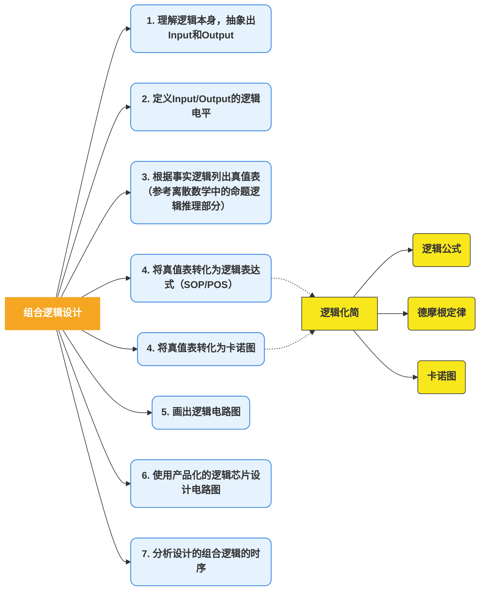

# 《数字设计与计算机体系结构》第二章 完整笔记

---



---

## 一、引言

### 1. 数字电路的黑盒子模型

电路可看成处理离散变量的网络，黑盒子包括：

- 输入（Inputs）：一个或多个离散信号
- 输出（Outputs）：一个或多个离散信号
- 功能规范（Functional Specification）：描述输入与输出之间的逻辑关系
- 时序规范（Timing Specification）：描述输入与输出之间的时序关系（延时）

### 2. 电路组成

- **节点（Nodes）**：一段导线，通过电压传递离散变量
  - 输入节点（Inputs）：A, B, C
  - 输出节点（Outputs）：Y, Z
  - 内部节点（Internal）：n1
- **组件（Circuit Elements）**：带有输入、输出、功能规范、时序规范的子电路，如 E1, E2, E3

### 3. 组合逻辑 vs 时序逻辑

| 类型 | 特点 |
|------|------|
| 组合逻辑（Combinational Logic） | 输出**仅取决于当前输入**，无记忆部件 |
| 时序逻辑（Sequential Logic） | 输出**取决于当前输入和之前输入**，有记忆部件（下一章介绍） |

### 4. 组合逻辑电路的构成规则

1. 每个组件都是组合电路
2. 每个节点连接输入和输出，但只能连接一个输出
3. 电路不能包含回路（no loops）

---

## 二、逻辑表达（Logic Representation）

### 1. 布尔表达式（Boolean Expressions）

根据输入确定输出的函数。

**例：1位全加器（Full Adder）**

- 输入：A, B, Cin
- 输出：S, Cout
- 布尔表达式：
  $$S = A \oplus B \oplus C_{in}$$
  $$C_{out} = AB + AC_{in} + BC_{in}$$

### 2. 术语（Terminology）

| 术语 | 含义 |
|------|------|
| 补（Complement） | 变量取反，如 A', B' |
| 项（Literal） | 变量的真值形式或补形式，如 A, A' |
| 乘积项（Product / Implicant） | 一个或多个项的“与”，如 AB'C, AC |
| 最小项（Minterm） | n 个变量组成的乘积项，且每个变量以原变量或反变量形式出现一次 |
| 最大项（Maxterm） | 包含全部输入变量，每个变量以原变量或反变量形式出现一次的和项 |
| 求和项（Sum） | 一个或多个项的“或” |

### 3. SOP（Sum-of-Products，积之和）

- 真值表每一行对应一个最小项
- 该最小项仅在对应行取值下为真
- 将输出为 1 的全部最小项做逻辑或，构造逻辑函数
- **构建方法**：各项先做逻辑与，再整体逻辑或

**例**：

| A | B | Y | minterm | minterm name |
|---|---|---|---|--------------|
| 0 | 0 | 0 | A'B' | m0 |
| 0 | 1 | 1 | A'B | m1 |
| 1 | 0 | 0 | AB' | m2 |
| 1 | 1 | 1 | AB | m3 |

$$Y = A'B + AB$$

### 4. POS（Product-of-Sums，和之积）

- 真值表每一行对应一个最大项
- 该最大项仅在对应行取值下为假
- 将输出为 0 的全部最大项做逻辑与，构造逻辑函数
- **构建方法**：各项先做逻辑或，再整体逻辑与

**例**：

| A | B | Y | maxterm | maxterm name |
|---|---|---|---|--------------|
| 0 | 0 | 0 | A+B | M0 |
| 0 | 1 | 1 | A+B' | M1 |
| 1 | 0 | 0 | A'+B | M2 |
| 1 | 1 | 1 | A'+B' | M3 |

$$Y = (A+B)(A'+B)$$

### 5. 逻辑表达的等价表示

逻辑表达式 ↔ 真值表 ↔ 逻辑门（电路原理图）↔ 硬件描述语言（Verilog）

### 6. 电路图绘制准则

- 输入在左侧（或顶部），输出在右侧（或底部）
- 逻辑门电流尽量从左向右流
- 最好使用直线，少用拐角线
- 线总是在 T 型接头连接
- 两条线交叉连接需放“点”；交叉无“点”表示未连接

---

## 三、布尔代数（Boolean Algebra）

### 1. 目的

简化逻辑，用最少的逻辑门实现电路。

### 2. 公理（Axioms）

| 公理 | 对偶式 | 备注 |
|------|--------|------|
| B=0 if B≠1 | B=1 if B≠0 | 二进制值域 |
| 0'=1 | 1'=0 | 非运算（NOT） |
| 0·0=0 | 1+1=1 | 与/或运算 |
| 1·1=1 | 0+0=0 | 与/或运算 |
| 0·1=1·0=0 | 1+0=0+1=1 | 与/或运算 |

### 3. 定理（Theorems）

| 定理 | 对偶式 | 备注 |
|------|--------|------|
| B·1 = B | B+0 = B | 同一性定理 |
| B·0 = 0 | B+1 = 1 | 零元定理 |
| B·B = B | B+B = B | 重叠定理 |
| (B')' = B | — | 回旋定理 |
| B·B' = 0 | B+B' = 1 | 互补定理 |
| B·C = C·B | B+C = C+B | 交换律 |
| (B·C)·D = B·(C·D) | (B+C)+D = B+(C+D) | 结合律 |
| (B·C)+(B·D) = B·(C+D) | (B+C)·(B+D) = B+(C·D) | 分配律 |
| B·(B+C) = B | B+(B·C) = B | 吸收律 |
| (B·C)+(B·C') = B | (B+C)·(B+C') = B | 合并率 |
| (B·C)+(B'·D)+(C·D) = B·C+B'·D | (B+C)·(B'+D)·(C+D) = (B+C)·(B'+D) | 一致率 |
| (B0·B1·B2...)' = B0'+B1'+B2'... | (B0+B1+B2...)' = B0'·B1'·B2'... | 德摩根定理 |

### 4. 对偶原则（Dual Principle）

如果符号 0 和 1 互换，操作符“与”和“或”互换，则表达式依然正确。

### 5. 德摩根定律（De Morgan's Laws）

$$(AB)' = A' + B'$$
$$(A+B)' = A'B'$$

**推气泡规则**：

- 与非门（NAND）等效于带反相器输入的或门
- 或非门（NOR）等效于带反相器输入的与门
- 从输出端往输入方向推，让小圆圈（气泡）相互抵消

**例**：

$$Y = \overline{\overline{AB} \cdot \overline{CD}} = AB + CD$$

---

## 四、组合逻辑设计（Combinational Logic Design）

### 设计流程（7 步）

1. 理解逻辑本身，抽象出 Input 和 Output
2. 定义 Input/Output 的逻辑电平
3. 根据事实逻辑列出真值表
4. 将真值表转化为逻辑表达式（SOP/POS）或卡诺图
5. 画出逻辑电路图
6. 使用产品化的逻辑芯片设计电路图
7. 分析设计的组合逻辑的时序

### 示例 1：1位半加器（Half Adder）

| a | b | Cout | s |
|---|---|------|---|
| 0 | 0 | 0 | 0 |
| 0 | 1 | 0 | 1 |
| 1 | 0 | 0 | 1 |
| 1 | 1 | 1 | 0 |

$$s = a'b + ab' = a \oplus b, \quad C_{out} = ab$$

**注意**：半加器不考虑低位进位，全加器（Full Adder）需增加 Cin 输入。

### 示例 2：野餐问题

- 输入：A（蚂蚁）、R（下雨）
- 输出：E（享受野餐）
- 真值表：

| A | R | E |
|---|---|----|
| 0 | 0 | 1 |
| 0 | 1 | 0 |
| 1 | 0 | 0 |
| 1 | 1 | 0 |

$$E = A'R' = (A+R)'$$

**逻辑化简**：用德摩根定律，将两个反相器+与门简化为一个或非门（NOR）。

---

## 五、卡诺图（Karnaugh Maps, K-Maps）

### 1. 简介

- 图形式的化简方法，可视化，适合变量 ≤ 4 的布尔表达式化简
- 莫里斯·卡诺（Maurice Karnaugh）发明

### 2. 关键术语

- **最小项（Minterm）**：n 个变量组成的乘积项，每个变量以原变量或反变量出现一次
- **相邻最小项（Adjacent Minterms）**：两个最小项只有一个变量取值不同
- 两个相邻最小项的或（+），可以简化掉那个取值不同的变量

### 3. 卡诺图位置

| 变量数 | 卡诺图大小 | 格雷码顺序 |
|--------|------------|------------|
| 2 | 2×2 | 00, 01, 11, 10 |
| 3 | 2×4 | 列变量 AB 按 00, 01, 11, 10；行变量 C 按 0, 1 |
| 4 | 4×4 | 行 AB、列 CD 均按 00, 01, 11, 10 |
| 5 | 4×8 | 很少使用 |

**三变量卡诺图标准排列**（行变量 $C_{in}$，列变量 $ab$）：

| $C_{in} \backslash ab$ | 00 | 01 | 11 | 10 |
|---|---|---|---|---|
| 0 | m0 | m1 | m3 | m2 |
| 1 | m4 | m5 | m7 | m6 |

**四变量卡诺图**：

| AB\CD | 00 | 01 | 11 | 10 |
|-------|----|----|----|----|
| 00 | m0 | m1 | m3 | m2 |
| 01 | m4 | m5 | m7 | m6 |
| 11 | m12 | m13 | m15 | m14 |
| 10 | m8 | m9 | m11 | m10 |

**一维格雷码序列**（3 变量）：

$$000, 001, 011, 010, 110, 111, 101, 100$$

### 4. 卡诺图化简步骤

1. 确定 n 变量的所有最小项的卡诺图位置
2. 用卡诺图表示出逻辑函数（填 1 和 0，无关项填 X）
3. 画卡诺圈：
   - 圈越大越好（消掉更多变量）
   - 圈里最小项数量只能是 **2 的幂**（1、2、4、8、…）
   - 圈是长方形或正方形，不能异形
   - 总圈数越少越好
   - **求最简 SOP 时**，每个圈至少有一个 1 未被其他圈覆盖，避免冗余圈
   - 若为消除毛刺，可有意增加冗余圈
4. 每个卡诺圈对应一个最简“与项”
5. 将所有最简项相或，得到 SOP 形式

### 5. 卡诺图化简示例

**例**：$C_{out} = a'bC_{in} + ab'C_{in} + abC_{in}' + abC_{in}$

对应最小项：

- $m_3 = a'bC_{in} = 011$
- $m_5 = ab'C_{in} = 101$
- $m_6 = abC_{in}' = 110$
- $m_7 = abC_{in} = 111$

**正确三变量卡诺图**（行变量 $C_{in}$，列变量 $ab$）：

| $C_{in} \backslash ab$ | 00 | 01 | 11 | 10 |
|---|---|---|---|---|
| 0 | 0 | 0 | 1 | 0 |
| 1 | 0 | 1 | 1 | 1 |

**卡诺圈**：

- $m_6(110)$ 与 $m_7(111)$ 合并 → $ab$
- $m_7(111)$ 与 $m_5(101)$ 合并 → $aC_{in}$
- $m_7(111)$ 与 $m_3(011)$ 合并 → $bC_{in}$

**化简结果**：

$$C_{out} = ab + aC_{in} + bC_{in}$$

### 6. 含无关项的卡诺图（Don't Cares）

- **约束项（Constraint Term）**：某些输入组合不可能出现，对应最小项不会作为有效输入出现，输出可视为无关项，用 X 表示。
- **任意项（Don't Care Term）**：输出为 0 或 1 都不影响逻辑功能，也可用 X 表示。
- 卡诺图中用 X 表示，可当作 1 或 0 用于扩大圈。

**例：交通信号灯蜂鸣器**

- 当仅有绿灯亮时，蜂鸣器响
- 约束项：红灯+黄灯同时亮、红灯+绿灯同时亮等 5 种情况不可能出现
- 卡诺图化简后：$Beep = G$（只需一根线）

---

## 六、组合逻辑模块（Combinational Building Blocks）

### 1. 多路选择器（Multiplexer, MUX）

根据 select 信号从多个输入中选择一个输出。

**2:1 MUX**：

- 输入：D0, D1；选择端：S；输出：Y
- 表达式：$Y = S'D_0 + SD_1$

**4:1 MUX**：

- 输入：D0~D3；选择端：S1, S0；输出：Y
- 表达式：$Y = S_1'S_0'D_0 + S_1'S_0D_1 + S_1S_0'D_2 + S_1S_0D_3$

**MUX 应用**：

- 实现逻辑单元（Logic Unit, LU）
- 用查表方式构造逻辑
- 用较小 MUX 实现较大 MUX（层次化设计）

**多位总线 MUX**：

- 用斜线标注总线宽度，如 8 表示 8 位总线
- 可由多个 1 位 MUX 并行构成

### 2. 译码器（Decoder）

- N 位输入，2^N 位输出
- 独热输出（One-hot outputs）：只有一个输出为高电平（或低电平）

**2:4 译码器**：

| A1 | A0 | Y3 | Y2 | Y1 | Y0 |
|----|----|----|----|----|----|
| 0 | 0 | 0 | 0 | 0 | 1 |
| 0 | 1 | 0 | 0 | 1 | 0 |
| 1 | 0 | 0 | 1 | 0 | 0 |
| 1 | 1 | 1 | 0 | 0 | 0 |

**译码器应用**：
- 与或门组合实现任意逻辑（每个输出是最小项）
- 地址译码（如存储器片选）
- 七段数码管显示译码器

### 3. 七段数码管显示译码器（7-Segment Display Decoder）

- 输入：4 位 BCD 码
- 输出：7 段控制信号（a~g）
- 共阳极（Common Anode）：低电平点亮
- 共阴极（Common Cathode）：高电平点亮

**真值表（共阴高有效，部分）**：

| D3D2D1D0 | Sa | Sb | Sc | Sd | Se | Sf | Sg |
|----------|----|----|----|----|----|----|----|
| 0000 | 1 | 1 | 1 | 1 | 1 | 1 | 0 |
| 0001 | 0 | 1 | 1 | 0 | 0 | 0 | 0 |
| 0010 | 1 | 1 | 0 | 1 | 1 | 0 | 1 |
| 0011 | 1 | 1 | 1 | 1 | 0 | 0 | 1 |
| 0100 | 0 | 1 | 1 | 0 | 0 | 1 | 1 |
| 0101 | 1 | 0 | 1 | 1 | 0 | 1 | 1 |
| 0110 | 1 | 0 | 1 | 1 | 1 | 1 | 1 |
| 0111 | 1 | 1 | 1 | 0 | 0 | 0 | 0 |
| 1000 | 1 | 1 | 1 | 1 | 1 | 1 | 1 |
| 1001 | 1 | 1 | 1 | 1 | 0 | 1 | 1 |
| others | X | X | X | X | X | X | X |

**修正说明**：数字 9 的 $S_d=1$，不是 0。原 v1 笔记中 $S_d=0$ 错误，已修正。

**带无关项的化简**：

$$S_a = D_1 + D_3 + D_2D_0 + D_2'D_0'$$

### 4. 商用译码器芯片

- 7448：输出高电平有效，驱动共阴极显示器
- 7447：输出低电平有效，驱动共阳极显示器
- 'HC138：3-8 译码器，低电平有效输出

---

## 七、时序（Timing）

### 1. 延迟（Delay）

- **传输延迟（Propagation Delay, tpd）**：从输入到输出的最长延迟
- **最小延迟（Contamination Delay, tcd）**：从输入到输出的最小延迟

**可能引起延迟的原因**：
- 电路中电容充电的时间
- 电信号以光速传播
- 不同的上升和下降延迟时间
- 温度影响（热慢冷快）

### 2. 关键路径 & 最短路径

- **关键路径（Critical Path）**：从输入到输出的最长路径，限制整个电路的速度
- **最短路径（Short Path）**：信号通过最快的路径，决定最小延迟

**例 2.15**：计算电路延迟

- $t_{pd} = 3t_{pd\_AND/NAND/XOR} = 300ps$
- $t_{cd} = 2t_{cd\_OR/NAND/XOR} = 120ps$

### 3. 多路选择器的时序（例 2.16）

| 实现方式 | tpd | 说明 |
|----------|-----|------|
| 方法 I（AND-OR） | 200ps | 从 S 到 Y 的延迟最大 |
| 方法 II（三态缓冲器） | 125ps | 从 S 到 Y 的延迟 |
| 方法 III（层次化 2:1 MUX） | 100ps | 从 D 到 Y 的延迟 |

**结论**：在例 2.16 的特定门延迟参数下，用两个 2:1 MUX 层次化实现的 4:1 MUX 关键路径较短，$t_{pd}=100ps$；但层次化设计不一定总减少延迟，需结合具体门延迟、扇出（fanout）和路径判断。

### 4. 毛刺（Glitches）

- 当单个输入信号变化引起多个输出变化时，可能产生毛刺
- 毛刺是短暂的错误脉冲

**毛刺判定**：

- 将逻辑关系用卡诺图表示
- 若卡诺图中两个包围圈相切而不相交，对应电路存在毛刺
- **适用范围**：主要针对两级 SOP 电路的静态 1 冒险（static-1 hazard）；POS 电路看 0 圈有对偶规则

**毛刺消除方法**：

1. 修改逻辑设计（增加冗余项）
2. 输出端接滤波电容
3. 引入选通脉冲
4. 同步设计约束（第3章介绍）

**例**：$Y = A'B + BC$

- 当 A=0, C=1, B 由 1→0 时，可能产生毛刺
- 增加冗余项 $\overline{A}C$：$Y = A'B + BC + \overline{A}C$

**注意**：组合逻辑中可以通过增加冗余项消除特定静态冒险（static hazard），但多个输入同时变化仍可能产生功能冒险或动态冒险，无法仅靠组合逻辑完全消除所有毛刺；工程上通常用同步设计约束解决。

---

## 八、高/低有效与共阳/共阴对照

### 1. 高有效 vs 低有效

| 类型 | 有效电平 | 示例 |
|---|---|---|
| 高有效（active high） | 1 表示有效/选中 | 7448 输出高电平点亮共阴数码管 |
| 低有效（active low） | 0 表示有效/选中 | 7447 输出低电平点亮共阳数码管；'HC138 输出低有效 |

### 2. 七段数码管共阳/共阴

| 类型 | 公共端 | 段输入 | 常用译码器 |
|---|---|---|---|
| 共阳极（common anode） | 接 VCC | 低电平点亮 | 7447 |
| 共阴极（common cathode） | 接 GND | 高电平点亮 | 7448 |

---

## 九、第二章易错点 + 勘误表

| 序号 | 易错点 | 正确结论 |
|---|---|---|
| 1 | SOP 圈 1，POS 圈 0 | 不要混用；SOP 对 1 圈，POS 对 0 圈 |
| 2 | 卡诺圈大小 | 必须是 2 的幂：1、2、4、8、… |
| 3 | 卡诺圈形状 | 必须是矩形/正方形，不能斜圈、不能异形 |
| 4 | 德摩根律 | 拆长横线：与变或、或变与，每个变量取反 |
| 5 | 无关项 | 可当 1 或 0，用于扩大卡诺圈 |
| 6 | MUX 实现逻辑 | 输入接 0/1/变量，选择端接变量 |
| 7 | 译码器输出 | 每个输出对应一个最小项，可配合或门实现 SOP |
| 8 | tpd 与 tcd | tpd 是最长延迟，tcd 是最短延迟 |
| 9 | 毛刺 | 可通过冗余项消除特定静态冒险，但多输入同时变化仍可能产生 |
| 10 | 自测题 1 POS | 正确为 $F=(A+B')(A'+B')$，不是 $(A'+B)(A+B')$ |
| 11 | 七段译码器 1001 | $S_d=1$，不是 0 |
| 12 | 半加器 vs 全加器 | 半加器只有 a,b 输入；全加器有 Cin |
| 13 | 约束项 | 不是“永远为 0”，而是“不会作为有效输入出现，输出可视为无关项” |

---

## 十、自测练习题（含答案）

### 题 1：SOP 与 POS

真值表：

| A | B | F |
|---|---|---|
| 0 | 0 | 1 |
| 0 | 1 | 0 |
| 1 | 0 | 1 |
| 1 | 1 | 0 |

写出 F 的 SOP 和 POS。

**答案**：

- 观察可知 $F = B'$
- SOP：$F = A'B' + AB' = B'$
- POS：$F = (A+B')(A'+B')$

### 题 2：K-map 化简

用 K-map 化简 $F(A,B,C) = \Sigma m(0,1,2,5,6,7)$。

**答案**：

$$F = A'B' + BC' + AC$$

### 题 3：MUX 实现

用 2:1 MUX 实现 $F = A \oplus B$。

**答案**：

- 选择端 $S = A$；
- $D_0 = B$；
- $D_1 = B'$；
- 输出 $Y = S'D_0 + SD_1 = A'B + AB'$。

### 题 4：译码器

写出 3-8 译码器的 $Y_5$ 表达式（输入 A2 A1 A0）。

**答案**：

$Y_5 = A_2 A_1' A_0$（因为 5 = 101）

### 题 5：毛刺判定

$Y = A'B + BC$，判断是否存在毛刺，如何消除？

**答案**：

- 存在毛刺：卡诺图中 A'B 和 BC 两个圈相切不相交
- 消除：增加冗余项 $\overline{A}C$，$Y = A'B + BC + \overline{A}C$

### 题 6：时序计算

某电路关键路径经过 2 个 AND 门和 1 个 OR 门，AND 门 tpd=60ps，OR 门 tpd=90ps，求电路传输延迟。

**答案**：

$$t_{pd} = 2×60 + 90 = 210ps$$

### 题 7：七段译码器

写出数字 9 的共阴高有效段码（Sa~Sg）。

**答案**：

$$S_a=1, S_b=1, S_c=1, S_d=1, S_e=0, S_f=1, S_g=1$$

---

## 十一、重要英文术语表

| 中文 | 英文 |
|------|------|
| 组合逻辑 | combinational logic |
| 时序逻辑 | sequential logic |
| 布尔代数 | Boolean algebra |
| 真值表 | truth table |
| 最小项 | minterm |
| 最大项 | maxterm |
| 积之和 | sum-of-products (SOP) |
| 和之积 | product-of-sums (POS) |
| 卡诺图 | Karnaugh map (K-map) |
| 无关项 | don't care |
| 约束项 | constraint term |
| 多路复用器 | multiplexer (MUX) |
| 译码器 | decoder |
| 优先编码器 | priority encoder |
| 三态缓冲器 | tri-state buffer |
| 传输延迟 | propagation delay (tpd) |
| 最小延迟 | contamination delay (tcd) |
| 关键路径 | critical path |
| 最短路径 | short path |
| 毛刺 | glitch |
| 静态冒险 | static hazard |
| 逻辑电平 | logic levels |
| 噪声容限 | noise margins |
| 总线 | bus |
| 独热输出 | one-hot outputs |
| 七段数码管 | 7-segment display |
| 共阳极 | common anode |
| 共阴极 | common cathode |
| 半加器 | half adder |
| 全加器 | full adder |

---

## 十二、Verilog 片段补充

### 1. 2:1 MUX

```verilog
module mux2(input d0, d1, s, output y);
    assign y = s ? d1 : d0;
endmodule
```

### 2. 2:4 译码器（高有效输出）

```verilog
module decoder2_4(input a1, a0, output [3:0] y);
    assign y[0] = ~a1 & ~a0;
    assign y[1] = ~a1 &  a0;
    assign y[2] =  a1 & ~a0;
    assign y[3] =  a1 &  a0;
endmodule
```

### 3. 半加器

```verilog
module half_adder(input a, b, output s, cout);
    assign s = a ^ b;
    assign cout = a & b;
endmodule
```

---
